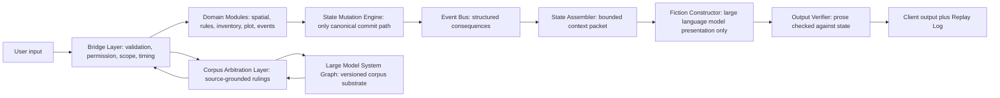
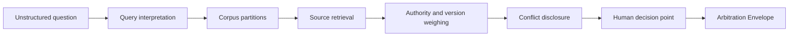

# Amazing Game Engine [AGE] Executive Summary

## Purpose

The Amazing Game Engine [AGE] is a state-authoritative narrative simulation and anchored corpus arbitration platform. AGE is designed for interactive role-playing games first, but the same architecture also supports professional corpus arbitration where a user asks an unstructured question and needs a source-grounded answer. A large language model [LLM] is a generative language model that interprets or presents language. AGE uses an LLM for interpretation and readable prose. AGE does not allow an LLM to own canonical state, resolve rules by itself, or invent facts that become true merely because they appeared in generated text.

A large model system [LMS] is the wider operating system around one or more language models. An LMS may include retrieval, graph search, tools, workspaces, agents, task routing, and external interfaces. The Large Model System Graph [LMS-Graph] is the maintained graph and relational corpus substrate inside AGE. LMS-Graph stores sources, concepts, rules, citations, dependencies, authority tiers, versions, conflicts, and structured facts. The Corpus Arbitration Layer [CAL] is the AGE service that answers questions against LMS-Graph by retrieving sources, weighing authority, surfacing conflicts, and preserving the human decision point.

The central AGE claim is straightforward. Narrative text is not truth. Committed state is truth. Generated prose explains truth after the engine validates and commits it.

## The Problem

Current artificial intelligence [AI] narrative systems usually put the LLM at the center of state. The user says what they do, the model writes the next paragraph, and the paragraph implies the new world condition. This feels flexible at first. It also creates the basic failure of AI-driven interactive fiction: continuity collapse. A destroyed bridge returns later. A dead character speaks. A locked door becomes unlocked because a later paragraph forgot the lock. A rule that mattered in one scene disappears in the next scene. The system remains fluent while the world loses cause and effect.

The same failure appears in professional knowledge work. A user may ask about a law, code, standard, medical guideline, license requirement, or technical procedure. An LLM can answer fluently, but its parametric memory may be stale, jurisdictionally wrong, incomplete, or unconstrained by the exact source corpus that governs the real question. The failure is not merely hallucination. The deeper failure is misplaced authority. A probabilistic text generator is being asked to own information that belongs in maintained sources, deterministic state, or human judgment.

AGE corrects the authority chain. Deterministic services own state. Maintained corpora own authoritative source claims. Human authorities own final judgment where the corpus conflicts, the rule is ambiguous, or table policy is required. The LLM remains useful because it can interpret language, assemble explanations, and render outcomes in a readable form. It is not asked to be the source of truth.

## Core Product Definition

AGE is both a game engine and a knowledge infrastructure. As a game engine, AGE supports persistent, multiplayer, state-coherent narrative play. Authors define worlds, rules, characters, events, overlays, and scenario structures. Players interact through natural language. A Referee may adjudicate uncertain cases. The runtime converts user language into structured action candidates, checks permissions and scope, routes the action to deterministic domain modules, commits state changes, records consequences, assembles bounded context, generates prose, verifies the prose against state, and writes a replay log.

As a knowledge infrastructure, AGE uses LMS-Graph and CAL to answer unstructured questions against a bounded corpus. A bounded corpus may be a role-playing game rulebook, errata set, and referee policy. Later it may be a licensing corpus, technical standard, legal corpus, regulatory archive, or institutional procedure library. The same pattern applies: the system does not answer from model memory alone. It retrieves, weighs, cites internally, exposes conflict, and identifies the decision a human must make.

The first production environment should be gaming. Gaming is not a toy proof for a different business. It is the correct low-consequence production domain for the architecture. A serious role-playing game contains rules, exceptions, examples, supplements, house rules, private information, ambiguous cases, player agency, world state, time, inventory, characters, factions, and human adjudication. That is enough complexity to test the architecture while avoiding domains where an early system error creates legal, medical, financial, or safety harm.

## Architecture at a Glance

The Bridge Layer is the validation and routing boundary. It receives structured candidates from user input, role output, authored events, or external systems. It checks permissions, scope, timing, entity versions, active overlays, module availability, visibility limits, and conflict triggers. A domain module is a deterministic service with bounded responsibility. Spatial movement, inventory, combat, event generation, communication, plot transition, and rules resolution are all examples of domain modules.

The State Mutation Engine is the only component allowed to commit approved changes to canonical state. A state delta is a proposed change. It is not true until the State Mutation Engine approves and commits it. The Event Bus is the structured consequence channel. It propagates committed changes to the partitions, queues, actors, schedules, and output systems that need to know. The State Assembler builds the bounded context packet that the Fiction Constructor may see. The Fiction Constructor is the LLM presentation layer. The Output Verifier checks the generated prose against committed state and active constraints. The Replay Log records the path from user words to final output.

This arrangement prevents the most damaging failure of AI storytelling. A generated paragraph cannot quietly add a new canonical fact. It must match the state that the runtime already accepted.

## The Execution Spine

The Execution Spine is the input-to-output path followed by a player action, authored event, or role-mediated request. It exists because natural language is flexible while state must be exact. The Input Coordinator converts user words into an action candidate. The Bridge Layer checks whether the action can be attempted. The correct domain module resolves the attempt. The State Mutation Engine commits approved change. The Event Bus distributes consequences. The State Assembler prepares a bounded context packet. The Fiction Constructor writes the readable result. The Output Verifier checks it. The Replay Log records it.

An example shows the practical difference. A player says, "I smash the lock with the crowbar and run through the service door." In an LLM-native system, the next paragraph may decide that the lock breaks, the door opens, and the character escapes. In AGE, the Input Coordinator extracts the attempted lock destruction and movement. The Bridge Layer checks that the character is present, has the crowbar, can reach the lock, has enough time, and is allowed to attempt the action. A physical interaction module resolves the lock damage. A movement module resolves whether the character can pass through the door after the lock result. The State Mutation Engine commits damage, noise, position, time passage, and any triggered alarms. Only then does the Fiction Constructor describe the scene.

The player still experiences natural-language play. The engine preserves consequence.

## Scope, Time, and Locale-to-World Shifts

AGE couples three scale ladders. Spatial scope describes physical scale: submap, locus, realm, region, and world. Narrative scope describes story scale: spotlight, scene, act, chapter, arc, and epic. Temporal scope describes time scale: moment, scene time, session time, campaign time, and world-history time. A TickPolicy is the rule that tells a partition how time advances. A partition is a bounded state or knowledge region, such as a room, city district, faction, journey route, troupe, rule corpus, or background world process.

This structure matters because a game cannot simulate every person, room, faction, economy, road, calendar, and weather pattern every second. Fine detail belongs where the players are acting. Background systems use compressed ticks. When local action changes something larger, AGE routes the consequence upward. When a world event manifests locally, AGE routes pressure downward as visible changes: rumor, price, weather, law enforcement, travel delay, faction behavior, resource scarcity, altered access, or non-player character movement. A non-player character [NPC] is a character controlled by the system, Referee, or authored scenario rather than by a player.

A locale-to-world shift occurs when local action becomes larger-scale consequence. A world-to-locale shift occurs when larger-scale pressure becomes local experience. These shifts must be recorded. Without explicit transition packets, the engine will appear arbitrary. With them, the Referee and players can see why a village changed after the war front moved, why a city patrol arrived after a public crime, or why a faction accelerated its plan after the players disrupted one cell.

## Narrative Structure and AGEScript

AGEScript is the authored scenario and consequence schema layer. It should not be treated as a rigid script that forces players through a fixed branch. It is a structure for preconditions, scene pressures, available transitions, fail states, success states, costs, and consequence mappings. Its purpose is to let authors prepare dramatic material without erasing player agency.

A fixed branch says, "The players meet the princess, rescue her, and receive the map." A consequence-first AGEScript package says, "The princess has information, political value, enemies, guards, escape routes, loyalties, and a schedule. If the players rescue her, one set of consequences follows. If they betray her, another set follows. If she dies, the information may move to a diary, witness, rival, coded letter, or lost opportunity, but the death remains true." AGE may rebind plot pressure. It must not erase cost or causality.

The Living World subsystem advances pressures beyond the immediate scene. Factions move. Timers expire. Weather changes. Patrols respond. Rumors spread. The market reacts. Travel consumes resources. AGEScript can attach hooks to these processes so authored content remains active while the world continues.

## World Generation, Lazy Ontology, and Overlays

AGE does not need to actualize a whole world at maximum detail before play begins. Lazy ontology means the system stores high-level truth until finer detail becomes necessary. A kingdom may exist as a political region, faction set, trade posture, travel risk, and few known locations until the players approach it. When play requires a border village, the system actualizes that village from the baseline world state, active overlays, local constraints, and author rules.

An overlay is a bounded modification applied over baseline world state. A technology-level overlay may define what tools, concepts, manufacturing methods, weapons, communication systems, or social institutions are available in a place. A disaster overlay may damage roads, reduce food, alter patrol frequency, and change local prices. A faction overlay may change access, law, recruitment, rumors, and threat response. Overlays are not free prose suggestions. They are structured constraints that affect what can be generated, purchased, built, known, or used.

The Bridge Layer enforces overlays. If the world has no radio technology, generated prose cannot casually place a working radio on a table. If a setting region has jump technology but lacks local manufacturing, a traveler may use a jump gate while the village around it remains otherwise low-technology. The overlay model prevents world generation from drifting toward generic modern assumptions.

## Partitions, State, and Memory

AGE partitions state because not all information belongs everywhere. A partition may be spatial, narrative, temporal, social, corpus-based, or user-specific. A room partition holds local entities and conditions. A city partition holds broader law, factions, markets, travel networks, and public knowledge. A troupe partition holds table state, local rulings, visibility, campaign time, and player-specific experience. A corpus partition holds sources, versions, authority tiers, and term meanings.

Partitioning gives AGE scalability and authority control. The system can update what matters now without waking every background process. It can isolate one troupe's local ruling from another troupe's campaign. It can keep private information private. It can propagate a flag upward, downward, or laterally only when the event rules require propagation.

Memory is therefore not merely conversation history. AGE memory is recorded state, scheduled consequence, source-grounded corpus knowledge, role history, visibility policy, and replay. Retrieval-augmented generation alone does not solve this problem because ordinary retrieval does not own time, causality, authority, or state mutation. AGE uses retrieval where retrieval is useful, but state and source authority remain structured.

## LMS-Graph and Corpus Arbitration

LMS-Graph is the knowledge substrate. It stores graph relations and relational facts. Graph relations include citations, dependencies, exceptions, supersession, jurisdiction, concept adjacency, authority chains, and conflicts. Relational facts include dates, thresholds, requirements, values, rule numbers, table entries, version fields, and status flags. CAL sits above this substrate and answers questions.

A CAL answer should not simply say what the model thinks. It should return an arbitration envelope. An arbitration envelope is the structured answer containing the ruling, source basis, confidence, conflict notes, applicable scope, version, missing coverage, and human decision point. For game rules, the human decision point may be the Referee's ruling. For professional domains, the human decision point may belong to a licensed professional, compliance officer, attorney, engineer, clinician, inspector, or institutional owner.

The first CAL deployment should be a Rules Service. A Rules Service applies CAL to a bounded game corpus: rulebook, errata, examples, supplements, table policy, and Referee notes. This environment has enough ambiguity to stress the system. It also makes errors survivable.

## Role Service and Human Authority

The Role Service defines bounded actors. A role may be an NPC, tutor, advisor, Referee assistant, rules clerk, worldbuilding assistant, authoring assistant, faction controller, or later professional persona. A Role Semantic Contract is the machine-readable and human-readable boundary for a role. It states what the role knows, what it may claim, what sources it may use, what tone it uses, what tools it may call, what decisions it cannot make, and when it must escalate.

A role is not an autonomous authority merely because it speaks fluently. A priest role, lawyer role, doctor role, ambassador role, monster role, city guard role, or authoring assistant role has epistemic limits. Role epistemology means the role's allowed knowledge and claim authority. AGE must distinguish a role's in-character belief, system-known truth, source-grounded claim, and human-authorized decision.

Human authority remains explicit. The Referee governs table adjudication. Authors govern published worlds and rule packages. Corpus owners govern source ingestion and authority tiers. Professional users govern decisions that require licensure or institutional accountability. AGE can surface evidence and enforce contracts; it does not dissolve responsibility into the model.

## Client, Multiplayer, and Output

AGE is designed for multiplayer narrative, not isolated single-prompt fiction. Multiplayer introduces coordination problems. Players may act at different times. Private information may differ. One player may trigger a consequence that another player has not yet seen. Two characters may attempt conflicting actions. The client must therefore preserve visibility, timing, concurrency, and replay.

The output system is also bounded. Text, image, audio, map, and interface outputs should derive from structured state. A visual character descriptor should be stored as structured data before image generation. The Output Verifier should reject visual or textual drift where the output contradicts state. A character should not change hair color, armor, injuries, equipment, species, or location merely because a generator varied the presentation.

The same principle applies to summaries. A session summary is not a creative rewrite of events. It is a reader-facing condensation of committed state, replay entries, and visibility rules.

## Quality Assurance and Certification

Quality assurance [QA] in AGE means more than testing whether software functions run. Semantic QA means testing whether outputs obey contracts. A semantic test asks whether a ruling followed authority tiers, whether a role stayed within its semantic contract, whether generated prose contradicted state, whether a partition leaked private knowledge, whether an overlay blocked invalid content, and whether a replay can reproduce the result.

Certification artifacts are durable QA records. A Role Semantic Contract can be certified against a test suite. A Rules Service can be certified against a benchmark corpus. A world module can be certified against drift tests. A generated answer can be stored with its arbitration envelope and replay path. This does not make AGE automatically correct. It makes correctness testable, auditable, and improvable.

## Minimum Viable Product

A minimum viable product [MVP] is the smallest product that proves the core loop. The AGE MVP should be narrow. It should not attempt every genre, every visual modality, every professional use case, every marketplace feature, or every external action workflow. It should prove one playable loop: author a bounded rules-and-world package, accept player input, validate action, resolve through deterministic modules, commit state, render output, verify output, answer rules questions through CAL, and replay the action path.

The MVP should include one troupe, one bounded game corpus, one or two small adventures, a small set of deterministic modules, a simple authoring path, a Rules Service, role contracts for a limited set of NPCs and assistants, semantic QA tests, and replay. It should exclude external professional agents, generalized marketplace promises, broad enterprise claims, and unrestricted world generation until the core loop works.

## Rewards

AGE offers several concrete rewards. It gives players persistent consequence without forcing them into menu-only interaction. It gives authors a way to build worlds that can survive player improvisation. It gives Referees support without replacing human judgment. It gives corpus owners a way to ground answers in maintained sources. It creates replayable and auditable sessions. It creates a path from game-rule arbitration to lower-risk professional corpus arbitration. It also creates a data flywheel: every action, ruling, role failure, verifier rejection, and human override becomes a labeled improvement signal.

The strategic reward is not that AGE owns a better prompt. Prompts commoditize. Models improve. Generic retrieval improves. The defensible architecture is the combination of state ownership, partitioned scope, corpus authority, human decision points, role contracts, semantic QA, and replay. That combination is harder to copy than a single model wrapper.

## Risks

The risks are substantial. The Bridge Layer can become too complex. Latency can make play feel slow. Domain modules can grow faster than the product can test them. World generation can drift if overlays are weak. CAL can overclaim if coverage gaps are not exposed. Role Service can become a liability if users mistake role fluency for authority. Professional expansion can arrive too early. Cost projections may fail if model calls, graph operations, and QA runs are not tightly managed. The product can also become illegible if it tries to sell game engine, authoring tool, role marketplace, professional arbitration, and agent platform at the same time.

The mitigation is scope discipline. Build gaming first. Keep the first corpus bounded. Make every state change replayable. Keep the LLM downstream of state. Require arbitration envelopes. Preserve human authority. Treat professional use as a later expansion after the engine has evidence from play, QA, replay, and corpus arbitration.

## Development Path

The development path has four stages. First, build the core runtime: Input Coordinator, Bridge Layer, domain modules, State Mutation Engine, Event Bus, State Assembler, Fiction Constructor, Output Verifier, and Replay Log. Second, build the authoring and scenario path: AGEScript, overlays, TickPolicy, partitions, and a small playable corpus. Third, build the Rules Service over LMS-Graph and CAL. Fourth, expand Role Service and semantic QA until roles and rulings can be tested and certified.

Agent Service comes later. Agent Service is the subsystem that lets authorized roles perform external actions through Model Context Protocol [MCP] gateways or application programming interface [API] gateways. MCP is a protocol pattern for connecting model systems to tools and external resources. An API is a defined software interface for a system or service. External action increases legal, safety, privacy, compliance, and attack-surface risk. It should not be part of the first AGE proof.

## What the User Experiences

The player or Referee should not experience AGE as a database form. The user experience remains conversational. A player says what the character attempts. The system responds in readable prose. The difference is inside the authority path. When the player returns next session, the bridge is still destroyed, the debt remains recorded, the guard still remembers the insult if the guard survived, and the rules ruling can be reviewed. The system's natural language surface hides neither state nor consequence; it presents them.

For the Referee, AGE should behave like a disciplined assistant. It can answer rules questions, summarize visible facts, propose scene continuations, track clocks, present unresolved conflicts, and remember local rulings. It should not replace the Referee's authority. When a case needs judgment, AGE should identify the decision and give the Referee the evidence needed to decide.

For the author, AGE should behave like a conversion layer between creative design and enforceable play. The author may begin with natural-language worldbuilding, but the Authoring Layer should turn that material into partitions, overlays, roles, events, rules references, visibility policies, and test cases. The author should be able to see what the system inferred and correct it before publication.

For the corpus owner, AGE should behave like an arbitration system rather than a chat model. It should show what sources are active, which version controls, what conflict exists, and where human authority begins. A source-grounded answer is useful because it remains inspectable.

## What Must Be Built First

The first build should be small enough to finish and strict enough to prove the architecture. The essential build is one bounded game environment with one rules corpus, one short adventure, one troupe, a narrow set of character actions, limited NPC roles, basic state, basic inventory, simple time, simple event clocks, a rules arbitration service, output verification, and replay. This is not the complete AGE vision. It is the smallest meaningful proof of the core authority chain.

The build should instrument everything. Every accepted output should be tied to a committed state path. Every rejected output should store the reason for rejection. Every human override should be recorded. Every rules answer should expose its source path. Without this instrumentation, AGE cannot learn from use and cannot prove that it solved the continuity problem.

The first authoring tools should also be narrow. They should let a creator define a location, NPC, item, rule reference, event, and overlay; then test those artifacts in play. A beautiful authoring suite that cannot produce enforceable artifacts is less useful than a plain tool that produces valid records.

## Definitive Limits

AGE does not make language models reliable by trusting them more. It makes them useful by trusting them less. The architecture assumes that generated language is powerful but not authoritative. It assumes that source corpora can conflict. It assumes that human decision points remain necessary. It assumes that persistent worlds need state ownership, not longer prompts.

AGE also does not eliminate design labor. Authors must still define meaningful worlds. System designers must still create rules. Engineers must still build modules. Referees must still adjudicate hard cases. Corpus owners must still decide authority tiers. The reward is that this labor becomes structured, testable, reusable, and replayable rather than trapped in scattered prose, chat history, or model memory.

## Executive Judgment

AGE is strongest when stated narrowly: it is a constraint-first engine for persistent narrative and anchored corpus arbitration. Its first product should prove that deterministic state, bounded language generation, graph-grounded rules arbitration, and human authority can coexist in a playable multiplayer experience. If that loop works, AGE has a path toward authoring tools, role systems, certification artifacts, and professional corpus infrastructure. If that loop does not work, the broader claims should not proceed.

The next development pass should therefore preserve one rule above all others. AGE must never allow fluent output to outrank committed state, maintained sources, or human authority.
