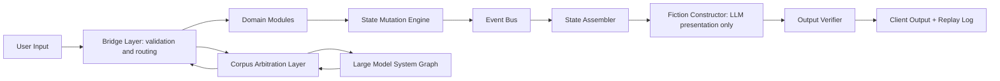

# Amazing Game Engine [AGE] Executive Summary

## Document definitions

Amazing Game Engine [AGE] means the complete platform described in this archive: the runtime engine, authoring tools, maintained corpus substrate, corpus arbitration service, role system, client experience, audit records, and later external-action layer.

AGE Engine means the deterministic runtime inside AGE. It validates actions, resolves rules and world modules, commits canonical state, assembles bounded context, verifies output, and records replay.

Large Language Model [LLM] means a generative language model used to interpret or render language. In AGE, an LLM may explain committed results, but it does not own canonical state.

Large Model System [LMS] means the wider model, retrieval, graph, tool, agent, and workspace system around one or more LLMs. LMS is broader than LLM.

Large Model System Graph [LMS-Graph] means the maintained graph/relational corpus substrate. It stores sources, concepts, rules, citations, dependencies, versions, authority tiers, scope, conflicts, and structured facts.

Corpus Arbitration Layer [CAL] means the AGE component that answers unstructured questions against LMS-Graph by retrieving sources, weighing authority, surfacing conflicts, and preserving human decision points.

Rules Service means the first CAL deployment. It applies CAL to a bounded game rules corpus.

Role Service means the subsystem that defines bounded actors, non-player characters, advisors, tutors, facilitators, and helpers through role contracts.

Agent Service means the later subsystem that allows authorized roles to perform external actions through Model Context Protocol [MCP] or Application Programming Interface [API] gateways.

Quality Assurance [QA] means testing and review. Semantic QA means testing whether rulings, roles, prose, and state changes obey AGE contracts.

Minimum Viable Product [MVP] means the smallest AGE product that can prove the core loop: author, play, arbitrate, commit state, render output, replay, test, and improve.

Referee means the human table authority who adjudicates play where human judgment is required.

Authoring Layer means the AGE tool layer that lets creators build worlds, rules packages, roles, adventures, events, overlays, and publication packages.

Bridge Layer means the validation and routing boundary between language, roles, modules, overlays, and canonical state.

Domain Module means a deterministic service with bounded responsibility, such as movement, inventory, combat, plot, event generation, or rules resolution.

State Mutation Engine means the only component allowed to commit approved changes to canonical state.

Event Bus means the structured consequence channel that propagates committed changes.

State Assembler means the component that builds bounded context packets for output generation.

Fiction Constructor means the LLM-based presentation layer that turns committed outcomes into readable prose.

Output Verifier means the component that checks generated prose against committed state and active constraints.

Partition means a bounded state or knowledge region.

TickPolicy means the rule for advancing time inside a partition.

AGEScript means the authored scenario and consequence schema layer.

Anchored Corpus Arbitration means source-grounded corpus arbitration that exposes authority, conflict, and human decision points.

## One-sentence definition

AGE is a state-authoritative narrative simulation and anchored corpus arbitration platform. Deterministic services own truth; language systems interpret user intent, retrieve source-grounded rulings, and present committed outcomes.

## What AGE is

AGE lets players, authors, Referees, and later institutional users interact through natural language without allowing generated prose to become the source of truth. A user may type a free-form action, ask a rules question, challenge a ruling, or request a summary. AGE converts that input into structured candidates, validates them, resolves them through deterministic modules, commits state, retrieves corpus evidence when needed, and only then asks an LLM to present the result.

Ordinary artificial intelligence [AI] narrative products invert this order. They generate the next text and let the text imply what changed. AGE resolves what changed first. The prose then explains the committed result. This is the foundation for persistent consequence, replay, audit, and durable rules interpretation.

## Core architecture

The Bridge Layer is the boundary between language and state. It checks permissions, timing, scope, rules, entity versions, active overlays, role constraints, and partition access. The State Mutation Engine is the only canonical commit path. The Fiction Constructor receives committed truth; it does not create it.

## Product layers

AGE has six major product layers.

1. AGE Engine is the runtime spine for state, scope, time, modules, events, context assembly, fiction rendering, output verification, and replay.
2. The Authoring Layer gives creators tools for worlds, systems, roles, adventure structures, event tables, AGEScript packages, overlays, and publication packages.
3. LMS-Graph stores the maintained corpus built from authoritative or configured source roots.
4. CAL answers unstructured corpus questions against LMS-Graph.
5. Role Service governs bounded actor behavior.
6. Agent Service is the later external-action layer and is not part of the first MVP.

Roles-as-a-Service [RaaS] is not used as an umbrella term in this archive. It previously blurred roles, rules, retrieval, arbitration, and external action. AGE instead keeps Role Service, Rules Service, CAL, LMS-Graph, and Agent Service separate.

## Scope, time, and world scale

AGE couples three scope ladders: spatial scope, narrative scope, and temporal scope. Spatial scope runs from submap to world. Narrative scope runs from spotlight to epic. Temporal scope runs from moment to world-history time. A TickPolicy defines how time advances in a partition: duration, step size, compression, background actions, scheduled events, ripple timing, and visibility.

This structure lets AGE move from a room conversation to a city investigation to a kingdom journey to a world-historical shift without pretending that every scale is simulated the same way. Local events use fine resolution. Travel, downtime, faction movement, and world shifts use compressed ticks and transition packets.

## Corpus arbitration

CAL performs Anchored Corpus Arbitration. A user asks a natural-language question. CAL interprets the query, selects corpus partitions, retrieves sources from LMS-Graph, weighs authority, exposes conflicts, identifies the human decision point, and returns an answer envelope.

The first Rules Service target should be a bounded owned or licensed game rules corpus. A game corpus contains rules, exceptions, examples, errata, supplements, table policy, ambiguous cases, and human judgment. It tests the same structure later needed for professional corpora, but it does so with lower consequence.

## Why gaming first

A serious role-playing game is the ideal first production environment. It contains rules, exceptions, character state, locations, factions, inventories, time pressure, social context, private information, ambiguous rulings, table authority, house rules, supplements, errata, and version conflicts. These are the same structural problems found in law, regulation, compliance, technical standards, institutional policy, and training scenarios.

Gaming is therefore not a toy version of AGE. Gaming is AGE running in its first safe production environment.

## MVP boundary

The MVP should be a single-troupe, game-native runtime with one bounded rules corpus. A troupe means the bounded play group that shares active state, timing, authority policy, and visibility. The MVP should include authoring, play, state mutation, CAL-based Rules Service, output verification, replay, and failure capture.

The MVP should not include broad professional advice, open-ended marketplace publication, unrestricted external actions, or Agent Service. Those require stronger licensing, governance, human authority design, and audit maturity.

## Rewards

AGE can create enforceable consequence, source-grounded rulings, replayable decisions, author-controlled generative output, persistent campaign worlds, and reusable test cases. It can also create a future path from games to serious play, internal training, technical documentation, enterprise policy, and regulated reference domains where licensing and governance permit.

## Risks

The largest risks are scope creep, latency, corpus licensing, weak authoring experience, role drift, mistaken authority weighting, hidden state leakage, overbroad professional claims, and premature external action. These are design risks rather than reasons to abandon the architecture. Each risk requires a boundary, a test, and a human decision point.

## Development order

1. Build the narrow AGE Engine action loop.
2. Add a small deterministic module set.
3. Commit state only through the State Mutation Engine.
4. Build replay and output verification early.
5. Ingest a bounded game rules corpus into LMS-Graph.
6. Deploy CAL as Rules Service.
7. Add authoring capture after the runtime can execute a small adventure.
8. Add Semantic QA around actual failures and overrides.
9. Defer Agent Service until role contracts, permissions, audit, and governance are mature.

## Success test

AGE succeeds when a bounded adventure can be authored, played, rules-arbitrated, state-mutated, rendered, replayed, tested, and improved without allowing generated prose to become canonical state.
