# Amazing Game Engine [AGE] Aggregated White Papers

This volume combines the definition-first AGE white papers. Each paper defines its local terms before using them.

---

# White Paper 01 - Core Runtime and Bridge Layer

## Document definitions

Amazing Game Engine [AGE] means the complete platform. Core Runtime means the part of AGE that turns user intent into validated state change. Bridge Layer means the validation and routing boundary between language, roles, client input, domain modules, overlays, and canonical state. Domain Module means a deterministic service with bounded responsibility, such as spatial movement, inventory, combat, communication, rules, plot, or event generation. State Delta means a proposed change to canonical state. State Mutation Engine means the only component allowed to commit an approved State Delta. Large Language Model [LLM] means a language generator used for interpretation or prose presentation; it does not own state.

Artificial intelligence [AI] means software behavior that performs model-based interpretation, generation, classification, or decision support.

Corpus Arbitration Layer [CAL] means the component that answers corpus questions from source evidence.

State Assembler means the component that builds bounded context packets for output generation.

Fiction Constructor means the LLM-based presentation layer that renders committed outcomes.

Output Verifier means the component that checks generated prose against committed state.

Event Bus means the structured consequence channel that propagates committed changes.

Replay Log means the durable record of the action path and result.

## Plain definition

The Core Runtime receives intent, validates it, sends it to the correct deterministic module, commits the approved State Delta, propagates events, prepares bounded context, verifies generated prose, and records replay. The Bridge Layer is the gate that prevents an LLM, a client user interface, a role, an overlay, or a module from mutating canonical truth without permission.

## Problem addressed

AI narrative systems collapse when the text generator owns state. AGE prevents this by making state mutation a formal engine operation. The LLM may describe what happened, but only after the runtime validates and commits what happened.

## Operating responsibility

The Core Runtime owns input routing, action validation, module orchestration, state mutation, event publication, context assembly, output verification, and replay logging. The Bridge Layer owns permission checks, entity version checks, scope checks, timing checks, module routing, overlay proposal review, Corpus Arbitration Layer [CAL] escalation triggers, and human decision triggers.

## Architecture

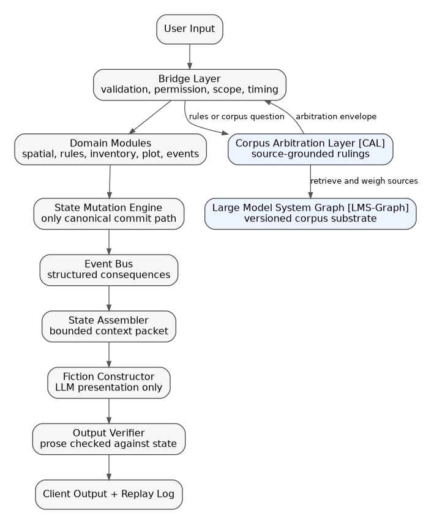

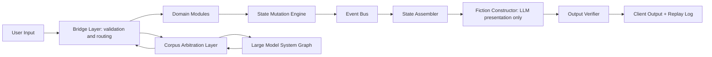

## Interfaces

Inputs are Action Candidates, current state, entity versions, active scope, role constraints, rules references, overlay proposals, and visibility limits. Outputs are Validation Results, module calls, rejected actions, CAL requests, human decision requests, and State Delta proposals.

Action Candidate means the structured representation of the user's proposed action. Validation Result means the Bridge Layer record that states whether the action may proceed, must be rejected, must be clarified, or must be escalated.

## Reward

The reward is enforceable consequence. Characters cannot die, move, learn, heal, spend, acquire, reveal, or change because prose says so. They change because state changed.

## Risk

The risk is complexity and latency. Every validation layer can slow play if the runtime is overbuilt before the first loop is playable.

## Mitigation

Build the narrow runtime first: one troupe, one action pipeline, a few deterministic modules, a simple verifier, and replay. Add richer modules only after the gate works.

## Build path

1. Define Action Candidate.
2. Define Validation Result.
3. Build Bridge Layer validation.
4. Build minimum Domain Modules.
5. Build State Mutation Engine.
6. Build Event Bus.
7. Build State Assembler.
8. Build Output Verifier.
9. Build Replay Log.

## Success criteria

A generated paragraph cannot introduce a canonical fact unless a prior State Delta authorized it. A replay can show why a state change occurred, which module resolved it, and which facts were visible to the Fiction Constructor.

---

# White Paper 01B - Engine Execution Spine

## Document definitions

Amazing Game Engine [AGE] means the complete platform. Execution Spine means the input-to-output pipeline followed by each player action. Input Coordinator means the component that converts user words into structured intent candidates. Action Candidate means the structured version of a proposed action. Bridge Layer means the validation and routing gate. Domain Module means a deterministic resolver. State Delta means a proposed state change. Fiction Constructor means the Large Language Model [LLM] presentation layer that renders committed outcomes. Replay Log means the audit record of the action path.

State Mutation Engine means the only component allowed to commit approved changes to canonical state.

Event Bus means the structured consequence channel that propagates committed changes.

State Assembler means the component that builds bounded context packets for output generation.

Output Verifier means the component that checks generated prose against committed state.

## Plain definition

The Execution Spine is AGE's operational path from user input to verified output. It allows flexible natural-language play while preserving structured state, rules, timing, and replay.

## Spine

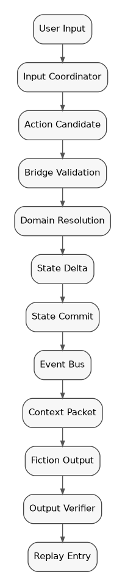

```mermaid
flowchart LR
    A[User Input] --> B[Input Coordinator]
    B --> C[Action Candidate]
    C --> D[Bridge Validation]
    D --> E[Domain Module Resolution]
    E --> F[State Delta]
    F --> G[State Commit]
    G --> H[Event Bus]
    H --> I[State Assembler]
    I --> J[Fiction Constructor]
    J --> K[Output Verifier]
    K --> L[Client Output and Replay Log]
```

## Problem addressed

Natural-language systems are flexible but ambiguous. Game engines are coherent but rigid. The Execution Spine lets AGE accept flexible input while still enforcing structured state, rules, and timing.

## Operating model

The Input Coordinator extracts intent. The Bridge Layer checks whether the action can be attempted. Domain Modules resolve what happens. The State Mutation Engine commits approved change. The Event Bus propagates consequences. The State Assembler prepares what the Fiction Constructor may know. The Fiction Constructor renders. The Output Verifier checks. The Replay Log records.

## Corpus arbitration integration

Corpus Arbitration Layer [CAL] means the component that answers unstructured corpus questions from source evidence. If an action depends on rule interpretation, table policy, or corpus evidence, the Bridge Layer can call CAL before module resolution or after conflict detection. CAL returns an Arbitration Envelope. Arbitration Envelope means the structured CAL answer containing ruling, sources, confidence, conflict notes, and the human decision point.

## Rewards

The spine provides auditability, replayability, testability, modularity, and prompt-model independence.

## Risks

The spine can become too slow or too formal for play. Ambiguous inputs may create excessive clarification loops.

## Mitigation

Use three paths: fast action path, quick ruling path, and detailed review path. Do not force detailed arbitration into every in-play action.

## Implementation path

Build the spine with a small module set and instrument every step. The early prototype should prefer visible logs and simple mechanics over hidden complexity.

## Success criteria

A single action can be traced from original user words to final verified output, including validation, resolution, State Delta, events, context packet, and replay entry.

---

# White Paper 02 - Narrative Scope, AGEScript, and Living World

## Document definitions

Amazing Game Engine [AGE] means the complete platform. Narrative Scope means the story scale at which an event is operating: spotlight, scene, act, chapter, arc, or epic. AGEScript means the authored scenario and consequence schema layer. Living World means the subsystem that advances background pressures beyond the immediate scene. TickPolicy means the rule for advancing time within a partition. Partition means a bounded state or knowledge region.

## Plain definition

Narrative Scope defines how close the story camera is. AGEScript defines authored scenario structure. The Living World system advances background pressures that are larger than the immediate scene.

## Problem addressed

A persistent narrative must handle immediate choices and large consequences without either railroading the player or simulating an entire world at full detail. AGE solves this by binding narrative scope to state scope and time scope.

## Responsibility

Narrative Scope manages spotlight, scene, act, chapter, arc, and epic. AGEScript defines preconditions, scenes, event hooks, transitions, consequences, and plot rebinding. Living World manages faction and macro pressures through TickPolicy and event thresholds.

## Operating model

A spotlight action can affect a scene. Scene outcomes can alter an act. Act outcomes can change a chapter. Chapter and arc pressure can manifest locally through events, rumors, prices, non-player character [NPC] movement, law enforcement, weather, technology, faction posture, or access changes.

## Consequence-first authorship

AGEScript should not assume that players follow one intended branch. It should define preconditions, pressures, costs, available transitions, fail states, success states, and consequence mappings. When player action breaks a planned path, the system preserves the committed consequence and then finds a valid continuation.

## Reward

AGE can preserve player agency while still allowing authored structure. The story can bend around player action because AGEScript binds consequences to state, not to a fixed linear branch.

## Risk

If the system overuses plot rebinding, players may feel that their choices do not matter. If it underuses rebinding, authored content becomes brittle.

## Mitigation

Plot rebinding must preserve cost, consequence, and causality. It may relocate pressure, swap actors, or change timing, but it must not erase committed outcomes.

## Implementation path

Define narrative scope, AGEScript nodes, preconditions, transition rules, consequence mappings, and Living World event hooks. Test with deliberate derailment cases.

## Success criteria

A player can solve, fail, avoid, or disrupt a scene, and the adventure continues through state-aware consequence rather than invalid retcon.

---

# White Paper 02B - Spatial, Narrative, and Temporal Scope

## Document definitions

Amazing Game Engine [AGE] means the complete platform. Spatial Scope means the physical scale of play. Narrative Scope means the story scale of play. Temporal Scope means the time scale of play. TickPolicy means the rule for advancing time within a partition. Transition Packet means the record that carries actors and consequences between scales. Troupe means a bounded play group with shared active state, timing, authority policy, visibility, and local overrides.

Non-player character [NPC] means a character controlled by the system, Referee, or authored scenario rather than by a player.

## Plain definition

This subsystem defines how AGE moves from room-scale action to world-scale consequence while keeping time coherent.

## Scope ladders

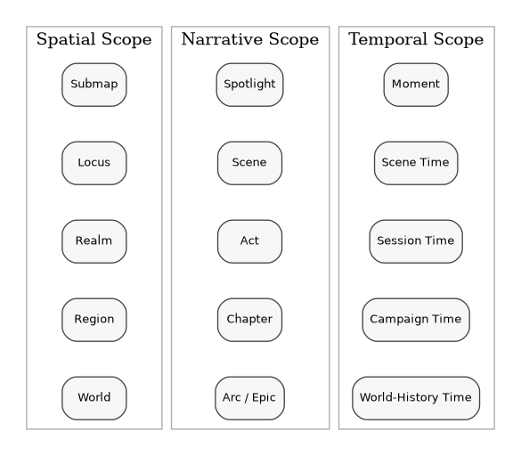

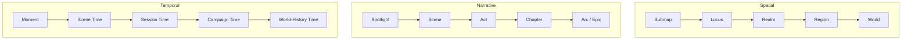

Spatial Scope runs through submap, locus, realm, region, and world. Narrative Scope runs through spotlight, scene, act, chapter, arc, and epic. Temporal Scope runs through moment, scene time, session time, campaign time, and world-history time.

## Problem addressed

A game cannot simulate every person, road, room, economy, and faction every second. It also cannot ignore large-scale consequences. AGE therefore uses scale-appropriate state and TickPolicy.

## Operating model

Local action uses fine resolution. Travel, downtime, faction moves, and world shifts use compressed ticks. A Transition Packet records elapsed time, route, resource use, encounters, background events, knowledge exposure, and arrival conditions.

## Troupe isolation

Troupe isolation prevents one group's unresolved or table-specific state from corrupting another group's experience. A troupe may have local rulings, visibility limits, time offsets, and authority policies without rewriting the shared corpus or global product state.

## Locale-to-world shifts

When local action triggers larger consequences, AGE routes the event upward through partitions. When world events manifest locally, AGE routes pressure downward as visible details, access changes, NPC movement, resource changes, rumors, law, weather, or faction behavior.

## Reward

AGE can show a living world without simulating all world detail at full resolution.

## Risk

Incorrect scale handling can create implausible travel, inconsistent time, or consequences that appear from nowhere.

## Mitigation

Use explicit TickPolicy, Transition Packets, scope gates, and event visibility rules.

## Success criteria

A character can leave a scene, travel through a larger geography, experience downtime, return to local action, and retain coherent time, resources, state, and world consequences.

---

# White Paper 03 - Partitions, State, and Memory

## Document definitions

Amazing Game Engine [AGE] means the complete platform. Partition means a bounded state or knowledge region. Canonical State means the authoritative committed facts of play. Memory means structured, scoped, versioned information rather than a chat transcript. State Assembler means the component that builds bounded context packets. Fiction Constructor means the Large Language Model [LLM] presentation layer. Corpus Arbitration Layer [CAL] means the component that answers corpus questions from sources. Role Service means the subsystem that governs bounded actors.

## Plain definition

Partitions define the boundaries of state and knowledge. Memory is not a transcript. It is structured, scoped, versioned information with ownership, visibility, and propagation rules.

## Problem addressed

Narrative systems fail when all facts are flattened into one context window. AGE separates spatial facts, actor facts, revealed knowledge, hidden knowledge, rules, roles, overlays, and authored content into partitions.

## Responsibility

This subsystem defines Abstract Partitions, Domain Partitions, state ownership, visibility, memory scope, narrative anchors, entity versions, and propagation rules. Abstract Partition means the general partition pattern. Domain Partition means a partition owned by a particular runtime or corpus domain.

## Operating model

A partition determines what can be known, changed, queried, summarized, or propagated. The State Assembler draws from partitions to create context packets. The Fiction Constructor only receives facts appropriate to its output task and visibility constraints.

## Integration

CAL uses corpus partitions. Role Service uses role and memory partitions. Runtime uses spatial and state partitions. These systems may communicate through contracts, but they must not collapse into one undifferentiated memory pool.

## Reward

AGE can preserve hidden information, character-limited knowledge, local consequence, table-specific rules, and versioned corpus state.

## Risk

Poor partition design causes stale facts, overexposure of hidden information, or missed consequences.

## Mitigation

Define partition ownership, visibility, update policy, propagation rules, and version behavior before adding complex content.

## Success criteria

The system can answer: who knows this, where is it true, which version applies, who may change it, and how far does the consequence propagate?

---

# White Paper 04 - Large Model System Graph [LMS-Graph] and Corpus Arbitration Layer [CAL]

## Document definitions

Amazing Game Engine [AGE] means the complete platform. Large Language Model [LLM] means a generative language model. Large Model System [LMS] means the wider model, retrieval, graph, tool, agent, and workspace system around one or more LLMs. LMS-Graph means the maintained graph/relational corpus substrate. CAL means the component that answers unstructured questions against LMS-Graph. Anchored Corpus Arbitration means the operation CAL performs: ground an answer in source material, expose authority, show conflicts, and preserve the human decision point. Rules Service means the first CAL deployment for a bounded rules corpus.

## Plain definition

LMS-Graph stores the corpus. CAL arbitrates questions against that corpus. The LLM may explain the answer, but the answer must be anchored to source, version, scope, authority, and conflict state.

## Problem addressed

LLMs can produce fluent answers from stale or ungrounded memory. Games, professional domains, and institutions need answers tied to source, version, scope, and authority. CAL shifts the LLM from parametric recall to evidence-guided explanation.

## Arbitration flow

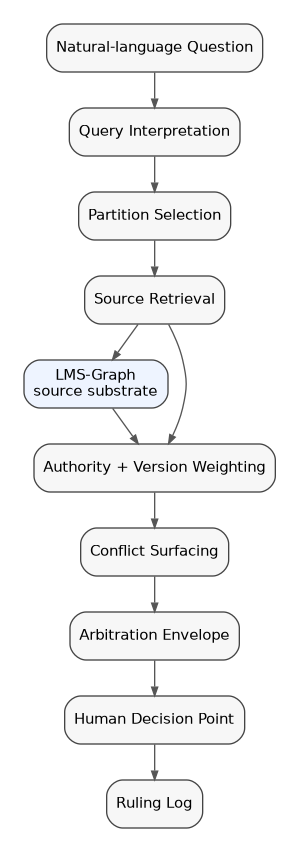

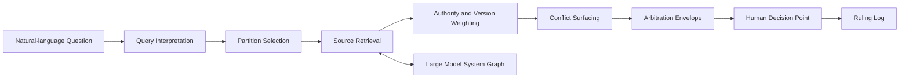

## LMS-Graph

LMS-Graph uses graph structures for relationships, citations, dependencies, exceptions, conflicts, version chains, scope, jurisdiction, and concept adjacency. It uses relational structures for tables, thresholds, dates, requirements, classifications, and repeatable facts.

## CAL responsibility

CAL receives a natural-language question, interprets it, chooses corpus partitions, retrieves source evidence, weighs authority, detects conflict, forms a primary answer, preserves alternative readings, identifies the human decision point, and logs the arbitration.

## Rules Service

Rules Service is the first CAL deployment. It should begin with an owned or licensed game rules corpus. That corpus is bounded, versioned, conflict-rich, and low-risk compared to professional domains.

## Output modes

Quick ruling is optimized for play continuity. It gives a concise answer, confidence, authority tier, and human decision point.

Detailed ruling is optimized for review, authoring, testing, or disputes. It includes sources, alternatives, conflicts, deep-dive paths, and override history.

## Reward

AGE gains a source-grounded ruling layer that can improve play, reduce rules friction, capture Referee overrides, and create reusable tests.

## Risk

Retrieved evidence can be incomplete, misweighted, out of scope, or too slow for play. A sourced answer can still be wrong if the corpus or authority policy is wrong.

## Mitigation

Use output envelopes, authority tiers, conflict flags, source versioning, scope labels, quick and detailed modes, Referee override capture, and corpus-improvement loops.

## Success criteria

A rules question is answered from source-bound evidence rather than model memory, with version, authority tier, confidence, conflicts, and human decision point visible.

---

# White Paper 04B - World Generation, Lazy Ontology, and Overlays

## Document definitions

Amazing Game Engine [AGE] means the complete platform. World Scaffold means incomplete but structured world possibility. Lazy Ontology means the rule that AGE actualizes detail only when needed. Actualization means turning scaffolded possibility into versioned canonical detail. Overlay means a concern-specific lens that reads state and proposes consequences. Bridge Layer means the validation and routing boundary that decides whether a proposal may become state.

Corpus Arbitration Layer [CAL] means the component that answers corpus questions from source evidence.

## Plain definition

Lazy Ontology lets AGE start with world scaffolding and actualize detail only when needed. Overlays are concern-specific lenses that interpret state and propose consequences.

## Problem addressed

A persistent world needs depth, but fully prebuilding or simulating all detail is wasteful and brittle. AGE separates scaffolded possibility from actualized canonical fact.

## Actualization model

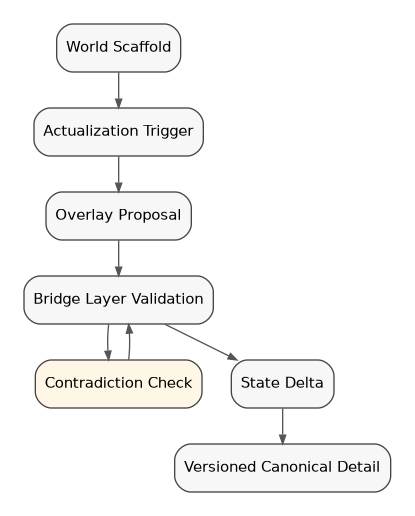

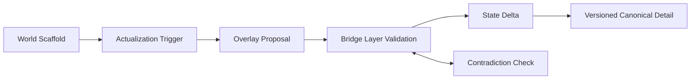

## Responsibility

This subsystem defines world scaffolds, actualization triggers, provenance, contradiction checks, overlay proposal rules, technology-level vectors, cultural, law, economy, faction, and religion lenses, and Living World interactions.

## Operating model

The world may know that a city has a market district before it knows every shop. A shop becomes canonical when a player visits, an author defines it, an event needs it, CAL references it, or an overlay actualizes it. Once created, it is versioned state.

Overlays inspect relevant partitions and propose effects. A law overlay may restrict weapons in a city. A technology overlay may determine available devices. An economy overlay may alter prices. A religion overlay may change social access. The Bridge Layer validates proposals before mutation.

## Reward

AGE can provide large-world feel with manageable state cost and strong author leverage.

## Risk

Lazy actualization can create contradictions if later detail conflicts with prior scaffold or authored fact.

## Mitigation

Track provenance, actualization reason, scope, overlay source, and contradiction tests.

## Success criteria

AGE can create useful local detail on demand, preserve it as canon, and prevent overlays from silently mutating state.

---

# White Paper 05 - Role Service, Actors, and Role Semantic Contracts

## Document definitions

Amazing Game Engine [AGE] means the complete platform. Role Service means the subsystem that defines bounded actors. Role Semantic Contract means the durable contract for a role's knowledge, behavior, authority, memory, evidence, and permitted action. Corpus Arbitration Layer [CAL] means the component that answers corpus questions from source evidence. Non-player character [NPC] means a character controlled by the system, Referee, or authored scenario rather than by a player.

Large Language Model [LLM] means a generative language model used for language interpretation or presentation.

Semantic Quality Assurance [Semantic QA] means tests that examine meaning, authority, role behavior, rules, state, and prose-state agreement.

## Plain definition

Role Service defines bounded actors. A role is not just a prompt persona. It is a contract for knowledge, behavior, authority, memory, evidence, and permitted action.

## Problem addressed

LLM characters and assistants drift when their behavior is held only in prompt text. AGE roles need durable boundaries: what they know, what they can say, what they can do, what evidence they need, and when they must defer.

## Role boundary model

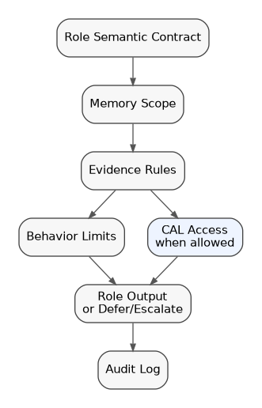

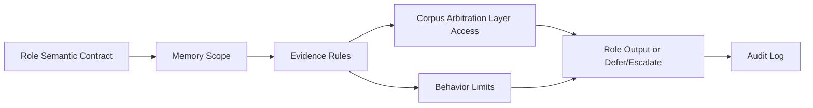

## Responsibility

Role Service owns Role Semantic Contracts, role epistemology, permissions, memory scope, behavioral constraints, evidence requirements, refusal rules, escalation rules, and role audit logs.

## Role Semantic Contract

A Role Semantic Contract defines purpose, audience, scope, knowledge boundaries, allowed claims, prohibited claims, tone and register constraints, tool access, CAL access, memory rules, and verification criteria.

## Role epistemology

Role epistemology defines what the role knows and how it knows it: personal observation, world state, corpus retrieval, author knowledge, table policy, rumor, inference, or hidden engine state. Roles must not leak knowledge outside their epistemic scope.

## Reward

AGE can run NPCs, advisors, tutors, facilitators, authoring helpers, and later professional support roles without treating them as unbounded chatbots.

## Risk

Roles can become too rigid, too generic, or falsely authoritative.

## Mitigation

Use contract versions, evidence rules, CAL references, memory partitions, Semantic QA, and drift detection.

## Success criteria

A role can interact naturally while staying within its knowledge, authority, behavior, and evidence boundaries.

---

# White Paper 05B - AGEScript, Plot, and Eventing

## Document definitions

Amazing Game Engine [AGE] means the complete platform. AGEScript means the authored scenario and consequence schema layer. Eventing means the runtime mechanism that turns committed changes into future pressure, opportunities, and world reactions. Event Generator means the subsystem that creates bounded events from current state. Plot Rebinding means relocating unresolved story pressure when player action invalidates the original path.

## Plain definition

AGEScript is the authored consequence layer. Eventing is the runtime mechanism that turns committed changes into future pressure, opportunities, and world reactions.

## Problem addressed

Traditional branching content breaks when players choose unexpected paths. Purely generated content loses authorial structure. AGEScript gives authors state-aware structure without requiring every branch to be prewritten.

## Consequence-first design

AGEScript should define preconditions, scenes, actors, pressures, transitions, event hooks, fail states, success states, and consequence mappings. It should not assume that the player follows one intended branch.

## Event generator

Event tables generate bounded surprises from current state, scope, overlay pressure, faction goals, travel, downtime, or scene complications. Dynamic table mutation allows prior outcomes to change future event likelihood.

## Plot rebinding

Plot Rebinding lets unresolved story pressure attach to a different actor, location, clue, cost, or time window when player action invalidates the original path. Rebinding must preserve causality and consequence.

## Reward

Authors get robust scenario design. Players get freedom without collapsing the adventure.

## Risk

If rebinding is too aggressive, it feels like railroading. If it is too weak, content becomes brittle.

## Mitigation

Expose rebinding rules to authors, record rebinding events, and make costs and consequences visible in replay.

## Success criteria

An adventure can continue after unexpected player action while preserving state, causality, and meaningful consequence.

---

# White Paper 06 - Semantic Quality Assurance [QA], Audit, and Certification Artifacts

## Document definitions

Amazing Game Engine [AGE] means the complete platform. Quality Assurance [QA] means testing and review. Semantic QA means tests that examine meaning, authority, role behavior, rule correctness, state consistency, and prose-state agreement. Audit Artifact means a persistent record that shows what happened and why. Certification Artifact means a reviewable evidence package; it is not a claim that AGE is an external certifying authority.

Corpus Arbitration Layer [CAL] means the component that answers corpus questions from source evidence.

Referee means the human table authority who adjudicates play where human judgment is required.

## Plain definition

Semantic QA tests whether outputs, roles, rulings, and state transitions obey AGE's contracts. Audit Artifacts record what happened and why.

## Problem addressed

A generative system can fail in ways ordinary unit tests miss: contradiction, hidden state leakage, invalid rule statements, role drift, unsupported authority, or prose-state mismatch.

## Responsibility

This subsystem owns test harnesses, replay analysis, contradiction detection, output verification, role drift checks, CAL ruling review, override analysis, and certification-style artifacts.

## Certification posture

AGE should first produce Certification Artifacts, not claim to be an external certifying authority. Artifacts include replay logs, source-bound ruling envelopes, role contract scores, drift reports, override records, and state-prose verification results.

## Reward

AGE can measure its own reliability and convert failures into tests.

## Risk

QA can become performative if tests are not tied to real failure modes.

## Mitigation

Seed tests from play errors, Referee overrides, contradiction cases, corpus conflicts, and role violations.

## Success criteria

A failed output or ruling becomes a reproducible test case, and the system can show whether later builds fixed it.

---

# White Paper 06B - Authoring User Experience [UX] and Capture

## Document definitions

Amazing Game Engine [AGE] means the complete platform. User Experience [UX] means the author's practical interaction with AGE tools. User Interface [UI] means the visible controls, screens, forms, panels, prompts, and previews used to operate those tools. AGEScript means the authored scenario and consequence schema layer. Corpus Arbitration Layer [CAL] means the component that answers corpus questions from source evidence.

Non-player character [NPC] means a character controlled by the system, Referee, or authored scenario rather than by a player.

## Plain definition

Authoring UX turns AGE's architecture into usable creative tools. It lets authors define worlds, systems, roles, events, overlays, and scripts without directly manipulating raw engine structures.

## Problem addressed

AGE concepts are powerful but technical. Without good authoring tools, the system becomes inaccessible to creators.

## Author types

Worldbuilder Authors define geography, cultures, factions, technology levels, history, locations, and world scaffolds.

System Authors define mechanics, rules references, resources, tests, conflict resolution, and CAL corpus policies.

Role Authors define NPCs, advisors, tutors, facilitators, and role contracts.

Adventure Authors define AGEScript packages, scenes, event tables, transitions, and consequence structures.

## Capture loop

The author describes intent. The system proposes structured entities. The author reviews. The validator checks consistency. Preview simulation tests sample paths. The package records provenance and publishes.

## Reward

AGE can scale content creation without forcing authors to become engine programmers.

## Risk

If authoring hides too much, authors lose control. If it exposes too much, authors face schema burden.

## Mitigation

Use layered UX: plain-language capture, structured editor, validation panel, simulation preview, and advanced schema access.

## Success criteria

An author can build and publish a bounded adventure with locations, actors, events, rules references, and consequences that pass validation and run in the engine.

---

# White Paper 07 - Client, Multiplayer, Communication, and Output

## Document definitions

Amazing Game Engine [AGE] means the complete platform. Client means the player-facing and Referee-facing application surface. Multiplayer means more than one player acting in a shared troupe state. Troupe means a bounded play group with shared state, timing, authority policy, and visibility. User Interface [UI] means the visible controls, screens, prompts, and displays through which users interact with AGE.

## Plain definition

This subsystem controls how players interact with AGE, how multiple players share state, how communication is scoped, and how verified output is displayed.

## Problem addressed

Multiplayer narrative fails when players see inconsistent state, act out of order, or communicate without scope. AGE needs explicit synchronization, visibility, and communication rules.

## Responsibility

The client layer owns input modes, choice presentation, free text, ruling requests, synchronization state, spotlight control, communication channels, voice and display options, replay access, and moderation or audit views.

## Troupe model

The first multiplayer unit is a troupe. Troupe isolation protects state coherence and permits table-specific policy.

## Communication

Communication should respect spatial proximity, channel, directive, character voice, visibility, and moderation logging. Original user text should remain available for audit where moderation requires it.

## Reward

Players get natural-language agency without losing shared reality.

## Risk

Poor UI can hide why something happened, interrupt pacing, or expose too much system machinery.

## Mitigation

Separate player-facing prose from optional details: quick explanation, ruling details, replay or audit view, and Referee tools.

## Success criteria

Multiple players can act, communicate, receive rulings, and remain synchronized around one coherent troupe state.

---

# White Paper 08 - Agent Service, Model Context Protocol [MCP], and Professional Extensions

## Document definitions

Amazing Game Engine [AGE] means the complete platform. Agent Service means the later AGE subsystem that allows qualified roles to perform bounded external actions. Model Context Protocol [MCP] means a protocol pattern for connecting model systems to external tools and context providers. Application Programming Interface [API] means a software interface used by one system to request services from another. Role Service means the subsystem that governs bounded actors. Corpus Arbitration Layer [CAL] means the component that answers source-grounded corpus questions. Minimum Viable Product [MVP] means the first narrow product that proves the core AGE loop.

## Plain definition

Agent Service is the later layer that allows qualified roles to perform bounded external actions through APIs or MCP gateways.

## Problem addressed

Some future AGE roles may need to do more than speak: schedule, file, notify, create tickets, update systems, or coordinate workflows. That is not safe until Role Service, CAL, permissions, and audit are mature.

## Responsibility

Agent Service owns action envelopes, external tool permissions, API and MCP integration, approval gates, revocation, audit, and human oversight.

## Relation to other subsystems

Agent Service depends on Role Service for actor identity and permissions, CAL for source-grounded guidance where needed, Semantic QA for behavior checks, and governance for authority boundaries.

## Reward

AGE can eventually support serious-play operations, enterprise workflows, and bounded professional support tasks.

## Risk

External action creates liability and safety exposure. A wrong answer is one risk; a wrong action is larger.

## Mitigation

Keep Agent Service out of the MVP. Require explicit permissions, narrow action scopes, human approval for consequential actions, replay, revocation, and audit.

## Success criteria

A qualified role can perform a bounded external action only when authorized, logged, reviewable, and reversible or accountable.

---

# White Paper 09 - Product Roadmap, Business Risk, and Minimum Viable Product [MVP] Narrowing

## Document definitions

Amazing Game Engine [AGE] means the complete platform. Minimum Viable Product [MVP] means the smallest product that proves AGE can author, play, arbitrate, commit state, render, replay, test, and improve. Corpus Arbitration Layer [CAL] means the component that answers corpus questions from source evidence. Quality Assurance [QA] means testing and review. Return on Investment [ROI] means the practical economic return expected from a product or market expansion.

Rules Service means the first CAL deployment for a bounded rules corpus.

Agent Service means the later AGE subsystem that allows qualified roles to perform bounded external actions.

User Experience [UX] means the practical user experience of authoring, play, review, and operation.

## Plain definition

AGE should begin as a narrow game-native product and expand only after the runtime, CAL, authoring, QA, and governance layers prove themselves.

## Product wedge

The first product is a persistent, state-authoritative, natural-language game runtime with source-grounded rules arbitration for one bounded corpus.

## Why gaming first

Gaming has complex rules, high query volume, ambiguity, human authority, version conflicts, and immediate feedback. It is structurally rich but low-stakes compared to professional domains.

## Market expansion principle

AGE should not predetermine the first non-gaming professional market. Market readiness depends on corpus access, licensing, buyer urgency, liability tolerance, competition, and ROI. The architecture should remain portable while the MVP remains narrow.

## Likely expansion sequence

1. Game-native AGE runtime and Rules Service.
2. Licensed entertainment corpora and creator tools.
3. Serious play: training, wargames, simulations, education.
4. Internal enterprise policy and technical documentation.
5. Regulated or professional reference corpora where licensing and governance permit.
6. Agent Service only after authority and audit maturity.

## Rewards

The architecture can create a defensible product wedge, recurring corpus value, author ecosystem, serious-play applications, and downstream enterprise or professional optionality.

## Risks

Scope creep, capital intensity, weak authoring UX, slow inference, licensing limits, marketplace quality, and premature professional claims are the major business risks.

## Mitigation

Ship one bounded game-native system first. Treat every expansion as a new corpus, authority, licensing, and governance problem rather than a simple feature toggle.

## MVP success criteria

A bounded adventure can be authored, played, rules-arbitrated, replayed, tested, and improved through human override capture.

