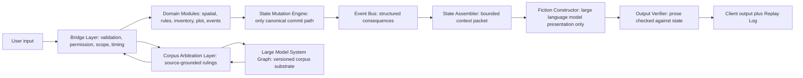
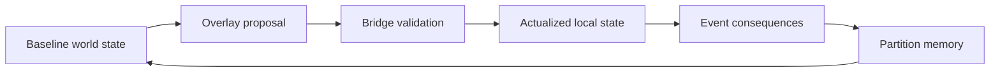
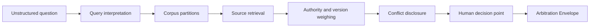
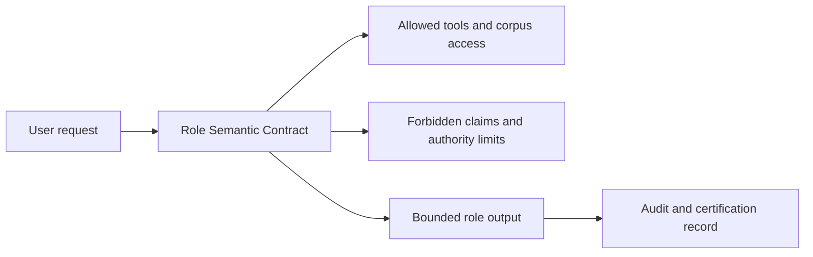

# Amazing Game Engine [AGE] Aggregated White Papers

This volume combines the informative AGE white papers. Each paper is written as a standalone reader path. Major terms are defined before use inside the paper where the term is needed. Diagrams summarize architecture after the controlling concepts are introduced.

---

# White Paper 01 - Core Runtime and Bridge Layer

## Purpose

The Amazing Game Engine [AGE] is a state-authoritative narrative simulation platform. The Core Runtime is the part of AGE that turns user intent into validated state change. The Bridge Layer is the validation and routing boundary between language, roles, client input, domain modules, overlays, corpus arbitration, and canonical state. A large language model [LLM] is a generative language model used by AGE for interpretation and prose presentation; it does not own canonical state.

The Core Runtime exists to enforce one rule: generated prose cannot become truth by itself. The engine must decide what happened before the Fiction Constructor writes what happened. The Fiction Constructor is the LLM-based presentation layer. It receives bounded context and committed outcome data, then renders that outcome for the user. It is downstream of state, not upstream of state.

## Runtime Thesis

Most artificial intelligence [AI] narrative systems place the language generator in the position of world owner. The model receives context, generates a continuation, and the continuation implies what changed. This creates flexible prose and unstable consequence. AGE reverses that order. A user's words become an action candidate. An action candidate is the structured representation of a proposed action. The Bridge Layer checks the candidate. Domain modules resolve it. The State Mutation Engine commits approved change. Only then does prose explain the result.

A domain module is a deterministic service with bounded responsibility. A movement module determines movement. An inventory module determines possession, weight, use, loss, or transfer. A rules module determines rule application. A combat module determines attack, defense, injury, and consequence. A plot module determines authored transitions and pressure. An event module determines scheduled or triggered background change. Modules may be simple at first, but they must own their boundaries.

## Architecture

The Bridge Layer is the narrow gate that prevents uncontrolled state mutation. It receives action candidates from the Input Coordinator, role output from the Role Service, authored scenario events from AGEScript, and corpus arbitration results from the Corpus Arbitration Layer [CAL]. CAL is the source-grounded service that answers rules or corpus questions against maintained source evidence. The Bridge Layer decides whether the candidate may proceed, must be rejected, requires clarification, requires CAL, or requires a human decision.

The State Mutation Engine is the only component allowed to commit approved state change. A state delta is a proposed change to canonical state. A state delta may add injury, change location, spend money, alter inventory, reveal knowledge, update a relationship, trigger a timer, change faction posture, or mark that a rule was applied. The state delta is not canonical until the State Mutation Engine commits it.

The Event Bus is the structured consequence channel. After a commit, the Event Bus distributes relevant events to partitions, schedules, role memories, visibility records, alerts, and future triggers. The State Assembler then builds a bounded context packet for presentation. The Output Verifier checks the generated result against the committed facts.

## Bridge Layer Checks

The Bridge Layer should perform practical checks before resolution. It should check actor identity, player authority, troupe authority, entity version, location, reach, time, visibility, inventory, active conditions, rule availability, overlay limits, target existence, and conflict with unresolved actions. The Bridge Layer also checks whether the action belongs to a domain module that exists. If no module can resolve the action, the Bridge Layer must either ask for a human ruling or reject the action as unsupported.

This prevents the common failure where a model accepts every plausible sentence. A player may say that their character uses a helicopter, but the Bridge Layer checks whether the character has a helicopter, can access it, can pilot it, has time to reach it, and is in a world where helicopters exist. If those facts are false or unknown, the action cannot proceed as stated.

## Interface Contract

The Core Runtime requires a small set of records.

| Record | Meaning | Owner |
| --- | --- | --- |
| Action Candidate | Structured form of a proposed action | Input Coordinator |
| Validation Result | Bridge Layer decision on whether the action may proceed | Bridge Layer |
| Module Request | Bounded call to a deterministic resolver | Bridge Layer |
| State Delta | Proposed canonical change | Domain Module |
| Commit Record | Accepted state mutation | State Mutation Engine |
| Event Record | Structured consequence emitted after commit | Event Bus |
| Context Packet | Bounded facts allowed into presentation | State Assembler |
| Output Finding | Verification result for generated prose | Output Verifier |
| Replay Entry | Durable action path and result | Replay Log |

The Replay Log is not a decorative transcript. It is the audit record. It should show the original user words, the action candidate, validation result, module calls, state deltas, committed changes, event emissions, context packet references, output verification, and final output.

## Example

A player says, "I use the stolen keycard to open the security door and sneak into the archive." AGE should not merely generate a paragraph where the door opens. The Input Coordinator extracts two action candidates: use keycard on door and move through door quietly. The Bridge Layer checks whether the character has the keycard, whether the keycard can be used by this character, whether the door accepts that credential, whether the character is at the door, whether the character has time, and whether stealth resolution is needed. The access-control module resolves the card. The movement module resolves passage. The stealth or perception module resolves exposure. The State Mutation Engine commits door state, character location, time passage, noise, camera logs, and any alert flag. The Fiction Constructor may then say what the player sees.

If the Output Verifier sees the prose claim that no one can ever discover the intrusion, it rejects the output unless the committed state actually erased cameras, witnesses, logs, and alarms. The prose must not overrule the commit record.

## Rewards

The reward is enforceable consequence. AGE can support long-running campaigns because state does not depend on model memory. It can support multiplayer because conflicts are routed through structured validation. It can support replay because each action has a recorded path. It can support authoring because modules give authors reliable boundaries. It can support later professional corpus work because the same architecture separates language from authority.

## Risks and Controls

The main risk is latency. Every check can slow play. The mitigation is not to remove the Bridge Layer. The mitigation is to divide the runtime into fast checks, deferred checks, and human escalation. Routine actions should pass quickly. Ambiguous rule questions can call CAL. High-impact or unsupported actions can ask the Referee. A Referee is the human table authority who adjudicates play where human judgment is required.

The second risk is overbuilding. A first AGE implementation should not attempt every possible module. It should use a minimum set: identity, location, inventory, time, simple physical interaction, rules arbitration, event emission, output verification, and replay. Combat, economics, faction strategy, visual generation, and external agents can be added after the gate works.

## Minimum Implementation

The minimum implementation should not begin with every possible rule. It should begin with a strict authority chain. The Input Coordinator may be simple. The domain modules may be few. The client may be plain. The important thing is that no action reaches canonical state without passing through validation and commit. A small working runtime with strict state is better than a broad demo that still lets generated prose decide outcomes.

The minimum domain modules should include identity, location, inventory, time, physical interaction, and rules reference. Identity determines who acts. Location determines where the actor and target are. Inventory determines what can be used. Time determines whether the action fits the current tick. Physical interaction resolves simple world changes. Rules reference calls the Corpus Arbitration Layer when a rule question affects the action.

## Output Verification

Output verification should begin with hard checks. The generated prose must not change location, inventory, injury, death, relationship, time, money, visibility, or rule result unless those changes appear in the committed state. The verifier does not need literary taste in the first build. It needs fidelity. A dull faithful paragraph is better than an exciting paragraph that corrupts state.

Later verification can check tone, style, pacing, and genre. Those checks are useful, but they are secondary. The first verifier protects truth.

## Human Override

The Referee may override a validation result, module result, or arbitration recommendation. That override must become a recorded decision. A recorded override protects future play because the system knows the new local rule or exception. An unrecorded override becomes another form of drift. The Referee should not need to write a legal opinion, but the system should capture what changed and why it matters.

## Success Criteria

The Core Runtime succeeds when a generated paragraph cannot add a canonical fact unless the State Mutation Engine already authorized that fact. It also succeeds when a replay can explain why a state change occurred, which module resolved it, which rule or source was used, which human decision was required, and which facts the Fiction Constructor was allowed to see.

---

# White Paper 01B - Engine Execution Spine

## Purpose

The Amazing Game Engine [AGE] uses an Execution Spine to turn user language into verified output. The Execution Spine is the ordered input-to-output pipeline followed by a player action, authored event, role action, or rules request. A large language model [LLM] may help interpret language and render prose, but the Execution Spine keeps state, timing, rule application, and replay outside the LLM's authority.

The Execution Spine matters because natural-language play is ambiguous. A player sentence often contains intent, assumption, narration, request, and hoped-for outcome in the same phrase. AGE must separate those parts before it changes the world.

## The Spine

The Input Coordinator converts user words into one or more action candidates. An action candidate is the structured form of a proposed action. The Bridge Layer validates each candidate. A domain module resolves the valid candidate. A domain module is a deterministic resolver with bounded responsibility. The State Mutation Engine commits approved state deltas. A state delta is a proposed canonical change. The Event Bus propagates consequences. The State Assembler builds bounded context. The Fiction Constructor writes the prose. The Output Verifier checks the prose. The Replay Log records the action path.

## Step-by-Step Operation

1. The user supplies words, a client command, or an authored event trigger.
2. The Input Coordinator extracts actor, intent, target, method, hoped-for result, timing, and unresolved assumptions.
3. The Bridge Layer checks identity, authority, scope, visibility, timing, location, inventory, rule availability, active overlays, and entity versions.
4. The Bridge Layer routes the valid candidate to the correct domain module or asks for clarification.
5. The domain module resolves the attempt and proposes one or more state deltas.
6. The State Mutation Engine accepts, rejects, or queues each state delta.
7. The Event Bus emits structured consequences to partitions and schedules.
8. The State Assembler builds a context packet containing only the facts the output layer may use.
9. The Fiction Constructor writes the result.
10. The Output Verifier checks the result against committed state and active constraints.
11. The client receives output and the Replay Log receives the durable record.

This order is important. The player may speak naturally, but the engine must not resolve naturally. It resolves structurally and then renders naturally.

## Clarification, Rejection, and Escalation

Not every input should proceed. If the user says, "I go there," and there are multiple possible destinations, the Bridge Layer should ask a clarification question. If the user says, "I draw the pistol," and the character has no pistol, the Bridge Layer should reject or revise the action. If the user says, "I invoke the obscure edge-case rule from the supplement," the Bridge Layer may call the Corpus Arbitration Layer [CAL]. CAL is the source-grounded service that answers corpus questions from maintained sources. If CAL finds conflicting authority or a table-policy question, the Referee decides.

The Execution Spine should therefore support four paths: immediate resolution, clarification, rejection, and human escalation. A fifth path exists for detailed review when the action involves a complex rules issue, high-impact state change, or source conflict.

## Fast Path and Detailed Path

AGE should not force every action through the slowest path. Walking across a room, checking a backpack, reading a visible sign, or speaking to a present non-player character can use the fast path. A non-player character [NPC] is a character controlled by the system, Referee, or authored scenario rather than by a player. The fast path uses current state, obvious permissions, and a simple resolver.

Detailed path resolution belongs to contested actions, expensive actions, combat, stealth, deception, rules questions, external tool calls, or events that propagate across partitions. A partition is a bounded state or knowledge region. Detailed resolution may require CAL, multiple modules, event scheduling, and explicit replay notes.

## Example

A player writes, "Before the guard notices, I toss the coin under the wagon, slip behind him, and open the side door." This single sentence contains distraction, movement, timing, stealth, and door interaction. The Input Coordinator splits it into candidates. The Bridge Layer checks whether the character has a coin, whether the wagon exists, whether the guard can be distracted, whether there is a side door, and whether the player has enough time. The distraction module resolves the coin. The perception module resolves the guard. The movement module resolves position. The door module resolves access. If any step fails, later steps may be blocked or modified.

The Fiction Constructor should not narrate all steps as successful merely because they make an exciting paragraph. It must render the actual committed sequence.

## Replay as a Design Requirement

Replay is a primary requirement, not a later feature. If AGE cannot replay an action path, it cannot debug rules, certify roles, reproduce sessions, or investigate drift. The Replay Log should store enough information to answer these questions: What did the user say? What did the system think the user meant? What facts were available? Which checks passed? Which module resolved the action? What state delta was proposed? What was committed? What output was rejected or accepted? Which human decision altered the result?

This record allows AGE to improve without relying on vague transcript review. The system can test whether the same input against the same state produces the same result.

## Performance Control

The spine creates latency risk. AGE should use tiered processing. Fast path actions should avoid expensive model calls where possible. Bridge checks can run in parallel when they do not depend on one another. Template prose can handle routine state reports. The Fiction Constructor can stream text only after the necessary committed result exists. Caching can support repeated descriptions, but cached prose must be invalidated when state changes.

Performance tuning should not compromise authority. A fast wrong answer is worse than a slightly slower valid answer in a persistent world.

## Action Candidate Design

The action candidate should be explicit enough for the Bridge Layer to reject it. It should name the actor, intent, target, tool, method, location, expected duration, urgency, resource use, and assumptions. It should also separate the player's desired result from the attempted method. A player may say, "I convince the guard to leave." The desired result is guard departure. The attempted method may be bribery, intimidation, deception, appeal to authority, seduction, or simple persuasion. The system must know which method is being attempted before it can resolve the action.

An action candidate may contain several linked actions. The engine should preserve order when order matters. If the character must unlock a door before moving through it, the movement candidate depends on the lock result. If the character can shout while running, the speech and movement may resolve in parallel or under one time tick.

## Failure Is State

Failure should not be treated as a missing success paragraph. A failed action may spend time, reveal intent, create noise, damage a tool, increase suspicion, trigger a clock, change a relationship, or expose the character. The Execution Spine should record failure with the same seriousness as success. This is how AGE makes consequence persistent.

A failed lockpick attempt that leaves scratches on the lock is different from a clean failure. A failed lie that creates suspicion is different from a lie that simply does not persuade. A failed jump that injures the character is different from a failed jump that leaves the character in place. Domain modules should return meaningful failed-state deltas where the rules or fiction support them.

## Replay as Test Data

Every replay entry is also test data. If users repeatedly correct the same kind of action candidate, the Input Coordinator needs improvement. If the Bridge Layer frequently asks unnecessary clarification questions, its validation policy is too rigid. If the Output Verifier rejects many outputs for the same hallucinated fact type, the Fiction Constructor prompt or context packet needs revision. The Execution Spine therefore doubles as the product's improvement loop.

## Success Criteria

The Execution Spine succeeds when a single action can be traced from original words to verified output. It also succeeds when ambiguous input produces a clear clarification, impossible input produces a clear rejection, source-dependent input produces a CAL arbitration envelope, and high-authority decisions remain with the Referee or designated human authority.

---

# White Paper 02 - Narrative Scope, AGEScript, and the Living World

## Purpose

The Amazing Game Engine [AGE] is built to support persistent narrative play without forcing the player through fixed branches. Narrative Scope is the story scale at which an event operates. The core levels are spotlight, scene, act, chapter, arc, and epic. AGEScript is the authored scenario and consequence schema layer. The Living World is the background system that advances pressures beyond the immediate scene.

This white paper explains how AGE gives authors structure without turning authored structure into railroading.

## Narrative Scope

Narrative Scope tells AGE how close the story camera is. Spotlight scope concerns one character, choice, exchange, or action. Scene scope concerns the immediate encounter. Act scope concerns a local objective or dramatic unit. Chapter scope concerns a larger mission, journey, dungeon, investigation, or operation. Arc scope concerns a campaign movement. Epic scope concerns world-historical or setting-defining change.

The levels are not literary decoration. They control resolution. A spotlight action may be resolved in seconds. A chapter transition may compress travel, downtime, wounds, supplies, rumor, and faction response. An epic pressure may not appear as a direct scene until it manifests through weather, law, war, migration, trade, technology, or social change.

## AGEScript as Consequence Schema

AGEScript should be read as authored logic, not a screenplay. It defines preconditions, pressures, scenes, triggers, transition rules, costs, state mutations, fail states, success states, and re-entry points. A fixed branch says the players must find the key and then open the vault. AGEScript says the vault exists, the key exists, the lock has properties, guards have schedules, alarms have thresholds, and several consequences can follow depending on what the players do.

This is consequence-first authorship. The author prepares meaningful conditions. The engine preserves what happened. If the players avoid the intended route, the authored pressure does not vanish. It changes form through state-aware continuation.

## The Living World

The Living World is the subsystem that advances background pressures. It does not simulate the entire world every second. It advances relevant partitions through TickPolicy. A TickPolicy is the rule for advancing time within a partition. A partition is a bounded state or knowledge region. The Living World can move factions, advance clocks, spread rumors, change prices, trigger weather, alter travel routes, schedule NPC actions, update legal response, or carry consequences from one scale to another.

The Living World gives AGE continuity beyond the immediate scene. If the players burn a warehouse, the fire may alter city supply, guard deployment, criminal behavior, witness testimony, insurance claims, faction pressure, and future prices. The exact propagation depends on partition scope and event rules.

## Player Derailment

Player derailment is not a bug. It is the ordinary condition of interactive play. The player may kill the expected informant, ignore the quest, destroy the bridge, ally with the villain, sell the artifact, expose the conspiracy early, or flee the region. AGE should not secretly undo those actions to restore the intended plot. It should preserve the consequence and then continue from the new state.

AGEScript handles derailment by binding plot movement to conditions rather than single branches. If the informant dies, the information may be lost, delayed, inherited by another actor, found in notes, discovered through investigation, or become unavailable. The correct continuation depends on what the authored package allows and what the Referee approves. The important rule is that the death remains true. Rebinding can move pressure; it cannot erase cost.

## Scene Rebinding

Scene rebinding is the controlled process of relocating or reshaping dramatic pressure after player action changes the expected path. AGE may relocate a clue, replace a messenger, advance a faction clock, expose a different witness, or move a confrontation to a new site. The system must record why the rebinding happened and what cost was preserved.

Rebinding becomes dishonest if it makes every choice produce the same result. The Referee and authoring tools should treat rebinding as continuity repair, not outcome laundering. A failed negotiation may still start a war. A dead guide may still leave the party lost. A destroyed artifact may still remove the easiest route. AGE can keep the story playable without making all roads identical.

## Basic Adventure Model

The basic adventure is the smallest useful AGEScript package. It should define the location, active actors, initial situation, player objective, optional objectives, obstacles, pressure clocks, available scenes, major transitions, resolution conditions, and aftermath. It should also state what happens if the players refuse the objective, leave the location, fail early, or solve the problem in an unexpected way.

This is where AGE differs from a conventional choose-your-own-adventure structure. A choose-your-own-adventure structure presents fixed choices. AGE presents stateful conditions. The player can attempt actions not listed by the author. The engine tests those actions against the world, rules, and scenario constraints.

## Example

A prepared scene expects the characters to interrogate a captured cultist. Instead, the players release the cultist and secretly follow him. In a brittle script, the scene breaks because the interrogation branch was skipped. In AGE, AGEScript records that the cultist was released, frightened, watched, and followed. The Living World advances his route, contacts, panic, and counter-surveillance. The next scene may become a tailing scene, an ambush, a hideout discovery, or a lost opportunity. The original information may appear differently or not at all.

The system protects both agency and structure. The players changed the route. They did not make the author's preparation useless.

## Risks

The first risk is invisible railroading. If every deviation quietly returns to the same content, players will learn that their choices do not matter. The second risk is brittle authorship. If every deviation breaks the package, authors cannot prepare usable material. The third risk is over-simulation. If every background pressure advances in detail, the system becomes slow and unreadable.

The mitigation is explicit consequence. AGEScript should identify which pressures may rebind, which consequences are fixed, which information can move, which information can be lost, and which costs must remain.

## Author Control

Consequence-first authorship does not remove author control. It changes where control is placed. The author controls the situation, actors, resources, pressures, constraints, and consequences. The author does not control every player decision. This is a better fit for role-playing games because the value of play is that players make meaningful decisions inside a prepared world.

The author should identify which parts of an adventure are essential and which are replaceable. A villain's goal may be essential. The exact tavern where the first clue appears may be replaceable. A prophecy may be essential to the genre. The person who delivers it may change. A murder may be unavoidable if the premise depends on it, but the culprit, witness access, and evidence path may remain interactive.

## Living World Pressure Types

Living World pressure should be categorized. Faction pressure comes from groups with goals. Environmental pressure comes from weather, disease, disaster, scarcity, or terrain. Legal pressure comes from law, patrols, courts, warrants, and punishment. Economic pressure comes from prices, labor, trade, debt, wages, and supply. Social pressure comes from rumor, reputation, family, religion, class, ideology, or fear. Supernatural or science-fiction pressure comes from the setting's special rules.

Categorizing pressure helps AGE decide how it manifests. A legal pressure may become a warrant. An economic pressure may become higher prices. A faction pressure may become recruitment or assassination. An environmental pressure may become blocked travel. A social pressure may become public hostility.

## Referee Use

The Referee should see active pressures and clocks. The system should not hide the world machinery so completely that the Referee cannot adjudicate it. A Referee-facing view can show which pressures are active, which events are eligible, which consequences are hard, which are flexible, and which player actions recently changed the situation. The player-facing view should show only what the characters can observe.

## Success Criteria

This subsystem succeeds when a player can solve, fail, avoid, disrupt, or invert a scene and the adventure continues through recorded consequence. It also succeeds when an author can prepare a meaningful adventure without needing to prewrite every possible branch.

---

# White Paper 02B - Spatial, Narrative, and Temporal Scope

## Purpose

The Amazing Game Engine [AGE] uses scope to decide how much detail a situation requires. Spatial Scope is the physical scale of play. Narrative Scope is the story scale of play. Temporal Scope is the time scale of play. A Transition Packet is the record that carries actors, time, resources, visibility, and consequences between scales. A troupe is a bounded play group with shared active state, timing, authority policy, visibility, and local overrides.

Without explicit scope, a persistent world becomes incoherent. A room-scale action cannot be resolved like a continent-scale war. A minute of combat cannot be advanced like six months of faction politics. AGE therefore binds space, story, and time together.

## Scope Ladders

Spatial Scope begins at submap scale, where exact position matters. A locus is a room, street corner, vehicle, campsite, or other immediate place. A realm is a site or local area such as a dungeon, village, building, ship, or neighborhood. A region is a broader territory. A world is the full setting instance or planet-scale frame.

Narrative Scope begins at spotlight scale, where one character's immediate action matters. Scene scope contains the encounter. Act scope contains a local objective. Chapter scope contains a mission, journey, investigation, or adventure. Arc and epic scope contain campaign and world-historical pressure.

Temporal Scope begins at moment scale. Scene time handles the immediate encounter. Session time handles the current play period. Campaign time handles downtime, travel, recovery, politics, and development. World-history time handles long changes such as wars, dynasties, migrations, technological transitions, environmental change, and institutional evolution.

## TickPolicy

A TickPolicy is the rule for advancing time inside a partition. It states the tick size, what background actions occur, what clocks advance, what events are checked, what visibility changes, and what must be recorded. TickPolicy prevents vague time jumps. If the party spends two weeks traveling, the system should know what travel consumed, what events were rolled or scheduled, which factions moved, what rumors spread, and what the arrival condition is.

Different partitions may use different TickPolicy values. A fight may use moment ticks. A city investigation may use hour or day ticks. A kingdom war may use week or month ticks. A star-sector economy may use quarter or year ticks. The engine does not pretend that all systems need the same clock.

## Locale-to-World and World-to-Locale Movement

A locale-to-world shift occurs when a local event creates broader consequence. A murdered noble may change regional politics. A stolen ship may affect trade. A destroyed bridge may alter military movement. A public miracle may change religion, law, media, or crowd behavior. AGE routes such consequences upward through partitions.

A world-to-locale shift occurs when a broad pressure appears in local detail. A famine becomes empty shelves, higher prices, sick children, hungry soldiers, desperate thieves, closed inns, and political anger. A war becomes refugees, patrols, checkpoints, conscription, rationing, rumors, propaganda, and missing family members. AGE routes broad pressure downward into concrete scene material.

These shifts are essential because they make the world feel alive without simulating everything at maximum detail.

## Transition Packets

A Transition Packet carries a change across scale. It should record the origin, destination, elapsed time, actors involved, resource changes, route, hazards, encounters, knowledge exposure, scheduled events, unresolved clocks, visibility changes, and arrival conditions. The packet becomes the bridge between detailed play and compressed play.

For travel, the packet may record days spent, food used, injuries, rumors heard, faction sightings, weather, route condition, and arrival time. For downtime, it may record training progress, income, debts, healing, research, correspondence, and background threats. For world-history jumps, it may record years, political changes, technology availability, inheritance, institutional memory, and what survives into the new period.

## Troupe Isolation

Troupe isolation keeps one group's state from corrupting another group's play. A troupe may have local rulings, discovered facts, modified NPC relationships, altered timing, and house policy. Another troupe may play the same published world without inheriting those local changes. Shared global content remains shared only where the product or author explicitly makes it shared.

This matters for multiplayer and for published adventures. A campaign can branch without rewriting the canonical product for all groups. A local ruling can remain local. A table-specific death, alliance, discovery, or disaster does not need to become universal unless the publisher or product design intends that result.

## Example

The players sabotage a dam in a mountain realm. At locus scale, the system resolves the device, guards, escape, injury, and noise. At realm scale, it resolves flooding, road loss, and local casualties. At region scale, it changes trade, law enforcement, political blame, and military movement. At chapter scale, it alters the mission. At arc scale, it may shift faction strategy. The Transition Packets record which consequences propagate and when local characters see them.

The same event can later return downward. Weeks later, a village scene shows ruined bridges, angry refugees, higher grain prices, and a bounty notice. Those details are not arbitrary color. They are world-to-locale manifestation of recorded consequence.

## Risks

The major risk is inconsistent compression. If time jumps ignore resources, players can travel for free. If world events appear locally without recorded cause, the world feels random. If local actions never propagate upward, the world feels fake. If every event propagates everywhere, the system becomes unusable.

The control is explicit scope gating. Each event type should define how far it normally propagates, what conditions expand it, what delays apply, and what visible forms it may take.

## Resolution Density

Resolution density is the amount of detail AGE uses at a given scope. Moment-to-moment combat may need exact action order, position, injury, and resource use. A month of travel may need route, cost, hazards, discoveries, and arrival condition rather than every footstep. A decade of world history may need institutions, population shifts, technology changes, wars, treaties, and inheritance rather than daily weather.

The system should change density deliberately. A scene can zoom in when the players engage a detail. It can zoom out when detail no longer matters. Zooming is not the same as ignoring state. The Transition Packet preserves what matters across the shift.

## Background Resolution

Background resolution is how AGE advances things away from the player spotlight. It should be lighter than foreground resolution but not arbitrary. A faction does not need a full scene for every meeting, but it should have goals, resources, clocks, and constraints. A road does not need every traveler simulated, but it should have traffic, danger, weather, and control. A city does not need every citizen tracked, but it should have law, mood, prices, events, and rumors.

Background resolution lets the world move while the players are elsewhere. It also gives the Referee concrete material when consequences return to the foreground.

## Scope Errors

Common scope errors include resolving a war as if it were a duel, resolving a duel as if it were a war, letting a local event change the world with no propagation path, letting a world event affect a village with no visible mechanism, and compressing travel without cost. AGE should treat these errors as test cases. If a subsystem often creates them, its TickPolicy or Transition Packet is too weak.

## Success Criteria

This subsystem succeeds when AGE can move from a room conversation to a city investigation to a regional journey to a world shift without losing time, cause, visibility, or resource consequence.

---

# White Paper 03 - Partitions, State, and Memory

## Purpose

The Amazing Game Engine [AGE] partitions state so that a persistent world can remain coherent, scalable, and private where needed. A partition is a bounded state or knowledge region. A state surface is the set of facts a partition owns. Partition memory is the durable record of facts, schedules, visibility, events, and authority within that boundary.

AGE does not treat memory as a chat transcript. It treats memory as structured world state, source state, role state, schedule state, visibility state, and replay.

## Why Partitions Exist

A persistent simulation cannot keep every fact active at all times. It also cannot store everything in one undifferentiated memory pool. A room, city, faction, journey route, rule corpus, player troupe, and professional source collection do not have the same boundaries or authority. Partitions allow each domain to own the facts that belong to it.

A spatial partition may own location, exits, objects, hazards, and local actors. A faction partition may own goals, resources, schedules, secrets, and relationships. A narrative partition may own scene state, unresolved pressures, and transition conditions. A corpus partition may own sources, versions, concepts, citations, and conflict records. A troupe partition may own local rulings, character knowledge, play history, and table policy.

## Partition Topology

Partition topology is the relationship among partitions. A room belongs to a building. A building belongs to a district. A district belongs to a city. A city belongs to a region. A faction may span several regions. A rule corpus may apply across many troupes. A secret may be visible to one character and hidden from another. A partition may therefore be nested, adjacent, overlapping, or linked by event rules.

AGE should not assume that topology is only geographic. A religious order, criminal network, school, guild, government, spaceship crew, research program, court case, or professional standard can all be partitions. The important question is ownership: which system owns the fact, who may see it, how does time advance for it, and how does it propagate consequence?

## State Surface

A partition's state surface defines what can be read or changed through that partition. The state surface should include identity, type, parent partitions, child partitions, visible entities, hidden entities, owned clocks, scheduled events, public facts, private facts, authority rules, active overlays, and open conflicts. The state surface also needs versioning. If two actors try to change the same object from different branches of play, the Bridge Layer must know which version is current.

Optimistic concurrency control is the practical model. A candidate action includes the version of the entities it touches. If the version changed before commit, the Bridge Layer rechecks or rejects the action. This prevents simultaneous multiplayer actions from silently overwriting one another.

## Memory Is Not Retrieval Alone

Retrieval-augmented generation is useful, but it does not by itself solve persistent state. Retrieval-augmented generation means using a search or retrieval process to provide source material to a language model. It can fetch relevant text, but it does not own state mutation, time, authority, private visibility, or causal propagation.

AGE can use retrieval inside partitions. It should not confuse retrieval with memory. Memory must say what happened, when it happened, who knows it, which partition owns it, which rule made it true, whether it is public, whether it is secret, and what future event it schedules.

## Flag Propagation

A flag is a structured marker that a condition exists. The flag may be local, regional, global, public, private, temporary, permanent, visible, hidden, or pending. A stolen relic flag may exist in one room at first. When the theft is discovered, the flag propagates to the owner faction. When the owner issues a bounty, the flag propagates to city law, market actors, informants, and travel checkpoints. When the players hide the relic in another region, a new partition receives it.

Flag propagation should be rule-based. AGE should know which flags remain local, which propagate upward, which propagate laterally, which require discovery, which are delayed, and which expire.

## Privacy and Visibility

Partitions also protect secrets. A player may know facts the character does not know. A character may know facts another character does not know. The Referee may know facts no player knows. A role may be allowed to speak only from character knowledge. The Fiction Constructor must receive only the facts allowed by the current visibility policy.

This is essential for multiplayer. If one player discovers a secret tunnel, another player should not automatically see it in their output unless the knowledge becomes shared. If an NPC is lying, the output may show the lie as speech without revealing the hidden truth. If a role is playing a merchant, it should not reveal system-known future events unless the role's contract allows prophetic knowledge.

## Example

A city partition owns a public curfew. A district partition owns a local riot. A faction partition owns a plan to exploit the riot. A troupe partition owns the fact that the players secretly armed one side. A character partition owns a hidden injury. When the players cross the district at night, the Bridge Layer reads the city curfew, district riot, faction plan if visible through events, troupe-local history, and character injury. The output should reflect only the facts the characters can observe or infer.

If the players later publish evidence of the faction plan, the secret moves from faction-private state to public city state. That is a state mutation, not a summary note.

## Risks

The first risk is fragmentation. If too many partitions exist, the system becomes hard to reason about. The second risk is leakage. If visibility rules are weak, secrets will appear in generated prose. The third risk is stale memory. If partitions do not update when events propagate, old facts will contradict new facts.

The mitigation is to define partition ownership clearly. Each partition should state what it owns, how time advances, how it receives events, how it emits events, and what visibility rules apply.

## Partition Records

A partition record should be practical. It should include an identifier, type, parent, children, authority owner, time policy, state surface, visibility policy, event inputs, event outputs, active overlays, open clocks, and replay references. It should not become a vague label. If a partition cannot say what it owns, the Bridge Layer cannot protect it.

Partition records also need lifecycle. Some partitions are permanent, such as a world or major faction. Some are temporary, such as a combat scene, a journey, a private conversation, or a dream sequence. Temporary partitions should close cleanly, emit their remaining consequences, and archive their replay references.

## Memory Promotion

Not every generated detail deserves permanent state. AGE should decide when a detail is promoted to canonical memory. A passing description of mud on a road may remain ephemeral unless it affects tracking, travel, evidence, disease, or mood. A named innkeeper who becomes important should be promoted. A random rumor may expire. A clue should be recorded. Promotion rules keep memory useful.

The Referee and authoring tools should be able to promote, demote, merge, or retire facts. This prevents the state store from filling with irrelevant detail while preserving the facts that play will rely upon later.

## Source Memory and World Memory

AGE should distinguish source memory from world memory. Source memory stores what the corpus says. World memory stores what happened in the campaign or product world. A rules source may say how falling damage works. World memory says that a character fell from the tower on the third night and injured a leg. Mixing these two kinds of memory causes confusion. The Corpus Arbitration Layer reads source memory. The runtime reads world memory. Some actions need both.

## Success Criteria

This subsystem succeeds when AGE can answer these questions for any important fact: Where is it owned? Who can see it? When did it become true? What made it true? What can change it? Which future processes does it affect?

---

# White Paper 04B - World Generation, Lazy Ontology, and Overlays

## Purpose

The Amazing Game Engine [AGE] uses lazy ontology and overlays to generate worlds without allowing generated detail to drift away from authored truth. Lazy ontology means the system delays fine-grained actualization until play requires detail. An overlay is a structured modification applied over baseline world state. Actualization is the act of turning abstract or compressed world state into concrete local state.

The goal is to let worlds be large without requiring every village, room, road, family, shop, item, and rumor to be fully written before play begins.

## Lazy Ontology

A world can be true at several levels of detail. At high level, a kingdom may have borders, ruler, climate, technology level, dominant faith, trade posture, law, military pressure, and faction conflicts. AGE does not need every blacksmith's name until a player enters a town and needs one. The high-level facts constrain the later detail.

Lazy ontology works only if actualized detail remains subordinate to baseline truth. If the kingdom is iron-poor, the generated village should not casually sell abundant steel plate. If the region bans firearms, a market scene should not generate gun shops unless an overlay, black market rule, or special exception allows it. If the world has no germ theory, the healer should not speak with modern clinical assumptions unless a specific technology or cultural overlay grants that knowledge.

## Overlays

An overlay modifies what is available, visible, legal, likely, or possible. A technology-level overlay governs tools, techniques, concepts, infrastructure, and manufacturing. A disaster overlay governs damage, scarcity, disease, displacement, and hazard. A faction overlay governs patrols, propaganda, recruitment, threat response, safe houses, and controlled markets. A magical, psionic, or science-fiction overlay may govern impossible effects, but it must still state what it changes.

Overlays should compose in a defined order. Baseline world state comes first. Global setting overlays modify it. Regional overlays modify the global result. Local overlays modify the regional result. Event overlays modify the local result. Character-specific or troupe-specific overlays then affect what a given user sees or can access.

## Technology-Level Overlays

A technology-level overlay is not only a list of devices. It also controls concepts. A world may have metallurgy but not electricity, railroads but not radio, genetic engineering but not cheap public computing, or jump gates without local manufacturing capacity. AGE should distinguish availability, comprehension, manufacture, maintenance, cost, legality, and cultural familiarity.

This prevents world generation mismatch. If a low-technology village lies beside an ancient orbital elevator, the elevator may exist as an artifact, shrine, ruin, military installation, or external dependency while the village itself remains low-technology. The overlay explains why one advanced object is present without upgrading the entire region to the same level.

## Actualization Procedure

When play requires new detail, AGE should actualize in order.

1. Identify the baseline partition.
2. Read the governing world facts.
3. Apply active overlays in authority order.
4. Check the current narrative and temporal scope.
5. Generate candidate detail.
6. Validate candidate detail through the Bridge Layer.
7. Commit accepted detail if it becomes canonical.
8. Record visibility and source of the actualized fact.

This procedure keeps generation useful without making it uncontrolled. A generated inn, guard, rumor, minor road, or shop inventory can become canonical only after validation.

## Example

The players enter a coastal town that has never been prepared in detail. The baseline world says the region is maritime, poor, storm-damaged, and under occupation. A technology overlay says the society has steam power and telegraphy but no radio. A faction overlay says the occupying navy controls the port. A recent disaster overlay says a storm destroyed part of the fishing fleet. The actualized town should therefore contain repaired docks, ration pressure, naval checkpoints, telegraph offices, shipwright shortages, black-market food, resentment, and storm debris. It should not generate a modern marina, wireless police dispatch, or abundant luxury imports unless another overlay permits them.

## Risks

The risk is drift toward generic content. Language models tend to fill gaps with familiar assumptions. Without overlays, a medieval town gains modern bureaucracy, a science-fiction colony gains present-day social services, or a post-disaster region gains normal market abundance. The Bridge Layer must reject detail that violates active overlays.

The second risk is overconstraint. If overlays are too rigid, generated worlds become sterile. The mitigation is to allow exception records. An exception record states why an unusual item, custom, person, technology, or institution exists and what limits apply.

## Overlay Conflict

Overlays can conflict. A regional technology overlay may forbid a device while an artifact overlay permits one example of it. A disaster overlay may close roads while a military overlay opens one guarded route. A cultural overlay may forbid public magic while a secret-society overlay permits hidden practice. AGE should resolve such conflicts through authority order and explicit exception records.

An exception record should say what is exceptional, where it applies, who knows it, whether it can be reproduced, and what limits it carries. This lets the system include wonders without turning every wonder into a general rule.

## Actualized Facts

An actualized fact should record its source. It may come from author text, a table, a generated candidate, a Referee decision, an event, or a player action. Recording source makes later cleanup possible. If a generated shop inventory created a problem, the author can see that the detail was generated and either revise it or turn it into an exception.

Actualized facts also need persistence level. Some facts persist until changed. Some persist for the scene. Some persist for a tick. Some are presentation-only and should not be used for later mechanics. AGE should not treat every adjective as permanent canon.

## Testing Overlays

Overlay testing should ask practical questions. Can the generator produce forbidden objects? Can it explain why an exception exists? Does a low-technology region accidentally gain modern knowledge? Does a disaster reduce resources consistently? Does a faction overlay affect law, prices, rumors, and travel in ways the author intended? These tests reveal whether the overlay is operational or merely descriptive.

## Success Criteria

This subsystem succeeds when AGE can generate useful local detail that feels alive while still obeying baseline world truth, technology limits, event consequences, and author intent.

---

# White Paper 04 - Large Model System Graph and Corpus Arbitration Layer

## Purpose

The Amazing Game Engine [AGE] uses the Large Model System Graph [LMS-Graph] to ground answers in maintained source material. A large model system [LMS] is the broader arrangement around one or more language models, including retrieval, graph search, tools, workspaces, agents, and task routing. LMS-Graph is the graph and relational knowledge substrate built from authoritative or configured source roots. The Corpus Arbitration Layer [CAL] is the service that answers unstructured questions against LMS-Graph.

This white paper explains how AGE replaces unanchored model recall with source-grounded arbitration.

## Why LMS-Graph Exists

A large language model [LLM] stores patterns in model weights. That makes it useful for language, synthesis, and explanation. It does not make it a reliable authority for current rules, law, procedure, standards, errata, licensing requirements, or table policy. The same sentence may be correct in one jurisdiction, obsolete in another, contradicted by errata, or true only under a specific edition.

LMS-Graph exists so AGE can route questions to maintained sources instead of depending on parametric memory. It does not promise automatic correctness. It promises traceability, boundedness, version awareness, conflict disclosure, and human decision points.

## Graph and Relational Structure

LMS-Graph uses graph structure where relationships matter. It stores citations, dependencies, exceptions, supersession chains, rule references, authority tiers, jurisdiction, conceptual adjacency, and conflicts. It uses relational structure where fields matter. It stores dates, thresholds, table entries, values, version numbers, requirements, statuses, identifiers, and classifications.

A game rule corpus benefits from both structures. A rule may cite another rule, depend on a condition, be superseded by errata, have an example, and be altered by table policy. It may also contain fixed numbers, target values, costs, ranges, durations, and version fields. Professional corpora have the same pattern at higher consequence.

## Corpus Ingestion

Corpus ingestion should begin from authoritative roots. In a game corpus, roots are rulebooks, errata, official examples, supplements, author rulings, and table policy. In a professional corpus, roots may include statutes, regulations, standards, official guidance, code books, case law, agency interpretations, licensing boards, or institutional procedures.

The ingestion process should proceed breadth-first before depth-first. Breadth-first ingestion builds baseline context and authority structure. Depth-first ingestion follows specific citations, definitions, exceptions, and cross-references. Agentic retrieval can divide work, but parallel ingestion must deduplicate sources, reconcile identifiers, and preserve provenance.

Provenance means the record of where a claim came from, which version it belongs to, and how it entered the corpus. A source without provenance may be useful for discovery. It should not become authority.

## Arbitration Envelope

CAL returns an arbitration envelope. The envelope should contain the user question, interpreted question, active corpus partition, applicable version, answer, source basis, authority weight, confidence, conflicts, missing coverage, human decision point, and suggested ruling if the domain permits suggestions.

For a game, the envelope may say that the core rule supports one answer, an expansion creates an exception, and the table policy must decide whether the expansion is active. For a professional domain, the envelope may say that the national rule is modified by local jurisdiction, that the source is paywalled or missing, or that a licensed professional must decide.

## Human Decision Points

Conflicting authority is normal. Courts disagree. Agencies revise guidance. Local amendments modify model codes. Game errata modifies books. Supplements create optional rules. Referees create house policy. CAL should not hide conflict in a single confident paragraph. It should expose the conflict and identify the human decision point.

This is one of AGE's central safeguards. The system can assemble and weigh evidence. It should not pretend that weighing evidence always produces an automatic final answer.

## Rules Service as First Deployment

The Rules Service is the first CAL deployment. It applies CAL to a bounded game rules corpus. This is the correct first target because game rules contain ambiguity, exceptions, examples, table policy, and human judgment while remaining lower consequence than law, medicine, construction, finance, or safety-critical engineering.

The Rules Service should answer quick rulings during play and detailed rulings outside play. A quick ruling gives the Referee a concise answer, active source basis, and decision point. A detailed ruling gives the full arbitration envelope, conflict analysis, examples, and test cases.

## Example

A player asks, "Can I use this movement power while carrying an unconscious ally through a locked window?" CAL should not answer from general model memory. It should retrieve the movement power, carrying rules, action economy, object interaction rules, window obstruction rules, unconscious ally state, and any table policy about forced movement or carried characters. If the rules conflict, it should expose the conflict. If the rules do not cover the case, it should identify the Referee decision point and offer a bounded ruling path.

## Risks

The risk is overclaiming. LMS-Graph may have incomplete coverage, stale sources, missing paywalled material, weak jurisdiction modeling, or unresolved contradictions. CAL must say when coverage is incomplete. Another risk is graph sprawl. Recursive ingestion can consume resources without improving answer quality. The ingestion system therefore needs priority rules, stopping criteria, freshness checks, and review queues.

## Authority Tiers

Authority tiers state which sources control when sources disagree. A core rulebook may outrank a blog post. Errata may outrank the first printing. A table policy may override an optional rule for one troupe. A local jurisdiction may override a model code. A later statute may supersede an earlier agency guide. CAL should not flatten these tiers.

Each corpus must define its own authority model. A game corpus and a legal corpus do not use the same authority rules. The important thing is not one universal hierarchy. The important thing is that the active hierarchy is explicit and inspectable.

## Coverage Maps

A coverage map states what the corpus contains and what it does not contain. This is necessary for trust. If a professional corpus lacks paywalled standards, local amendments, or recent decisions, CAL must expose the gap. If a game corpus lacks a supplement, the Rules Service should not act as if the supplement was considered.

Coverage maps also guide ingestion priorities. The system should improve the corpus where missing coverage actually affects user questions.

## Quick Rulings and Detailed Rulings

CAL should support quick rulings and detailed rulings. A quick ruling is used during play. It gives the likely answer, controlling source, active exception, and Referee decision point in compact form. A detailed ruling is used for review, publication, or dispute. It gives the full source chain, conflict analysis, alternatives, and test cases.

The two modes should use the same corpus. They differ in presentation and latency, not authority.

## Success Criteria

This subsystem succeeds when an unstructured question produces a source-grounded answer whose authority, version, conflict status, and human decision point are visible. It fails if it merely produces a confident answer that cannot be traced.

---

# White Paper 05B - AGEScript Plot and Eventing

## Purpose

The Amazing Game Engine [AGE] uses AGEScript to describe authored scenario structure and event consequences. An event is a structured occurrence that may be triggered by time, action, state, probability, Referee decision, or authored condition. An event generator is the subsystem that creates or selects events from validated conditions. A consequence map is the AGEScript record that connects an event to state changes, future triggers, and visible output.

This paper focuses on plot and eventing as executable structure rather than prose outline.

## Events as State-Carrying Units

An event is not merely a narrative beat. It should know its trigger, scope, eligible actors, prerequisites, output visibility, state deltas, follow-up events, and cancellation conditions. A bandit ambush event may require a road, travel time, bandit faction presence, adequate risk level, and player visibility. A court summons may require legal authority, known identity, jurisdiction, messenger access, and a pending charge.

Because events carry state, they can be tested. The system can ask whether the event was eligible, why it fired, what it changed, and what future consequences it scheduled.

## Plot Without Fixed Branching

AGEScript should not write a plot as a fixed path of scenes. It should write a situation with pressures. A pressure is an active condition that seeks expression through events. The necromancer wants the relic. The city guard wants order. The storm wants to close the road. The rival wants the witness silenced. The disease wants to spread along trade routes. These pressures manifest when their triggers become valid.

This lets the story continue even when players change the route. If the players avoid the haunted bridge, the bridge event may expire, remain waiting, or manifest as a rumor, alternate crossing, delayed attack, or lost opportunity. The rules for that behavior belong in the event record.

## Event Generator Procedure

An event generator should operate in a defined order.

1. Read the active partition and TickPolicy.
2. Identify eligible pressures.
3. Check event prerequisites.
4. Apply scope and visibility limits.
5. Select or generate candidate events.
6. Validate candidates through the Bridge Layer.
7. Commit accepted events or queue future events.
8. Record the result in replay and partition memory.

This order prevents a generator from inserting events that violate state. It also gives the Referee a record of why an event appeared.

## Consequence-First Schema

A consequence-first AGEScript schema should include preconditions, triggers, actor slots, location requirements, state costs, state awards, fail states, success states, visibility rules, follow-up hooks, cancellation conditions, and rebind rules. It should also state which consequences are hard and which are flexible. A hard consequence cannot be erased by rebinding. A flexible consequence may change form while preserving pressure.

For example, "the players learn the duke's secret" is too vague. A stronger schema says the secret exists in the duke's ledger, the steward's testimony, a coded letter, and the rival's blackmail file. Each source has access conditions, risks, and consequences. If the ledger burns, the other sources remain unless state changes remove them.

## Example

The players are expected to attend a masked ball where an assassin will strike. They instead intercept the costume shipment and never attend. AGEScript checks the assassin's objective, schedule, target, disguise source, alternate access, and deadline. The event may become an ambush at the tailor, a postponed assassination, a different disguise, a desperate attack, or a failed assassination that changes faction posture. The masked ball scene was not mandatory. The assassination pressure remains until resolved, transformed, or expired.

## Risks

The first risk is event spam. If every pressure fires whenever technically possible, play becomes noise. The second risk is invisible manipulation. If events always appear to preserve the author's plan, players will feel controlled. The third risk is weak cancellation. If events cannot expire, consequences never close.

The mitigation is event discipline. Events need weights, cooldowns, expiration rules, visibility gates, and cancellation conditions. The Referee should be able to see pending pressures and suppress, delay, or approve major events.

## Event Weighting

Event weighting controls how likely an eligible event is to appear. Weight should come from state, not only author preference. A hungry city increases theft, unrest, disease, and price events. A faction with resources and motive increases targeted action. A quiet road in good weather reduces travel hazard. Weighting makes events feel like consequences rather than random interruptions.

Weights should also be visible to the Referee. The Referee may not need exact numbers in the player-facing text, but the Referee should understand why an event is likely.

## Event Cancellation

Cancellation is as important as triggering. If the players kill the assassin, the assassin's future events should cancel or transform. If they cure the disease, disease events should diminish. If they expose the conspiracy, secret meetings may become panic, flight, or open violence. Without cancellation, the world ignores player success.

Cancellation should emit consequences. Removing a pressure may create relief, retaliation, opportunity, or vacuum. The absence of danger can itself change the world.

## Event Visibility

Not every event is visible when it occurs. A faction may make a secret alliance. A disease may incubate. A court may issue a sealed order. A monster may move underground. AGE should record hidden events while controlling when and how they become visible. Visibility rules prevent the Fiction Constructor from revealing hidden event machinery too early.

## Success Criteria

AGEScript plot and eventing succeed when authored pressure produces coherent consequences across player improvisation without retconning state or flooding play with arbitrary incidents.

---

# White Paper 05 - Role Service, Actors, and Role Semantic Contracts

## Purpose

The Amazing Game Engine [AGE] uses Role Service to govern bounded actors. A role is a defined behavioral and epistemic contract for a non-player character, assistant, tutor, rules clerk, Referee helper, authoring aide, faction controller, or later professional persona. A non-player character [NPC] is a character controlled by the system, Referee, or authored scenario rather than by a player. A Role Semantic Contract is the record that defines what a role may know, say, decide, ask, escalate, and use.

Role Service exists because fluent persona behavior is not the same as safe or correct authority.

## Persona Is Not Authority

A large language model [LLM] can imitate voices. That is useful for NPC dialogue and assistant interfaces, but dangerous if the persona is treated as authority. A village priest role may speak with confidence about local doctrine. That does not mean the role may decide real theological questions, overrule source material, or know hidden system facts. A legal scholar role may summarize a corpus. That does not mean it may practice law or decide a user's case. A monster role may threaten players. That does not mean it may alter state unless the engine authorizes the action.

AGE therefore separates persona, knowledge, tool access, state authority, and human decision authority.

## Role Semantic Contract

A Role Semantic Contract should contain identity, role type, allowed knowledge, forbidden knowledge, source access, tool access, tone, behavioral constraints, escalation triggers, output format, audit requirements, and authority limits. It should also state whether the role is in-character, out-of-character, advisory, adjudicative, educational, operational, or external-action capable.

A role may know only what its contract allows. A city guard NPC may know patrol routes, public law, personal suspicion, and visible evidence. It should not know hidden player inventory unless the guard has observed it. A rules clerk may know the rules corpus and table policy. It should not decide the final ruling where the Referee must decide. An authoring assistant may suggest events. It should not commit world state without approval.

## Role Epistemology

Role epistemology means the role's rules for knowledge and claim authority. AGE should distinguish four categories: in-character belief, character-observable fact, system-known fact, and source-grounded fact. A role may speak from one category but not another.

For example, an NPC may believe the ruins are cursed. The system may know that the ruins contain a gas leak. A source-grounded rules answer may state how poison exposure works. A Referee may decide whether the player characters can infer the truth. If the NPC speaks with system knowledge, the scene leaks. If the rules clerk speaks as if it were the Referee, authority drifts.

## Roles and Tools

Tool access must be explicit. A role that can search LMS-Graph, call a calendar, send an email, alter a map, create an item, or trigger an event has more authority than a role that can only speak. AGE should not grant tool access because a prompt says the role is helpful. The Role Semantic Contract should list allowed tools, allowed data, rate limits, approval steps, and audit requirements.

This is especially important for later Agent Service. Agent Service is the subsystem that lets authorized roles perform external actions. It should remain separate from Role Service until the role contract, audit, and human approval system are mature.

## Role Capture Loop

Role authoring should be human-friendly and machine-strict. The author describes the role in natural language. AGE expands the description into constraints. The author reviews and corrects the constraints. The system generates adversarial tests. The role is tested against forbidden claims, hidden facts, tone drift, source misuse, and escalation failures. A certification snapshot records the contract and test results.

This process makes roles reusable. It also gives authors and Referees a way to understand what a role is allowed to do.

## Example

An author creates "Captain Rhea," a suspicious spaceport security officer. The role contract gives her public law, station procedures, visible camera logs, suspicion of smugglers, and authority to question characters. It does not give her private player notes, future plot events, or hidden cargo manifests unless she obtains them through state. If a player asks, "Do you know what is in my sealed case?" Captain Rhea may bluff, demand inspection, cite law, or reveal what a scanner detected. She may not read the player's inventory record unless the scanner result is committed state visible to her.

## Risks

The first risk is semantic drift. A role may become more helpful, more omniscient, more permissive, or more authoritative than intended. The second risk is user confusion. A persuasive role may be mistaken for a real expert. The third risk is tool escalation. A role with external access can cause harm if its contract is weak.

The mitigation is contract-first role design, output verification, adversarial role tests, human escalation, and audit logs.

## Role Testing

Each role should have tests. A guard role should be tested for hidden-knowledge leakage, inappropriate mercy, inappropriate omniscience, and authority overreach. A rules clerk should be tested against ambiguous questions, optional rules, missing sources, and Referee-only decisions. An authoring assistant should be tested against canon drift and unsupported world changes. A professional persona should be tested against disclaimers, source authority, tool limits, and escalation.

Role testing should include adversarial prompts. Users will ask roles to reveal secrets, ignore rules, act outside authority, or make unsupported claims. AGE should treat this as ordinary use, not rare abuse.

## Role Memory

Role memory should be partitioned. An NPC's memory is not the same as system memory. A rules clerk's memory is not the same as campaign state. A professional assistant's memory is not the same as a user's private file store. The Role Semantic Contract should state what memory the role can read, what it can write, and how long the memory persists.

This prevents role bleed. A tavern keeper should not remember a private Referee note. A rules assistant should not speak as an in-character oracle. An authoring assistant should not use one unpublished project as source material for another project unless allowed.

## Human-Facing Labels

The client should label roles clearly. A user should know whether they are speaking to an in-character NPC, a Referee assistant, a rules clerk, an authoring assistant, or an external-action capable agent. Ambiguous labels create misplaced trust. The role may be entertaining, but its authority must remain legible.

## Success Criteria

Role Service succeeds when each role can be tested against its contract, when private information stays private, when roles escalate instead of overclaiming, and when human authority remains visible.

---

# White Paper 06B - Authoring Experience and Capture

## Purpose

The Amazing Game Engine [AGE] needs an Authoring Layer that lets creators build worlds, rules packages, roles, adventures, events, overlays, and publication packages without writing every internal schema by hand. The authoring experience is the human-facing workflow for capturing creative intent and converting it into machine-usable constraints.

The Authoring Layer should make structured design possible without forcing authors to think like database engineers.

## Authoring Principle

Authors should speak first in ordinary design language. AGE should then ask precise questions, propose structure, expose missing constraints, and produce editable records. The human author remains the source of creative authority. The system helps convert that authority into enforceable game material.

This is not generic worldbuilding chat. An authoring assistant that merely writes pretty lore does not solve AGE's problem. The output must become usable by the Bridge Layer, State Mutation Engine, Role Service, AGEScript, overlays, and Corpus Arbitration Layer.

## Capture Loop

The authoring capture loop should follow a repeatable process.

1. Intent capture: the author describes the world, scene, rule, role, item, faction, or event.
2. Constraint expansion: AGE identifies implied limits, missing fields, dependencies, and possible conflicts.
3. Structured draft: AGE proposes a machine-readable and human-readable record.
4. Author review: the author approves, edits, rejects, or marks uncertainty.
5. Adversarial testing: AGE tests the record against edge cases and misuse.
6. Publication packaging: accepted records become part of a versioned module.
7. Certification snapshot: tests, approvals, and unresolved issues are recorded.

The loop should be conversational, but its product must be structured.

## Author Types

AGE should distinguish worldbuilder authors from system authors. A worldbuilder author creates setting, geography, culture, factions, characters, equipment, mysteries, adventures, and events. A system author creates rules, procedures, statistics, tests, costs, advancement, combat, economies, and mechanical modules. Some creators will do both, but the tool should not blur the tasks.

A worldbuilder may say that a city has harsh winter rationing. A system author or rules package must define what rationing does to prices, travel, morale, disease, crime, and availability if those effects matter in play. The Authoring Layer should help connect descriptive truth to operational consequence.

## Structured Artifacts

The Authoring Layer should produce several artifact types: world facts, partition definitions, overlay records, role contracts, AGEScript scenes, event generators, item definitions, rule references, faction clocks, transition packets, visibility policies, and test cases. Each artifact should have a version, owner, authority level, dependencies, and publication status.

Publication status matters. A draft note should not behave like canon. A tested module should not be silently overwritten by an experimental idea. A table-specific local override should not modify the global product unless the author explicitly promotes it.

## User Interface Requirements

The authoring interface should show the author what AGE inferred. If the author describes a plague city, the interface should ask whether the plague is magical, biological, social, divine, unknown, or deliberately ambiguous. It should ask what symptoms matter, how transmission works if known, what public authorities believe, what is visible to players, what rules apply, and what consequences should be scheduled.

The interface should also show gaps. A faction with goals but no resources cannot act coherently. A technology overlay with devices but no maintenance assumptions will drift. A role with personality but no knowledge boundary will leak information. A scene with a clue but no alternate access path may become brittle.

## Example

An author writes, "The Stone Maze is an ancient test that rearranges itself when the party lies." AGE should capture this as more than flavor. It should ask what counts as a lie, who judges it, whether omission counts, how the maze changes, what state records the change, whether characters can detect the rearrangement, what happens to separated characters, what event triggers reset, and what the maze wants if it has agency. The resulting AGEScript and partition records make the idea playable.

## Risks

The risk is friction. If authoring requires too many fields too early, creators will abandon the tool. The opposite risk is vagueness. If the tool accepts beautiful but unstructured lore, the runtime cannot enforce it. The Authoring Layer must therefore use progressive disclosure. It should ask only the questions needed for the artifact's intended use, then deepen structure when the author promotes the artifact toward publication or simulation.

## Promotion Pipeline

Authoring should use a promotion pipeline. A note begins as private draft. It becomes structured draft when AGE extracts fields. It becomes testable artifact when required fields and dependencies are present. It becomes accepted module when the author approves it. It becomes published content when packaged with version, license, dependencies, and tests.

This pipeline prevents accidental canon. It also gives authors confidence that experimentation will not corrupt the live product.

## Author Feedback

The Authoring Layer should return useful feedback. It should not merely say that an artifact is invalid. It should say which field is missing, which dependency is unresolved, which overlay conflicts, which role leaks knowledge, which event has no cancellation, which rule reference lacks authority, or which transition has no consequence. The author can then make a creative decision instead of guessing at schema failure.

## Example of Structured Capture

If an author writes, "The captain is loyal until the prince insults her family," AGE should identify a loyalty condition, a trigger condition, a relationship boundary, a possible faction shift, a visibility question, and a future event hook. It should ask whether the insult must be public, whether apology can repair the damage, who counts as family, and whether the captain betrays, resigns, retaliates, or merely withdraws support. That is the difference between flavor and playable state.

## Success Criteria

The Authoring Layer succeeds when a creator can begin with natural language, produce enforceable AGE artifacts, understand what the system inferred, test the artifact against likely misuse, and publish without losing creative control.

---

# White Paper 06 - Semantic Quality Assurance, Audit, and Certification Artifacts

## Purpose

The Amazing Game Engine [AGE] requires quality assurance [QA] that tests meaning, not only code execution. Semantic QA is the process of testing whether rulings, role outputs, generated prose, state changes, overlays, and corpus answers obey their contracts. An audit artifact is a durable record that shows what was tested, what passed, what failed, and what human decision changed the result.

AGE cannot rely on demonstration quality. It needs repeatable evidence.

## Semantic Drift

Semantic drift occurs when a system output moves away from its governing contract. A role becomes more knowledgeable than allowed. A ruling ignores a source hierarchy. A generated room contradicts a technology overlay. A summary invents a fact. A visual output changes a character's equipment. A corpus answer presents a weak source as if it were controlling authority.

Semantic drift is different from ordinary software failure. The code may run. The answer may read well. The failure is that the meaning no longer obeys the contract.

## Test Categories

AGE should use several semantic QA categories.

| Test Type | Purpose |
| --- | --- |
| Contract conformance | Checks whether an output obeys its role, rule, overlay, or module contract |
| Metamorphic testing | Checks whether safe rewording preserves the same result |
| Adversarial testing | Applies pressure meant to make the role or engine drift |
| Replay testing | Re-runs action paths to confirm reproducibility |
| Visibility testing | Checks whether hidden facts leak into output |
| Corpus arbitration testing | Checks whether answers use correct sources, versions, and authority tiers |
| Output verification testing | Checks whether prose matches committed state |
| Regression testing | Confirms that a fixed failure does not return |

These tests should be written as product assets, not improvised during review.

## Certification Snapshots

A certification snapshot records the artifact version, test suite, test date, inputs, expected results, actual results, failures, overrides, and approval status. Role Semantic Contracts, rules corpora, world overlays, event generators, and output modalities can all receive certification snapshots.

Certification does not mean perfection. It means the artifact has a known tested boundary. A certified role may still fail in new conditions, but the failure can be added to the test suite. This gives AGE a path for continuous improvement.

## Drift Metrics

AGE may use drift metrics, but it should define them operationally. A drift percentage is meaningful only if the test set, scoring method, severity weighting, and artifact scope are known. A role that fails one harmless tone test is not equivalent to a role that leaks hidden medical data or invents a legal ruling. Severity must matter.

The useful metric is not a marketing number. The useful metric is a record of which contract failed, how often, under what pressure, and what control reduced the failure.

## Audit Trail

Every high-impact output should be auditable. The audit trail should show source selection, authority tier, visible facts, state version, role contract, tool calls, verifier findings, human overrides, and final output. This is necessary for debugging, user trust, professional expansion, and product liability control.

In game use, audit can be lighter during fast play but should remain available for contested rulings, major state changes, and Referee review. In professional use, audit becomes heavier because the consequence of error is higher.

## Example

A rules clerk role answers a combat question. Semantic QA tests whether it used the active rules corpus, respected errata, identified optional rules, avoided table-policy overclaiming, and escalated the final ambiguous case to the Referee. The same question is then rephrased several ways. If the answer changes without a state or source change, the test fails. If the role cites a rule that is not active in the troupe, the test fails. If it gives a confident answer where the corpus has conflict, the test fails.

## Risks

Semantic QA can become expensive. It can also create false confidence if tests are too narrow. A weak test suite certifies only the happy path. The mitigation is to include adversarial tests, known edge cases, user rewordings, hidden information traps, and historical failures.

Another risk is treating QA as a separate late stage. AGE should build QA into development. Every module, role, corpus partition, and output pathway should have tests as it is built.

## Benchmark Corpora

AGE needs benchmark corpora. A benchmark corpus is a controlled set of source material, questions, expected rulings, edge cases, and known traps. For game rules, it should include common actions, rare exceptions, optional rules, contradictory examples, and Referee-only decisions. For roles, it should include secret knowledge traps, tone pressure, tool pressure, and authority challenges.

Benchmarks allow improvement to be measured. Without benchmarks, quality claims remain impressions.

## Severity

Semantic failures should have severity. A typo in output is low severity. A minor tone drift may be low or medium severity. A role revealing a hidden enemy is high severity in a game. A professional role inventing a source or giving unauthorized advice is critical. A visual output changing an injury may be medium or high depending on whether the injury matters mechanically.

Severity helps the team prioritize fixes. It also prevents a misleading aggregate score from hiding dangerous failures.

## Audit Use

Audit should serve practical users. The Referee may use audit to settle a rules dispute. An author may use audit to see why an event fired. An engineer may use audit to debug a module. A corpus owner may use audit to fix source coverage. A professional reviewer may use audit to determine whether the answer can be trusted. The same record can serve each user if it is structured.

## Success Criteria

Semantic QA succeeds when AGE can show why an output was accepted, why a failure was rejected, which contract governed the decision, and what test will catch the same failure later.

---

# White Paper 07 - Client, Multiplayer, Communication, and Output

## Purpose

The Amazing Game Engine [AGE] is designed for multiplayer persistent narrative. A client is the user-facing application that displays output and receives input. Multiplayer state is the shared and private state that allows multiple players to act in the same world without losing timing, visibility, or authority. Output modality means the form in which AGE presents results, such as text, map, image, audio, interface cards, or summary.

This paper explains how AGE keeps output downstream of state in a multiplayer environment.

## Multiplayer Problem

Single-user generated fiction can hide many errors. Multiplayer cannot. One player's action may affect another player's location, resources, enemies, knowledge, or future options. Two players may act at the same time. One player may know a secret. Another may be misled. A Referee may need to pause a conflict. The client must therefore coordinate timing, visibility, and state authority.

AGE should not treat multiplayer as several isolated chats. It should treat multiplayer as shared state with controlled views.

## Visibility

Visibility rules determine what each user, character, role, and output layer may know. A player may know out-of-character information that the character does not know. A character may know a secret that other characters do not know. A Referee may know hidden state. A faction role may know only what the faction has discovered. The Fiction Constructor should receive only the facts allowed by the current output view.

This prevents private information leakage. If one player opens a hidden vault while separated, another player should not receive a summary that reveals the vault unless the information becomes shared.

## Concurrency

Concurrency occurs when multiple actions touch the same state before the system has resolved all of them. AGE should use explicit state versions and conflict checks. If two players try to grab the same object, the first committed result changes the object version. The second action must be rechecked against the new version. If both actions are simultaneous in the fiction, the appropriate domain module resolves the contest.

The client should make conflicts legible. It can show pending actions, pause for Referee decision, request clarification, or explain that the state changed before the action completed.

## Output Modalities

Text is the first output modality, but AGE should be designed for more. Maps, images, audio, timelines, relationship cards, inventory panels, rule cards, replay views, and summaries can all present state. The rule remains the same: output presents committed or authorized information.

For image generation, AGE should store structured visual descriptors. A visual descriptor is a record of appearance, equipment, injuries, environment, lighting, style constraints, and continuity anchors. The image generator may render from the descriptor. It should not decide that a character has different gear, body, species, wounds, or location unless state changed.

## Summaries and Communication

A summary is a derived output, not a new authority. Session summaries, private notes, character journals, faction reports, and recap cards should derive from replay and visible state. If a summary introduces a new fact, the Output Verifier should reject it or route it to author approval.

Communication between players also needs structure. A whispered message, radio call, public speech, magical sending, forum post, or written letter has sender, recipients, medium, delay, interception risk, and record. AGE should not simply broadcast all communication to all clients unless the medium is public.

## Example

Three players are in the same city. One breaks into the archive. One negotiates with a police captain. One waits outside with a getaway vehicle. The archive player sees locked doors, records, alarms, and guards. The negotiator sees the captain's office and conversation. The driver sees street activity and police movement. If the archive alarm triggers, the Event Bus may send consequences to all three views, but the details differ. The archive player hears alarms inside. The negotiator sees the captain receive a call. The driver sees patrol cars move.

Each output is truthful to the same committed event while preserving local visibility.

## Risks

The first risk is desynchronization. Players may see outputs that imply incompatible states. The second risk is leakage. Private information may appear in public output. The third risk is modality drift. Images, maps, or summaries may contradict text state. The fourth risk is client opacity. If players do not understand why an action paused or failed, the system will feel arbitrary.

The mitigation is shared state authority, per-view context packets, output verification, replay, and clear client explanations.

## Client Views

The client should support distinct views. A player view shows what the player and character may know. A Referee view shows hidden state, clocks, pending events, and arbitration details. An author view shows artifact structure and validation. A replay view shows the action path. A rules view shows source-grounded rulings. These views may use the same underlying state, but they should not expose the same information.

View design is part of authority design. If the client shows hidden state in the wrong place, the backend may be correct while the product still fails.

## Communication Records

Communication should be recorded as state when it matters. A spoken statement may be heard by nearby characters. A written letter may persist as an object. A radio message may be intercepted. A magical message may leave a trace if the setting says so. A private player note may not be character knowledge. AGE should record medium, sender, recipient, time, visibility, and persistence.

This turns communication from loose transcript into game state.

## Output Style and Fidelity

Output style can vary by genre, role, or product, but fidelity should not vary. A grim style, comic style, terse style, or ornate style may all describe the same committed outcome. None may change the outcome. The Output Verifier should therefore check factual fidelity before stylistic preference.

## Success Criteria

This subsystem succeeds when several players can act in one persistent world, receive different but compatible outputs, preserve secrets, resolve conflicts, and replay the shared consequence chain.

---

# White Paper 08 - Agent Service, Model Context Protocol, and Professional Extensions

## Purpose

The Amazing Game Engine [AGE] may later include Agent Service. Agent Service is the subsystem that allows authorized roles to perform external actions. Model Context Protocol [MCP] is a protocol pattern for connecting model systems to tools and external resources. An application programming interface [API] is a defined software interface used to communicate with a system or service.

Agent Service is not part of the first minimum viable product. A minimum viable product [MVP] is the smallest product that proves the core loop. AGE must prove state authority, rules arbitration, roles, output verification, and replay before it allows external action.

## Why Agent Service Is Separate

A role that speaks is one risk class. A role that acts outside the game or corpus is another. Sending email, booking a calendar event, editing a document, filing a form, querying a private database, initiating a purchase, updating a ticket, or calling a professional system creates real-world consequence. The AGE architecture must not allow external action merely because a role generated persuasive instructions.

Agent Service therefore requires explicit authorization, tool boundaries, approval steps, audit logs, rollback planning where possible, and human accountability.

## Relationship to Role Service

Role Service defines who the actor is and what it may claim. Agent Service defines what the actor may do through external tools. The two services must remain separate. A legal assistant role may summarize a case corpus without having permission to send filings. A scheduling assistant may propose times without having permission to confirm a meeting. A game NPC may threaten to call guards without having permission to alter real client data.

A Role Semantic Contract should list whether a role has any external-action capability. If it does, the Agent Service contract should define allowed tools, data access, approval requirements, rate limits, logging, and failure handling.

## Professional Extensions

AGE's professional extension path depends on LMS-Graph and the Corpus Arbitration Layer. A professional corpus may include codes, standards, regulations, case law, institutional procedures, or licensing rules. The system can retrieve, weigh, and explain sources. It can identify conflicts and decision points. It should not present itself as the licensed professional unless the deployment has the legal, organizational, and human authority to support that use.

Professional domains raise the stakes. A wrong game ruling can be corrected by the Referee. A wrong legal, medical, engineering, financial, or safety answer can harm people. AGE should therefore treat professional expansion as a later stage requiring stronger source licensing, domain review, audit, semantic quality assurance, privacy controls, and jurisdiction modeling.

## Tool Boundary Procedure

External tool calls should follow a strict order.

1. Identify the role and its contract.
2. Identify the requested external action.
3. Check whether the action is within allowed tools.
4. Check whether required data is available and permitted.
5. Present the action plan and consequence to the human where approval is required.
6. Execute only after approval or within preauthorized bounds.
7. Record tool call, input, output, state change, and human approval.
8. Report success, failure, uncertainty, and rollback options.

The tool call should never be hidden inside generated prose.

## Example

A campaign author asks an authoring assistant to publish a new adventure packet. The role may assemble files, run validation, and present a publication checklist. It should not publish to a marketplace until the author approves the exact package, version, price, rights statement, and public description. The Agent Service records the approval and action.

In a professional setting, a compliance assistant may draft a report from a source-grounded arbitration envelope. It should not file the report with an agency unless the deployment contract, user authority, and approval workflow allow that action.

## Risks

Agent Service increases attack surface, privacy risk, legal risk, and user trust risk. A prompt-injected document could try to make a role call tools. A user could ask a role to exceed its authority. A tool could return ambiguous or dangerous data. A professional workflow could be mistaken for licensed advice.

The mitigation is to keep Agent Service out of the first MVP, require explicit contracts, use least-privilege tool access, log all external actions, and require human approval for high-impact operations.

## External Action Classes

External actions should be classified by risk. Read-only lookup is lower risk than writing to a system. Drafting is lower risk than sending. Local game-state action is lower risk than real-world action. Financial, legal, medical, safety, identity, and public communication actions are high risk. AGE should not use one permission model for all tools.

A role that can read a calendar is not automatically allowed to schedule a meeting. A role that can draft an email is not automatically allowed to send it. A role that can retrieve a regulation is not automatically allowed to file a compliance document.

## Approval Design

Human approval should be specific. A vague prior statement such as "handle this for me" should not authorize every downstream action. The approval prompt should show the action, target system, data to be sent, expected consequence, reversible or irreversible status, and audit record. The user should approve the exact operation or delegate a clearly bounded class of operations.

## Professional Boundary

Professional extension should begin with reference and drafting, not autonomous practice. AGE may retrieve sources, assemble an arbitration envelope, draft a memo, or prepare a checklist. It should not present the output as final professional judgment unless the deployment has the required human and institutional controls. This boundary protects users and protects the product.

## Success Criteria

Agent Service succeeds only when an external action can be traced to a role contract, permission check, human approval policy, tool call, result, and audit record. Until that standard is met, AGE should keep external action out of scope.

---

# White Paper 09 - Product Roadmap, Business Risk, and Minimum Viable Product Narrowing

## Purpose

The Amazing Game Engine [AGE] has broad potential, but its first product must be narrow. A minimum viable product [MVP] is the smallest product that proves the core loop. AGE's core loop is author, play, validate action, resolve through deterministic modules, commit state, render output, verify output, arbitrate rules from sources, replay, test, and improve.

This paper states the product path, rewards, and risks without treating later possibilities as already proven.

## Product Thesis

AGE should enter through role-playing games because games provide the correct pressure environment. A serious role-playing game needs persistent state, rules, exceptions, characters, factions, equipment, locations, time, secrets, table policy, and human adjudication. It is complex enough to test the architecture and low-consequence enough to permit iteration.

The broader opportunity is anchored corpus arbitration. If AGE can answer game-rule questions against a bounded corpus while preserving authority, conflict, and human decision points, the same structure can later be tested against professional corpora. That later path is valuable, but it must not distort the first build.

## MVP Boundary

The first MVP should include the following.

| Component | MVP Treatment |
| --- | --- |
| Core Runtime | Required |
| Bridge Layer | Required |
| State Mutation Engine | Required |
| Event Bus | Required in simple form |
| State Assembler | Required |
| Fiction Constructor | Required, text first |
| Output Verifier | Required in simple form |
| Replay Log | Required |
| Authoring Layer | Required for a small bounded package |
| AGEScript | Required in simple form |
| Partitions | Required in small number |
| TickPolicy | Required for scene and downtime scale |
| Rules Service | Required for one bounded rules corpus |
| LMS-Graph | Required in limited corpus form |
| Role Service | Required for limited NPCs and assistants |
| Semantic QA | Required for core paths |
| Agent Service | Excluded from MVP |
| Professional deployment | Excluded from MVP |
| Marketplace | Excluded from MVP |
| Full multimodal output | Deferred |

The MVP must not become a universal platform on day one. It should prove the action spine and rules arbitration with one or two carefully selected adventures.

## Business Rewards

The game product can offer persistent AI-assisted play that does not collapse into arbitrary prose. It can give authors tools to create stateful worlds and sell structured adventures. It can give Referees a rules clerk, replay assistant, and scenario manager. It can give players natural-language interaction with coherent consequence. It can create a corpus of tested rulings and state transitions that improves the product.

The business also has a possible second line: corpus arbitration tools for professional domains. This should be treated as a later expansion after the system has real evidence from game use.

## Business Risks

The risks are not minor. The product could be too complex to build with available resources. Latency could damage play. Authoring tools could be too demanding for ordinary creators. Existing game engines and AI chat products could absorb parts of the concept. Professional expansion could trigger legal and compliance burdens before product-market fit. Revenue assumptions may be too optimistic. A broad pitch may confuse investors or customers.

The strongest criticism is that "constraint-first" alone is not a moat. Many competitors can claim constraints, retrieval, memory, agents, or tool use. AGE's defensible position must be the integrated system: state authority, partitioned scope, rules arbitration, role contracts, semantic QA, replay, and authoring workflow.

## Cost and Performance Discipline

AGE can become expensive if every action calls multiple models, graph queries, and verifier passes. The MVP should use model calls only where they add value. Deterministic modules should handle deterministic tasks. Fast path actions should use minimal inference. CAL should support quick rulings and detailed rulings separately. Caching should be used where state permits it. Replay and QA should identify expensive paths.

The product should measure latency from the start. A beautiful architecture that makes ordinary play feel slow will fail.

## Development Phases

Phase One builds the runtime spine, simple authoring, one corpus, one troupe, text output, replay, and core QA. Phase Two improves authoring tools, AGEScript, overlays, partitions, roles, and Rules Service. Phase Three adds multiplayer depth, richer client output, marketplace preparation, and certification artifacts. Phase Four may evaluate professional corpus arbitration. Agent Service and external action belong only after role contracts, audit, and human approval are mature.

## Hiring and Team Shape

The early team needs practical engineering more than theoretical architecture. It needs runtime engineering, backend state design, authoring tool design, language-model integration, game systems design, quality assurance, and product leadership. The first hires should be able to build the narrow proof, not merely discuss the platform.

## What Not to Build First

The first product should not build a marketplace, professional compliance platform, autonomous external-action system, universal world generator, full visual engine, or broad role marketplace. These may become valuable later. Building them first would diffuse effort and weaken the proof.

The first product should also avoid supporting too many rules systems. One controlled rules corpus is enough to test the Corpus Arbitration Layer. Multiple corpora can come later after the authority model works.

## Investor and Customer Message

The message should be narrow and concrete. AGE is not "a chatbot for games." It is a state-authoritative narrative engine with source-grounded rules arbitration. The customer should understand that the product protects continuity, supports authors, assists Referees, and enables persistent multiplayer play. The broader corpus arbitration opportunity can be described as future leverage, not as an immediate deliverable.

## Kill Criteria

The roadmap should include kill criteria. If the engine cannot maintain state across sessions, pause expansion. If the Bridge Layer cannot validate ordinary actions, pause expansion. If the Output Verifier cannot prevent factual drift, pause expansion. If authoring tools cannot produce enforceable artifacts, pause expansion. If rules arbitration cannot expose source and conflict, pause expansion. These criteria keep the project honest.

## Success Criteria

AGE's first commercial proof succeeds when a group can play a bounded adventure through natural language, receive coherent stateful output, ask rules questions, obtain source-grounded rulings, replay actions, and continue across sessions without continuity collapse. If that works, the product can widen. If that does not work, the wider business claims should be narrowed or paused.
