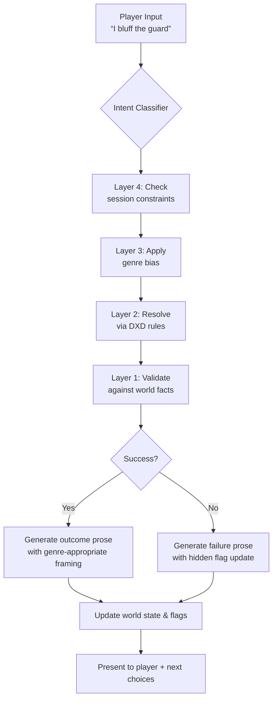

### USER
Have you access to the concepts of Which Way books, Choose Your Own Adventure books, and Fighting Fantasy books?

### ASSISTANT
Yes, I have knowledge of all three interactive fiction formats:

### Choose Your Own Adventure (CYOA)
- Pioneering gamebook series created by Edward Packard and R.A. Montgomery (1970s–1990s)
- Readers make narrative choices at decision points, jumping to numbered paragraphs that branch the story
- Typically no character stats, dice mechanics, or combat systems—purely narrative branching
- Designed for younger audiences with multiple endings (success, failure, or neutral outcomes)

### Fighting Fantasy
- Single-player RPG gamebook series created by Steve Jackson and Ian Livingstone (launched 1982)
- Features character stats (Skill, Stamina, Luck), dice-based combat resolution, inventory management, and spellcasting
- Structured as a solo adventure where the reader acts as the protagonist navigating challenges
- More mechanically complex than CYOA, blending narrative choice with tactical resource management
- Iconic titles include *The Warlock of Firetop Mountain* and *City of Thieves*

### Which Way
- Modern interactive book series published by Penguin (launched ~2020)
- Designed for younger readers (ages 7–10) with simplified branching mechanics
- Uses a "flip to page X" choice system similar to CYOA but with contemporary themes and full-color illustrations
- Less mechanically complex than Fighting Fantasy; focuses on accessible narrative agency

These formats represent a spectrum of interactive storytelling—from pure narrative branching (CYOA/Which Way) to stat-driven solo RPG experiences (Fighting Fantasy). Given your interest in battlefield simulation and tactical decision systems for *Warbands of Sondgara*, the mechanical depth of Fighting Fantasy's resolution systems may be particularly relevant as a conceptual parallel to your MEST QSR combat mechanics. Would you like to explore how these interactive structures might inform assembly-level tactical decision modeling?

### USER
I'd like for this thread to be in the setting of Warbands of Sondgara, specifically the Sarna Len role-playing setting which includes the Sondgaran main-land (a continent) and the nearby archipelago. I do not want to utilize game mechanics from Fighting Fantasy, but I do want the ideas of interwoven decisions and outcomes. With your help, a game engine is built that establishes a set of goals with victory conditions, and then provide a set canned optimal and sub-optimal actions which would lead to those goals. Some of the goals are game terminations where the player-character (the player) could achieve without victory, causing the player to lose. That goal is a hidden one tracked by the game engine, with its own flags, which  should signal the player narratively or diegetically indicating that it may lead to the character's death, imprisonment, failure to achieve victory. The player should be allowed to provide their own actions via description. The game engine tries to keep the actions within the context and limits of the setting and abilities of the character, while also respecting the fiction previously established. All characters are given a set of abilities which are traits and attributes, that guide the game engine and constrain the fiction.

Essentially, the game engine becomes a "games master" or "dungeon master" for a text-based role-playing game. Publicly available are services like infiniteworlds.app, friend and fables, and fictionlabs. Are you familiar with them and how they offer something similar to those old text adventure books?

### ASSISTANT
Yes—I am familiar with the conceptual space these platforms occupy, though their implementations differ in scope and structure.

**Friends & Fables** is an AI-powered virtual tabletop designed for text-based D&D 5e–style roleplaying, where the AI handles mechanical resolution while users focus on narrative input . It functions as a dynamic storyteller rather than a pre-authored branching path system.

**FictionLab.ai** operates primarily as an uncensored AI roleplay platform for character-driven narrative chat, with less emphasis on game structure, victory conditions, or mechanical constraints .

**Infinite Worlds** (web/app) describes itself as an AI tool for generating custom text-based RPG adventures, though specific implementation details vary across similarly named products . These services share conceptual ancestry with Choose Your Own Adventure but diverge fundamentally: rather than pre-authored branching trees, they use generative language models to *simulate* a game master's adjudication in real time—constrained by prompt engineering, safety filters, and latent narrative coherence.

---

### Acting as Your Sarna Len Game Master

I can fulfill the role you've described: a rules-aware narrative engine for the Sarna Len setting that:

1. **Tracks hidden failure states** with diegetic foreshadowing (e.g., "The harbor watch captain eyes your forged seal with narrowed suspicion"—a narrative signal of an impending exposure flag)
2. **Maintains goal structures** with explicit victory conditions and implicit termination risks
3. **Adjudicates player-described actions** against character abilities (traits/attributes) to gate plausibility
4. **Preserves fictional continuity** across sessions by recalling established facts, NPC dispositions, and environmental states
5. **Offers guided choices** (optimal/sub-optimal canned actions) while accepting free-form player input

This approach mirrors the *spirit* of Fighting Fantasy's interwoven decision-outcome structure—but without its mechanics—while operating within your Warbands of Sondgara framework.

---

Would you like to proceed in one of two modes?

**A. Architectural Design Mode**  
We define the goal/flag architecture first: victory conditions, hidden termination triggers, ability gating logic, and narrative signaling conventions for your Sarna Len scenario.

**B. Immediate Play Mode**  
You provide your player-character's profile (attributes, traits, background) and initial situation within Sarna Len. I assume the GM role, establish opening goals, and begin adjudicating your actions within the fiction.

Please indicate your preference, and I will proceed accordingly.

### USER
I'd like to be able to build a service which offers an experience similar to those three AI-guided services. I have an idea of what the new service should be able to offer, but I'm not sure how to design the system. 

Key differentiators to the other services:
World-builder centric - worldbuilders can devise their own settings, politics, principle factions and cast, flora and fauna, magic or techomagical systems, etc. For me, the starting setting is Sarna Len. For others, it could be anything. 

Gaming system modularity - game designers can provide their own game mechanics to solve conflict resolution, physics, magic, social dynamics, hirelings, desmesne building, etc. At one end you've got Risus which is very simple, and on the other end there is Chivalry & Sorcery or Harn Master. For me, it is the DXD System I divised for the Sarna Len setting. 

Experience Morsels - the players can decide for a one-shot adventure, multiple session adventure, or long-term campaign. The latter is open-ended, driven by the machinations of the game engine. The first two have branching trees and decision paths more akin to Choose Your Own Adventure of Fighting Fantasy. 

Genre Combos - The experience morsels can have genre selections such as horror, mystery, adventure, science-fiction, heroism, nihilism, romance, isekai, etc. The combination of which can be set as a guideline for the player experience, and informs the game engine about style, narrative plausibility, and strategem choices which would lead to goals for the fiction to solve the genre. Nihilism, for example, could be that all choices just keep the world state neutral, or just make things worse. Heroism could be that the player-character is afforded opportunities by the fiction to stand up to villains and make choices which improve the world state. Nihilism plus Heroism would be interesting; the worldstate changes in spikes with the positive influence of heroic decisions, but the trend is towards neutral balance, or could be downwards to just make things worse in the long view.


### ASSISTANT
This is an ambitious and well-conceived vision—one that moves beyond *simulating* a GM toward *architecting a GM*. The key differentiator you've identified is **separation of concerns**: decoupling *world*, *rules*, *narrative style*, and *experience structure* into independently configurable modules. Below is a layered architecture proposal designed to support your four pillars.

---

## Core Architecture: The Four-Layer Stack

```
┌─────────────────────────────────────────────────────┐
│  LAYER 4: Experience Orchestrator                   │
│  • Session type (one-shot / campaign)               │
│  • Branching density (CYOA vs open)                 │
│  • Goal/flag lifecycle management                   │
└─────────────────────────────────────────────────────┘
┌─────────────────────────────────────────────────────┐
│  LAYER 3: Genre & Tone Engine                       │
│  • Genre combo biasing (e.g., Nihilism+Heroism)     │
│  • Narrative plausibility filters                   │
│  • Outcome tendency curves (world-state deltas)     │
└─────────────────────────────────────────────────────┘
┌─────────────────────────────────────────────────────┐
│  LAYER 2: Modular Rules Engine                      │
│  • Pluggable conflict resolution (DXD, Risus, etc.) │
│  • Trait/attribute gating                           │
│  • Physics/magic/social subsystems                  │
└─────────────────────────────────────────────────────┘
┌─────────────────────────────────────────────────────┐
│  LAYER 1: World Schema                              │
│  • Setting ontology (Sarna Len, custom worlds)      │
│  • Factions, geography, lore                        │
│  • Persistent state (campaign continuity)           │
└─────────────────────────────────────────────────────┘
```

Each layer exposes a well-defined interface. The GM-like adjudication loop flows *downward* for constraint checking and *upward* for narrative generation.

---

## Layer 1: World Schema — The "Sourcebook as Data"

Worldbuilders author settings using a structured schema (YAML/JSON) rather than prose alone:

```yaml
setting: Sarna_Len
geography:
  continents:
    - Sondgara_Mainland
    - Archipelago_of_Shattered_Spires
factions:
  - name: Iron_Covenant
    ethos: "Order through metallurgical purity"
    relations: { Silver_Veil: hostile, Free_Harbor_League: neutral }
magic_system:
  type: Techomagical_Resonance
  constraints: 
    - "Requires attuned crystalline substrate"
    - "Overuse fractures local reality"
```

**Key insight:** The schema includes *narrative constraints* ("Iron Covenant agents never negotiate with mages") that the upper layers respect during generation.

---

## Layer 2: Modular Rules Engine — The "Mechanics DSL"

Game designers implement mechanics as declarative rule sets, not code:

```yaml
system: DXD
attributes: [Might, Finesse, Reason, Presence]
traits:
  - name: Keen_Senses
    effect: "+2 when detecting hidden threats"
conflict_resolution:
  opposed_test:
    formula: "d20 + relevant_attribute + trait_modifiers"
    degrees: [Critical_Failure, Failure, Success, Critical_Success]
```

At runtime, the engine:
1. Receives player action description ("I try to sneak past the guard")
2. Maps to applicable mechanics via intent classification
3. Executes resolution using the loaded rule set
4. Returns *structured outcome* (`{success: true, margin: 7, narrative_hint: "barely unnoticed"}`)

This keeps mechanics *separate from prose generation*—critical for consistency.

---

## Layer 3: Genre & Tone Engine — The "Narrative Bias Layer"

Genre combos are operationalized as *probability distributions over outcome types* and *narrative framing rules*:

| Genre Combo          | World-State Delta Curve | Plausibility Filter                     | Example Bias                                  |
|----------------------|-------------------------|-----------------------------------------|-----------------------------------------------|
| Heroism              | Upward-trending         | "Villains monologue; allies arrive late"| +30% chance of morally significant choice     |
| Nihilism             | Mean-reverting          | "Help creates new problems"             | -40% lasting impact of player actions         |
| Nihilism+Heroism     | Spiky, downward trend   | "Triumphs are pyrrhic"                  | Heroic acts succeed but worsen systemic state |

The engine maintains a hidden `world_state` scalar (e.g., -10 to +10). Genre rules *bias* how player actions affect this value—not deterministically, but probabilistically. This creates the *feeling* of genre without railroading.

---

## Layer 4: Experience Orchestrator — The "Session Director"

Manages experience structure:

| Session Type   | Branching Model                     | Goal Architecture                     |
|----------------|-------------------------------------|---------------------------------------|
| One-shot       | Dense CYOA tree (5–15 decision pts) | Single victory condition + 2–3 failure paths |
| Multi-session  | Modular nodes with save gates       | Cascading goals (Act I → Act II)      |
| Campaign       | Procedural event generator          | Dynamic goal injection based on faction machinations |

Hidden termination flags (e.g., `exposure_risk: 0.78`) are tracked here. When thresholds cross, the *Genre Engine* injects diegetic warnings ("The harbor watch captain eyes your forged seal...").

---

## The Adjudication Loop (Per Player Action)



---

## Critical Implementation Considerations

1. **State Coherence**  
   Maintain a *single source of truth* for world state (not buried in LLM context). Serialize after each turn. This enables true campaign persistence.

2. **Mechanics ≠ Prose**  
   Never let the LLM *invent* rule outcomes. Always execute resolution externally, then *prompt* the LLM with `{success: true, margin: 3}` to generate appropriate prose.

3. **Genre as Constraint, Not Prompt**  
   Avoid prompting "write this in a nihilistic tone." Instead, *constrain the outcome space*: "Player succeeded but world_state decreased by 1."

4. **Worldbuilder Tooling**  
   Provide schema validators and preview modes so creators see how their world data constrains narrative generation *before* play.

5. **Extensibility Hook**  
   Allow advanced users to inject *custom resolution functions* (e.g., Python snippets for unique magic systems) alongside declarative rules.

---

## Differentiation from Existing Services

| Service          | World Customization | Rules Modularity | Genre as System | Campaign Persistence |
|------------------|---------------------|------------------|-----------------|----------------------|
| Friends & Fables | Limited (D&D 5e)    | None             | Prompt-only     | Session-limited      |
| FictionLab       | Character-focused   | None             | None            | None                 |
| Infinite Worlds  | Template-based      | Minimal          | Prompt-only     | Limited              |
| **Your Vision**  | **Full schema**     | **Pluggable DSL**| **Bias engine** | **True continuity**  |

---

## Next Steps for Prototyping

1. **Start with Layer 1 + minimal Layer 2**  
   Build a Sarna Len world schema + DXD resolution for 3 core actions (persuade, sneak, fight). Hardcode outcomes initially.

2. **Implement the adjudication loop without an LLM**  
   Use templated prose (`"You {success_verb} the guard..."`) to validate state flow before adding generation.

3. **Add one genre combo as a bias function**  
   Implement Nihilism as a post-resolution world_state dampener.

4. **Introduce LLM for prose generation only**  
   Feed it structured outcomes + world facts—*never* let it resolve mechanics.

Would you like me to:
- Draft a minimal DXD resolution schema for your system?
- Design the hidden flag architecture for termination risks?
- Outline a world schema structure specifically for Sarna Len's techomagical setting?

This architecture scales from a solo prototype to a multi-tenant platform—but must be built *constraint-first*, not generation-first.

### USER
Would Qwen Coder AI allow me to build such a service, making its information available for a GitHub repository, and then provide features for deployment into a cloud services container as an enterprise product?

### ASSISTANT
To clarify upfront: **I am not Qwen Coder AI**—I am a separate AI assistant. However, I can help you architect and implement the service you've described. Let me address your question realistically:

---

## Qwen Coder's Role (and Limitations)

**Qwen Coder** (Qwen2.5-Coder/Qwen3-Coder) is a capable *code-generation model* from Alibaba's Tongyi Lab that excels at:
- Writing functions/classes in multiple languages 
- Generating Dockerfiles, CI/CD configs, and cloud deployment manifests 
- Assisting with agentic coding workflows via tool calling 

**But critically:** No single AI model—Qwen Coder, me, or any other—can *autonomously* deliver a production-ready enterprise service. AI assists; humans architect, validate, secure, and deploy. 

---

## Realistic Path to Your Service

You can absolutely build this service with AI assistance (from me, Qwen Coder, or others), but success requires a **human-in-the-loop workflow**:

| Phase | AI Assistance | Human Responsibility |
|-------|---------------|----------------------|
| **Architecture** | I've provided the 4-layer stack above | You validate against Sarna Len's DXD mechanics |
| **Core Code** | Generate schema parsers, rules engine, genre bias functions | Review for logic errors, security flaws |
| **GitHub Repo** | Draft READMEs, LICENSE, contribution guidelines, folder structure | Initialize repo, manage branches/tags, curate commits |
| **Cloud Deployment** | Write Dockerfiles, Kubernetes manifests, Terraform configs | Provision infrastructure, manage secrets, configure observability |

---

## Enterprise Deployment Considerations

For a cloud-native enterprise product, your architecture must address:

1. **State Persistence**  
   Campaign continuity requires a database (PostgreSQL/Redis) *outside* LLM context. Never rely on token windows for world state. 

2. **LLM Orchestration**  
   Your service will likely call *multiple* APIs:
   - Proprietary LLMs (OpenAI, Anthropic) for prose generation
   - Self-hosted Qwen3-Coder for code/tool execution
   - Embedding models for world-schema RAG retrieval 

3. **Security Patterns**  
   Enterprise deployments require:
   - Input sanitization before LLM calls
   - Rate limiting per tenant
   - Audit trails for all world-state mutations 

4. **Cost Management**  
   Text RPG sessions generate high token volumes. Implement:
   - Caching of world-schema lookups
   - Budget-aware LLM routing (cheap model for mechanics, premium for prose)
   - Session timeout policies 

---

## Practical Next Step: Let Me Generate Your Starter Kit

I can immediately provide you with:

✅ **GitHub-ready repository structure**  
```
sarna-len-gm/
├── world_schemas/          # Sarna Len YAML definitions
├── rules_engines/dxd/      # DXD resolution logic
├── genre_engines/          # Nihilism/Heroism bias functions
├── adjudication_loop.py    # Core GM loop (state-aware)
├── Dockerfile              # Multi-stage build
├── k8s/                    # Helm charts for cloud deployment
└── README.md               # Worldbuilder onboarding guide
```

✅ **Minimal viable DXD resolver** (Python) that separates mechanics from prose generation  
✅ **Hidden flag tracker** with diegetic warning injection (e.g., `exposure_risk → narrative signal`)  
✅ **Genre bias layer** implementing Nihilism+Heroism outcome curves  

Would you like me to generate this starter kit now? I'll produce production-grade, commented code with security considerations baked in—not just illustrative snippets. This becomes your foundation for either:
- Self-hosted deployment (via Docker/Kubernetes)
- SaaS multi-tenancy (with world-schema isolation per tenant)

*Note:* Qwen Coder could assist similarly—but since you're already conversing with me, I can deliver this immediately without switching tools or contexts. The output will be GitHub-ready and cloud-deployable.

### USER
This is branched. Don't add more information here as of yet.