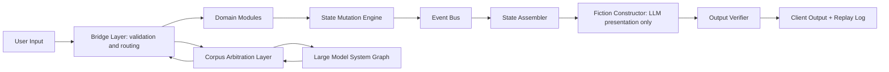

# White Paper 01 - Core Runtime and Bridge Layer

## Document definitions

Amazing Game Engine [AGE] means the complete platform. Core Runtime means the part of AGE that turns user intent into validated state change. Bridge Layer means the validation and routing boundary between language, roles, client input, domain modules, overlays, and canonical state. Domain Module means a deterministic service with bounded responsibility, such as spatial movement, inventory, combat, communication, rules, plot, or event generation. State Delta means a proposed change to canonical state. State Mutation Engine means the only component allowed to commit an approved State Delta. Large Language Model [LLM] means a language generator used for interpretation or prose presentation; it does not own state.

Artificial intelligence [AI] means software behavior that performs model-based interpretation, generation, classification, or decision support.

Corpus Arbitration Layer [CAL] means the component that answers corpus questions from source evidence.

State Assembler means the component that builds bounded context packets for output generation.

Fiction Constructor means the LLM-based presentation layer that renders committed outcomes.

Output Verifier means the component that checks generated prose against committed state.

Event Bus means the structured consequence channel that propagates committed changes.

Replay Log means the durable record of the action path and result.

## Plain definition

The Core Runtime receives intent, validates it, sends it to the correct deterministic module, commits the approved State Delta, propagates events, prepares bounded context, verifies generated prose, and records replay. The Bridge Layer is the gate that prevents an LLM, a client user interface, a role, an overlay, or a module from mutating canonical truth without permission.

## Problem addressed

AI narrative systems collapse when the text generator owns state. AGE prevents this by making state mutation a formal engine operation. The LLM may describe what happened, but only after the runtime validates and commits what happened.

## Operating responsibility

The Core Runtime owns input routing, action validation, module orchestration, state mutation, event publication, context assembly, output verification, and replay logging. The Bridge Layer owns permission checks, entity version checks, scope checks, timing checks, module routing, overlay proposal review, Corpus Arbitration Layer [CAL] escalation triggers, and human decision triggers.

## Architecture

## Interfaces

Inputs are Action Candidates, current state, entity versions, active scope, role constraints, rules references, overlay proposals, and visibility limits. Outputs are Validation Results, module calls, rejected actions, CAL requests, human decision requests, and State Delta proposals.

Action Candidate means the structured representation of the user's proposed action. Validation Result means the Bridge Layer record that states whether the action may proceed, must be rejected, must be clarified, or must be escalated.

## Reward

The reward is enforceable consequence. Characters cannot die, move, learn, heal, spend, acquire, reveal, or change because prose says so. They change because state changed.

## Risk

The risk is complexity and latency. Every validation layer can slow play if the runtime is overbuilt before the first loop is playable.

## Mitigation

Build the narrow runtime first: one troupe, one action pipeline, a few deterministic modules, a simple verifier, and replay. Add richer modules only after the gate works.

## Build path

1. Define Action Candidate.
2. Define Validation Result.
3. Build Bridge Layer validation.
4. Build minimum Domain Modules.
5. Build State Mutation Engine.
6. Build Event Bus.
7. Build State Assembler.
8. Build Output Verifier.
9. Build Replay Log.

## Success criteria

A generated paragraph cannot introduce a canonical fact unless a prior State Delta authorized it. A replay can show why a state change occurred, which module resolved it, and which facts were visible to the Fiction Constructor.
