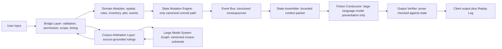

# White Paper 01 - Core Runtime and Bridge Layer

## Purpose

The Amazing Game Engine [AGE] is a state-authoritative narrative simulation platform. The Core Runtime is the part of AGE that turns user intent into validated state change. The Bridge Layer is the validation and routing boundary between language, roles, client input, domain modules, overlays, corpus arbitration, and canonical state. A large language model [LLM] is a generative language model used by AGE for interpretation and prose presentation; it does not own canonical state.

The Core Runtime exists to enforce one rule: generated prose cannot become truth by itself. The engine must decide what happened before the Fiction Constructor writes what happened. The Fiction Constructor is the LLM-based presentation layer. It receives bounded context and committed outcome data, then renders that outcome for the user. It is downstream of state, not upstream of state.

## Runtime Thesis

Most artificial intelligence [AI] narrative systems place the language generator in the position of world owner. The model receives context, generates a continuation, and the continuation implies what changed. This creates flexible prose and unstable consequence. AGE reverses that order. A user's words become an action candidate. An action candidate is the structured representation of a proposed action. The Bridge Layer checks the candidate. Domain modules resolve it. The State Mutation Engine commits approved change. Only then does prose explain the result.

A domain module is a deterministic service with bounded responsibility. A movement module determines movement. An inventory module determines possession, weight, use, loss, or transfer. A rules module determines rule application. A combat module determines attack, defense, injury, and consequence. A plot module determines authored transitions and pressure. An event module determines scheduled or triggered background change. Modules may be simple at first, but they must own their boundaries.

## Architecture

The Bridge Layer is the narrow gate that prevents uncontrolled state mutation. It receives action candidates from the Input Coordinator, role output from the Role Service, authored scenario events from AGEScript, and corpus arbitration results from the Corpus Arbitration Layer [CAL]. CAL is the source-grounded service that answers rules or corpus questions against maintained source evidence. The Bridge Layer decides whether the candidate may proceed, must be rejected, requires clarification, requires CAL, or requires a human decision.

The State Mutation Engine is the only component allowed to commit approved state change. A state delta is a proposed change to canonical state. A state delta may add injury, change location, spend money, alter inventory, reveal knowledge, update a relationship, trigger a timer, change faction posture, or mark that a rule was applied. The state delta is not canonical until the State Mutation Engine commits it.

The Event Bus is the structured consequence channel. After a commit, the Event Bus distributes relevant events to partitions, schedules, role memories, visibility records, alerts, and future triggers. The State Assembler then builds a bounded context packet for presentation. The Output Verifier checks the generated result against the committed facts.

## Bridge Layer Checks

The Bridge Layer should perform practical checks before resolution. It should check actor identity, player authority, troupe authority, entity version, location, reach, time, visibility, inventory, active conditions, rule availability, overlay limits, target existence, and conflict with unresolved actions. The Bridge Layer also checks whether the action belongs to a domain module that exists. If no module can resolve the action, the Bridge Layer must either ask for a human ruling or reject the action as unsupported.

This prevents the common failure where a model accepts every plausible sentence. A player may say that their character uses a helicopter, but the Bridge Layer checks whether the character has a helicopter, can access it, can pilot it, has time to reach it, and is in a world where helicopters exist. If those facts are false or unknown, the action cannot proceed as stated.

## Interface Contract

The Core Runtime requires a small set of records.

| Record | Meaning | Owner |
| --- | --- | --- |
| Action Candidate | Structured form of a proposed action | Input Coordinator |
| Validation Result | Bridge Layer decision on whether the action may proceed | Bridge Layer |
| Module Request | Bounded call to a deterministic resolver | Bridge Layer |
| State Delta | Proposed canonical change | Domain Module |
| Commit Record | Accepted state mutation | State Mutation Engine |
| Event Record | Structured consequence emitted after commit | Event Bus |
| Context Packet | Bounded facts allowed into presentation | State Assembler |
| Output Finding | Verification result for generated prose | Output Verifier |
| Replay Entry | Durable action path and result | Replay Log |

The Replay Log is not a decorative transcript. It is the audit record. It should show the original user words, the action candidate, validation result, module calls, state deltas, committed changes, event emissions, context packet references, output verification, and final output.

## Example

A player says, "I use the stolen keycard to open the security door and sneak into the archive." AGE should not merely generate a paragraph where the door opens. The Input Coordinator extracts two action candidates: use keycard on door and move through door quietly. The Bridge Layer checks whether the character has the keycard, whether the keycard can be used by this character, whether the door accepts that credential, whether the character is at the door, whether the character has time, and whether stealth resolution is needed. The access-control module resolves the card. The movement module resolves passage. The stealth or perception module resolves exposure. The State Mutation Engine commits door state, character location, time passage, noise, camera logs, and any alert flag. The Fiction Constructor may then say what the player sees.

If the Output Verifier sees the prose claim that no one can ever discover the intrusion, it rejects the output unless the committed state actually erased cameras, witnesses, logs, and alarms. The prose must not overrule the commit record.

## Rewards

The reward is enforceable consequence. AGE can support long-running campaigns because state does not depend on model memory. It can support multiplayer because conflicts are routed through structured validation. It can support replay because each action has a recorded path. It can support authoring because modules give authors reliable boundaries. It can support later professional corpus work because the same architecture separates language from authority.

## Risks and Controls

The main risk is latency. Every check can slow play. The mitigation is not to remove the Bridge Layer. The mitigation is to divide the runtime into fast checks, deferred checks, and human escalation. Routine actions should pass quickly. Ambiguous rule questions can call CAL. High-impact or unsupported actions can ask the Referee. A Referee is the human table authority who adjudicates play where human judgment is required.

The second risk is overbuilding. A first AGE implementation should not attempt every possible module. It should use a minimum set: identity, location, inventory, time, simple physical interaction, rules arbitration, event emission, output verification, and replay. Combat, economics, faction strategy, visual generation, and external agents can be added after the gate works.

## Minimum Implementation

The minimum implementation should not begin with every possible rule. It should begin with a strict authority chain. The Input Coordinator may be simple. The domain modules may be few. The client may be plain. The important thing is that no action reaches canonical state without passing through validation and commit. A small working runtime with strict state is better than a broad demo that still lets generated prose decide outcomes.

The minimum domain modules should include identity, location, inventory, time, physical interaction, and rules reference. Identity determines who acts. Location determines where the actor and target are. Inventory determines what can be used. Time determines whether the action fits the current tick. Physical interaction resolves simple world changes. Rules reference calls the Corpus Arbitration Layer when a rule question affects the action.

## Output Verification

Output verification should begin with hard checks. The generated prose must not change location, inventory, injury, death, relationship, time, money, visibility, or rule result unless those changes appear in the committed state. The verifier does not need literary taste in the first build. It needs fidelity. A dull faithful paragraph is better than an exciting paragraph that corrupts state.

Later verification can check tone, style, pacing, and genre. Those checks are useful, but they are secondary. The first verifier protects truth.

## Human Override

The Referee may override a validation result, module result, or arbitration recommendation. That override must become a recorded decision. A recorded override protects future play because the system knows the new local rule or exception. An unrecorded override becomes another form of drift. The Referee should not need to write a legal opinion, but the system should capture what changed and why it matters.

## Success Criteria

The Core Runtime succeeds when a generated paragraph cannot add a canonical fact unless the State Mutation Engine already authorized that fact. It also succeeds when a replay can explain why a state change occurred, which module resolved it, which rule or source was used, which human decision was required, and which facts the Fiction Constructor was allowed to see.
