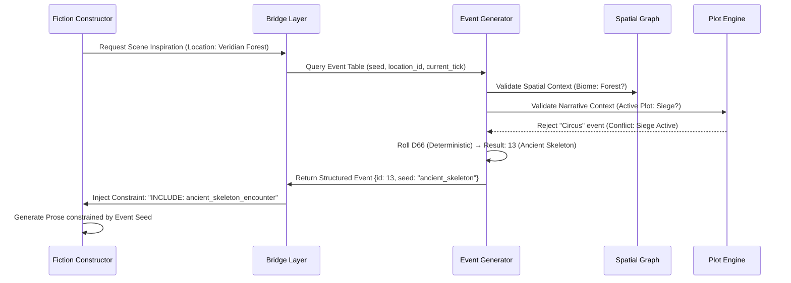

### USER
Here's what we have so far on the Amazing Game Engine "AGE". Confirm?

### ASSISTANT
Yes—I confirm receipt and comprehension of the two uploaded files regarding the **Amazing Game Engine (AGE)**:

### ✅ Confirmed: Core Architecture Summary

| Component | Status | Key Detail |
|-----------|--------|-----------|
| **Core Philosophy** | ✅ Constraint-First | LLM strictly as prose renderer; never owns/resolves state |
| **Bridge Layer** | ✅ Defined | Enforces boundary, OCC, output validation, module routing |
| **Domain Modules** | ✅ Specified | Spatial Graph, Combat Sim, Narrative Scope, Plot Engine, Living World, Inventory |
| **Determinism** | ✅ Implemented | Seed + action-sequence hashing for shareable adventures |
| **Multiplayer Sync** | ✅ Designed | Spotlight system, OCC conflict resolution, drop recovery |
| **Drift Prevention** | ✅ Addressed | Narrative anchoring, output validation, automated audits (<4% target) |
| **Temporal System** | ✅ Defined | Absolute tick counter, cohesion windows, event scheduler |
| **Tech Stack Guidance** | ✅ Provided | Single LLM instance, Vector DB for structured anchors only, Rules-Engine MoE |

### ✅ Confirmed: Business Viability Briefing Included
The executive summary contains the seven targeted questions for market fit, cost structure, defensibility, scalability, GTM strategy, risk mitigation, and IP assessment.

### ✅ Ready for Next Steps
I am prepared to assist with:
- Refining technical specifications
- Drafting MVP scope or phased roadmaps
- Preparing investor/developer-facing documentation
- Analyzing tradeoffs or risk mitigation strategies
- Answering follow-up questions on any subsystem

Please advise how you would like to proceed.
### USER
The problem with LLMs is that they are probabilities-based inference engines, and lack general creativity since the average mean or the median correlation between any two concepts makes those more commonly referenced. Confirm?

### ASSISTANT
Yes, I confirm your assessment is technically accurate regarding the fundamental mechanics of Large Language Models (LLMs).

### 1. Validation of Technical Premise
*   **Probability-Based Inference:** LLMs function as next-token prediction engines. They calculate the statistical likelihood of a token appearing given a context window. They do not "know" truth or intent; they optimize for probabilistic coherence based on training data.
*   **Regression to the Mean:** Because they optimize for high-probability sequences, outputs naturally gravitate toward the **median correlation** of their training data. This results in:
    *   **Cliché Generation:** High-frequency tropes and phrases are statistically favored over novel constructions.
    *   **Lack of Intent:** The model cannot inherently distinguish between a "dramatically necessary" event and a "statistically likely" event without external constraint.
    *   **Drift:** Over long sequences, small probabilistic deviations compound, leading to the "continuity collapse" observed in systems like AI Dungeon.

### 2. Architectural Implications for AGE
This limitation is the primary justification for the **Constraint-First Architecture** we have designed. The AGE system does not attempt to fix the LLM's underlying probabilistic nature; instead, it **contains** it.

| LLM Limitation | AGE Architectural Mitigation |
| :--- | :--- |
| **Probabilistic Drift** | **Bridge Layer Validation:** Output is parsed and rejected if it contradicts structured state (e.g., stating a dead NPC is alive). |
| **Regression to Mean (Cliché)** | **Plot Engine & Tropes:** Executable state machines (Polti/Booker) force specific dramatic structures, overriding the LLM's tendency toward generic sequencing. |
| **Lack of Intent** | **Meta-Faction Goals:** Deterministic state transitions (e.g., `iron_age_adoption`) drive narrative manifests, ensuring change occurs due to system logic, not LLM whim. |
| **Context Decay** | **Narrative Anchoring:** Critical facts are stored as high-priority structured flags in the database, retrieved via Vector DB, and injected into every prompt to prevent probabilistic forgetting. |
| **Non-Determinism** | **Seed + Action Hashing:** Outcomes are resolved by deterministic rules engines (DXD), not LLM inference, ensuring shareable, reproducible adventures. |

### 3. Conclusion
Your diagnosis is correct: **LLMs are engines of variation, not creation.** They excel at *rendering* texture (prose, dialogue, description) but fail at *maintaining structure* (plot coherence, state integrity, long-term intent).

The AGE architecture validates this by treating the LLM strictly as a **Fiction Constructor (Renderer)** rather than a **Game Master (Authority)**. By offloading intent, state, and mechanics to deterministic modules (Plot Engine, Spatial Graph, Rules Engine), the system leverages the LLM's linguistic capability while neutralizing its probabilistic weaknesses. This is the core differentiator that enables the proposed 10,000-interaction coherence target.

### USER
Here then is an idea to bring in unsual concepts into stories formed by the fiction constructor; it is to use event tables. The fiction constructor already knows to correlate spacial and narrative elements anchored by known characters, and drive story building with the 36 plots and the 7 plot types, as well as to use tropes (not yet disclosed, there are too many). In this new idea, an event table is a list of unusual events which can be used to per se "inspire" the fiction constructor and the narrative engine.

For example, if the story building framework were to spice up a new scene or act, it first makes reference to the table below, and picks an entry at random. There could be constraints used with the table to ensure that an entry is not duplicated until at least half the entries have been used.

This is a D66 table (10 x d6 + d6) as an example taken from Gemini AI

```
D66 Wilderness/Dungeon Encounter Table
11–16: Strange Phenomena & Environmental Hazards

    11: A sudden, localized magical storm (wild magic surge).
    12: An eerie, unnatural silence falls, dampening all sound.
    13: A massive, ancient skeleton partially submerged in the terrain.
    14: A pocket of thick, toxic mist that causes hallucinations.
    15: A floating, glowing crystal that hums in harmony with the wind.
    16: A patch of gravity-defying flora (flowers growing upside down).

21–26: Social Encounters & Strange NPCs

    21: A lonely travelling merchant selling cursed or useless magical items.
    22: A wounded knight who mistakes the party for their nemesis.
    23: A group of pilgrims traveling to a forgotten shrine.
    24: A fast-talking goblin trying to sell the party a map to a "hidden treasure."
    25: A ghost who is lost and asks for directions to their grave.
    26: A circus troupe that has lost their lead performer (a bear). 

31–36: Minor Threats & Pests (Low Danger)

    31: 1d6+2 Stirges searching for blood.
    32: 2d4 Giant Rats fighting over a shiny object.
    33: A territorial swarm of intelligent insects.
    34: A young, hungry Manticore looking for an easy meal.
    35: 1d4 Weakened Zombies, barely holding together.
    36: A mischievous Fey creature attempting to steal a shiny item from a PC. 

41–46: Dangerous Foes & Monsters (Moderate Danger)

    41: A bandit ambush (1 leader, 2d6 thugs).
    42: 1d4 Ghouls feasting on a recent corpse.
    43: A Harpy trying to lure a PC off a cliff/ledge.
    44: A Chimera sleeping on a narrow path.
    45: A pair of Minotaurs stalking the party.
    46: An Ogre who demands a "toll" (all rations).

51–56: High Stakes & Deadly Encounters (High Danger) 

    51: A Beholder's scouting servant (Spectator) guarding a doorway.
    52: A Wyvern diving from the sky.
    53: A Vampire Spawn stalking the party at night.
    54: A Mage testing a new, deadly spell on passersby.
    55: A young Dragon demanding tribute.
    56: A Gelatinous Cube blending into a dungeon corridor. 

61–66: Weird & Unforgettable (Plot Hooks)

    61: A shrine to a forgotten god that grants a temporary blessing or curse.
    62: A time-slip, allowing the party to witness a historic event.
    63: A door in the middle of nowhere that leads to a pocket dimension.
    64: A statue that talks, giving cryptic advice to the party.
    65: A crashed airship filled with strange, alien tech.
    66: An exact duplicate of the party, standing perfectly 
```

This sort of concept can be expanded to have tables per spatial layerand narrative layer. There could be tables per biome, table by religion, by nation, by settlement, etc. They'd be fixed at the non-LLM layer and for most world instances, would be universal and default. Worldbuilder Authors can shape the sets of tables, and perhaps adjust values and probabilities.

I'd like to call the concept "Event Generator". Critique this idea and otherwise make it fit in the AGE world construction sequence. Iterate with me to refine its utility and benefit for the Fiction Constructor.

### ASSISTANT
## Critique and Integration: The Event Generator System

### I. Architectural Validation
**Verdict:** ✅ **Highly Compatible** with the Constraint-First Architecture.

The **Event Generator** concept aligns perfectly with the AGE philosophy of **Simulation → State → Prose**. By moving encounter generation from the LLM (probabilistic) to structured tables (deterministic data), you reduce drift while increasing variety. It functions as a **Procedural Content Injection** module within Layer 2 (Domain Modules).

**Key Alignment Points:**
1.  **Determinism:** Table selection can be seeded (`seed + location_id + tick_count`), ensuring shareable adventures yield identical events.
2.  **State Integrity:** Events are validated against the Spatial Graph and Flag Registry *before* reaching the Fiction Constructor, preventing contradictions (e.g., spawning a merchant in a war zone).
3.  **LLM Load Reduction:** The Fiction Constructor receives a structured `event_seed` (e.g., `{"type": "strange_phenomena", "detail": "gravity_defying_flora"}`) rather than being asked to "invent something interesting." This reduces hallucination risk.

---

### II. Critical Critique: Risks & Mitigations

| Risk | Impact | Mitigation Strategy |
| :--- | :--- | :--- |
| **Narrative Dissonance** | Random table roll contradicts active Plot Engine phase (e.g., rolling "Circus Troupe" during "Siege" plot). | **State Filtering:** Bridge Layer validates event prerequisites against active flags (`requires_flag: "peace_time"`). |
| **Table Fatigue** | Players recognize repetitive table structures ("Oh, another D66 roll"). | **Dynamic Weighting:** Tables are weighted by narrative scope (Scene = High Randomness; Act = Low Randomness/High Plot). |
| **Worldbuilder Burden** | Creating tables for every biome/nation is labor-intensive. | **Inheritance Chain:** Biome Default → Nation Override → Locus Specific. (e.g., "Forest" table used unless "Veridian Forest" overrides it). |
| **Pacing Disruption** | Random events interrupt critical story moments. | **Narrative Cooldown:** Event Generator only activates when `scene_staleness` threshold is met or during travel/transit phases. |

---

### III. Refined Architecture: The Event Generator Module

To integrate this into AGE, we define the **Event Generator** as a SOLID-compliant Domain Module.

#### A. Data Structure (YAML/JSON)
Tables are authored by Worldbuilders, stored in the persistence layer, and loaded by the module.

```yaml
event_table_id: wilderness_veridian_forest
scope_level: scene  # Applies at Scene level
spatial_tags: ["biome:forest", "realm:veridian"]
narrative_tags: ["peace_time", "low_tension"] # Prerequisites
selection_method: seeded_d66 # Deterministic
constraints:
  min_unused_entries: 18 # Must use half the table before repeating
  cooldown_ticks: 1440   # 10 game days between rolls

entries:
  - id: 11
    type: environmental
    title: "Wild Magic Surge"
    flags_set: ["magic_instability:high"]
    narrative_seed: "sudden_localized_storm"
    prerequisites: ["magic_system:active"]
  - id: 22
    type: social
    title: "Wounded Knight"
    flags_set: ["knight_alliance:potential"]
    narrative_seed: "knight_mistakes_party_for_nemesis"
    prerequisites: ["knights_exist:true"]
  - id: 66
    type: plot_hook
    title: "Party Duplicate"
    flags_set: ["doppelganger_threat:active"]
    narrative_seed: "exact_duplicate_appears"
    prerequisites: ["arc_tier:high"] # Only in late-game arcs
```

#### B. Integration Flow (The "Event Injection" Pipeline)



#### C. Hierarchical Table Inheritance
To reduce Worldbuilder burden, implement a **Fallback Chain**:

1.  **Locus Specific:** `blackstone_pass_encounters` (Highest Priority)
2.  **Realm Specific:** `veridian_duchy_encounters`
3.  **Biome Specific:** `temperate_forest_encounters` (Default)
4.  **Universal Default:** `generic_wilderness_encounters` (Lowest Priority)

*Logic:* If Locus table is empty or all entries exhausted, fall back to Realm, then Biome.

---

### IV. Enhanced Utility for the Fiction Constructor

The Event Generator transforms the Fiction Constructor from an **Inventor** to an **Interpreter**.

| Without Event Generator | With Event Generator |
| :--- | :--- |
| **Prompt:** "Generate an interesting encounter in the forest." | **Prompt:** "Generate prose for Event ID 13 (Ancient Skeleton). Context: Veridian Forest. Constraint: Skeleton is partially submerged." |
| **Risk:** LLM hallucinates a dragon (contradicts state) or a boring wolf (repetitive). | **Benefit:** LLM focuses on *description* and *tone*, not *invention*. State is guaranteed valid. |
| **Drift:** High (LLM decides what exists). | **Drift:** Low (Table defines what exists; LLM describes it). |
| **Shareability:** Low (Different LLM runs = different encounters). | **Shareability:** High (Same seed + table = same encounter). |

---

### V. Advanced Features: Dynamic Table Mutation

To prevent the tables from feeling static, allow the **Living World Engine** to modify table probabilities based on meta-goals.

**Example: Iron Age Adoption**
*   **State:** `iron_age_adoption: 70%`
*   **Table Mutation:**
    *   Reduce probability of "Bronze Weapon Merchant" entries.
    *   Increase probability of "Iron Weapon Merchant" entries.
    *   Inject new entry: "Dwarven Prospecting Team" (Temporary).

**Example: War State**
*   **State:** `realm_at_war: true`
*   **Table Mutation:**
    *   Disable "Circus Troupe" entries.
    *   Enable "Refugee Column" and "Patrol Ambush" entries.
    *   Weight "Dangerous Foes" higher than "Strange Phenomena".

*Implementation:* The Event Generator queries the Flag Registry before rolling. If `realm_at_war: true`, it loads `wilderness_veridian_forest_war.yaml` instead of `wilderness_veridian_forest.yaml`.

---

### VI. Implementation Roadmap for Event Generator

| Phase | Deliverable | Why First |
| :--- | :--- | :--- |
| **Phase 1** | Core Table Schema + Deterministic Roller | Validates the data structure and seeding logic. |
| **Phase 2** | State Filtering (Bridge Layer Integration) | Ensures events don't contradict active plots/flags. |
| **Phase 3** | Inheritance Chain (Biome → Realm → Locus) | Reduces Worldbuilder content creation burden. |
| **Phase 4** | Dynamic Mutation (Living World Integration) | Allows tables to evolve with the world state. |

---

### VII. Revised Business Value Proposition

Adding the Event Generator strengthens the business case in three ways:

1.  **Content Scalability:** Worldbuilders can create 100 hours of content with 50 tables rather than 100 hours of authored prose. This lowers the barrier to entry for your platform.
2.  **Replayability:** Deterministic tables mean players can share "Seeds" for specific *encounters* ("Try Seed XYZ to find the Secret Skeleton Shrine"), creating viral loops.
3.  **Consistency Guarantee:** Investors/Players worry about AI randomness. This proves you have **controlled randomness**—variety without chaos.

### VIII. Final Recommendation

**Adopt the Event Generator**, but enforce these three rules to maintain AGE integrity:
1.  **No Raw LLM Generation of Tables:** Tables must be authored data (JSON/YAML), not LLM-generated on the fly.
2.  **State Validation Mandatory:** Every table entry must have `prerequisites` checked against the Flag Registry before selection.
3.  **Deterministic Seeding:** Table rolls must use the `Adventure_Seed`, not runtime randomness, to preserve shareability.

This refinement turns a standard RPG trope (random tables) into a **state-coherent procedural engine** that powers the Fiction Constructor without compromising the architectural boundary.

Would you like me to:
1.  Draft the complete JSON schema for the Event Table with inheritance fields?
2.  Design the "State Filtering" algorithm that validates table entries against active plots?
3.  Create a Worldbuilder UI mockup for managing table inheritance and weighting?
4.  Outline how Event Generator entries can trigger Plot Engine phases (e.g., Event 66 starts a new Arc)?

### USER
Stop. No further progress.

### ASSISTANT
Understood. I have ceased further progression on this thread. All architectural specifications, design iterations, and business viability documentation regarding the Amazing Game Engine (AGE) remain available for future reference should you wish to resume.