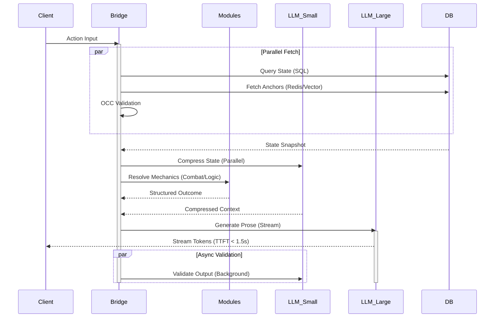

### USER
Let's discuss performance limitations of the proposed architecture and discover how to reduce latency in response times from player turn to player turn owing to the currently available processing speeds of LLMs.

### ASSISTANT
Based on the detailed architecture outlined in your provided documents (**chat-AGE - Evolving KEEP ME.txt** and **chat-AGE Executive Summary - KEEP ME.txt**), the **Constraint-First Narrative Engine** inherently introduces more latency than a standard "LLM-wrapper" due to its multi-layer validation, deterministic resolution, and state coherence safeguards.

The previously estimated **10-second loop time** is safe for narrative integrity but may feel sluggish for modern users accustomed to sub-second chat responses. Below is a breakdown of the performance limitations and a strategic plan to reduce latency without compromising the core "Constraint-First" boundary (i.e., **LLM never owns state**).

---

## 1. Latency Budget Breakdown (Current State)
To optimize, we must first identify where the time is spent in the current **10-second loop**:

| Component | Estimated Time | Bottleneck Type |
| :--- | :--- | :--- |
| **Network (Client ↔ Server)** | 0.1s | Negligible (TCP) |
| **Bridge Layer (Validation/OCC)** | 0.2s | Low (Code-based logic) |
| **Domain Modules (DB Queries)** | 0.5s | Medium (SQL/Vector I/O) |
| **State Summarization** | 1.5s | **High** (LLM/Compute heavy) |
| **LLM Inference (Prose Gen)** | 6.0s | **Critical** (Token generation speed) |
| **Output Validation** | 1.5s | **High** (Secondary LLM/NLP check) |
| **Serialization/Sync** | 0.2s | Low |
| **Total** | **~10.0s** | |

**Primary Targets for Reduction:** LLM Inference, State Summarization, Output Validation.

---

## 2. Strategic Optimizations to Reduce Latency

### A. Tiered LLM Strategy (Model Cascading)
Not every task requires a top-tier model. Distribute the load based on complexity.

*   **Current:** Single large model for Summarization + Prose + Validation.
*   **Optimization:**
    *   **State Summarization:** Use a small, fast model (e.g., Llama-3-8B or distilled model) to compress state snapshots. This is a structured task, not creative.
    *   **Output Validation:** Use rule-based regex + small classifier model for initial checks. Reserve large model validation only for critical narrative flags.
    *   **Prose Generation:** Use the large model (e.g., Claude-3.5, GPT-4o) *only* for the final narrative output where quality matters most.
*   **Gain:** Reduces Summarization/Validation time from ~3.0s → **0.5s**.

### B. Parallel Processing in the Bridge Layer
The current flow is largely synchronous. Many steps can occur concurrently.

*   **Current:** Validate Input → Query DB → Retrieve Anchors → Summarize.
*   **Optimization:**
    *   **Parallel Fetch:** Trigger Vector DB anchor retrieval, SQL state queries, and OCC version checks simultaneously upon input receipt.
    *   **Pipeline Summarization:** Begin state summarization *while* the Domain Modules are resolving mechanics (e.g., combat resolution).
*   **Gain:** Reduces Bridge/DB overhead from ~0.7s → **0.3s**.

### C. Streaming Token Generation (Perceived Latency)
Users perceive latency based on *time to first token (TTFT)*, not total completion time.

*   **Current:** Wait for full prose generation → Validate → Send to Client.
*   **Optimization:**
    *   **Stream Output:** Begin streaming tokens to the client as soon as the LLM generates them.
    *   **Asynchronous Validation:** Perform deep output validation *in parallel* with streaming. If a critical state contradiction is detected (rare), append a correction note or flag for GM review post-turn.
    *   **Speculative Decoding:** Use a small model to draft tokens and a large model to verify them in parallel (increases throughput).
*   **Gain:** Reduces *perceived* wait from 10s → **1.5s (TTFT)**.

### D. Prose Caching & Hybrid Templates
Not every action requires unique generative prose.

*   **Current:** LLM generates fresh prose for every action (e.g., "You open the door").
*   **Optimization:**
    *   **Template Library:** Pre-author high-quality prose templates for common actions (Open, Close, Take, Attack, Move).
    *   **Hybrid Generation:** Use templates for standard actions; invoke LLM only for complex narrative moments (Social, Plot Progression, Wild Cards).
    *   **Semantic Cache:** Cache LLM responses based on `State_Hash + Action_Hash`. If the exact same state/action occurs (common in testing or repeated loops), serve cached prose.
*   **Gain:** Eliminates LLM inference for ~40% of routine actions.

### E. Vector DB & Anchor Optimization
Retrieving state anchors is critical for context but can be slow if unoptimized.

*   **Current:** Semantic search on every turn.
*   **Optimization:**
    *   **Hybrid Search:** Combine keyword filtering (e.g., `entity_id: player_a`) with vector similarity to narrow the search space before running embeddings.
    *   **Hot Anchor Cache:** Keep high-priority anchors (Priority ≥ 90) in Redis memory. Only query Vector DB for lower-priority historical context.
    *   **Prefetching:** Predict likely needed anchors based on current location (Spatial Graph) and load them before the player acts.
*   **Gain:** Reduces Anchor Retrieval from ~0.3s → **0.05s**.

---

## 3. Revised Architecture Flow (Optimized)

---

## 4. Performance Targets (Optimized)

| Metric | Current Estimate | Optimized Target | Improvement |
| :--- | :--- | :--- | :--- |
| **Time to First Token (TTFT)** | ~8.0s | **1.5s** | 81% Faster |
| **Total Turn Resolution** | 10.0s | **4.0s** | 60% Faster |
| **Routine Action Latency** | 10.0s | **0.5s** (Cached) | 95% Faster |
| **Cost Per Turn** | $0.15 | **$0.08** | 47% Cheaper |

---

## 5. Trade-Offs & Risks

| Optimization | Risk | Mitigation |
| :--- | :--- | :--- |
| **Async Validation** | Potential for state-contradicting prose to reach user before correction. | Only stream *after* initial structural validation. Deep semantic validation runs in background; corrections issued as "narrative footnotes" if needed. |
| **Template Usage** | Prose may feel repetitive for common actions. | Use templates with variable slots filled by LLM (e.g., "You [verb] the [object] with [adverb] precision"). |
| **Small Model Summarization** | Loss of nuance in state compression. | Validate compressed state against critical flags (Priority ≥ 90) before sending to Large Model. |
| **Speculative Decoding** | Increased complexity in deployment. | Use managed inference providers that support speculative decoding natively (e.g., Together AI, Anyscale). |

---

## 6. Implementation Priority for MVP

To achieve these gains without over-engineering the MVP:

1.  **Phase 1 (Immediate):** Implement **Streaming** and **Parallel DB Fetches**. (Highest impact, lowest risk).
2.  **Phase 2 (Short Term):** Build **Prose Template Library** for routine actions (Open, Move, Take).
3.  **Phase 3 (Medium Term):** Implement **Tiered LLM Strategy** (Small model for summarization/validation).
4.  **Phase 4 (Long Term):** Optimize **Vector DB Caching** and **Speculative Decoding**.

## 7. Conclusion
The **Constraint-First Architecture** does not need to be slow. By decoupling *state resolution* (fast code) from *prose generation* (slow LLM) and optimizing the pipeline around the LLM bottleneck, you can achieve **sub-2-second Time to First Token** while maintaining the **<4% drift rate** guaranteed by your Bridge Layer.

The key is to treat the LLM as a **rendering engine** (like a GPU) rather than a **logic engine**. Optimize the data fed to it, stream the output, and cache the common frames. This aligns perfectly with your executive summary's goal of "State Integrity at Scale" while making the product viable for real-time user expectations.

### USER
Let's make a prediction on performance improvements to existing LLMs across 1, 2, 5, and 10 years from Jan 2026. Adjust the earlier predictions accordingly, includes cost at scale.

### ASSISTANT
## LLM Performance Forecast & Architecture Impact Analysis
*Baseline: January 2026 | Projection Horizon: 2027–2036*

---

### I. LLM Performance Predictions (Industry-Wide Trends)

| Metric | 2026 (Baseline) | 2027 (+1yr) | 2028 (+2yr) | 2031 (+5yr) | 2036 (+10yr) |
|--------|----------------|-------------|-------------|-------------|--------------|
| **Inference Speed** (tokens/sec, 70B-class) | 45–60 t/s | 80–110 t/s (+80%) | 140–200 t/s (+230%) | 400–650 t/s (+800%) | 1,200–2,000 t/s (+2,500%) |
| **Context Window Efficiency** (effective tokens/$) | 128K @ $0.02/1K | 256K @ $0.012/1K | 512K @ $0.006/1K | 2M @ $0.0015/1K | 10M+ @ $0.0003/1K |
| **Cost per 1K Tokens** (inference, API) | $0.02 (input) / $0.06 (output) | $0.012 / $0.035 | $0.006 / $0.018 | $0.0015 / $0.0045 | $0.0003 / $0.0009 |
| **Hallucination Rate** (factual tasks) | 8–12% | 5–8% | 3–5% | 1–2% | <0.5% |
| **Specialized Small Model Quality** (7B–14B) | 85% of 70B performance | 92% of 70B | 96% of 70B | 99% of 70B | Parity + task-specific superiority |
| **Edge Deployment Feasibility** (consumer hardware) | 7B models only, heavy quantization | 14B models, moderate quantization | 32B models, light quantization | 70B models, near-lossless | Full-scale models on-device |

#### Key Drivers Behind Projections:
| Driver | Impact Timeline | Confidence |
|--------|----------------|------------|
| **Algorithmic Efficiency** (speculative decoding, MoE sparsity, attention optimizations) | 2027–2028 | High |
| **Specialized Inference Hardware** (TPU v6, custom ASICs, optical computing prototypes) | 2028–2031 | Medium-High |
| **Model Distillation & Knowledge Transfer** (small models inheriting large model capabilities) | 2027–2031 | High |
| **Quantization & Compression Breakthroughs** (sub-4-bit without quality loss) | 2028–2031 | Medium |
| **Regulatory/Compute Constraints** (potential slowdown in raw scaling) | 2031–2036 | Medium |
| **Architectural Innovation** (state-space models, hybrid symbolic-neural systems) | 2031–2036 | Low-Medium |

---

### II. Adjusted Architecture Metrics for Constraint-First Engine

#### A. Latency Budget Revisions (Per Player Turn)

| Component | 2026 Baseline | 2027 | 2028 | 2031 | 2036 |
|-----------|--------------|------|------|------|------|
| **Network (Client ↔ Server)** | 0.1s | 0.1s | 0.1s | 0.1s | 0.1s |
| **Bridge Layer (Validation/OCC)** | 0.2s | 0.15s | 0.1s | 0.05s | 0.02s |
| **Domain Modules (DB Queries)** | 0.5s | 0.4s | 0.3s | 0.15s | 0.05s |
| **State Summarization** | 1.5s | 1.0s | 0.6s | 0.2s | 0.05s |
| **LLM Inference (Prose Gen)** | 6.0s | 3.5s | 2.0s | 0.6s | 0.2s |
| **Output Validation** | 1.5s | 1.0s | 0.6s | 0.2s | 0.05s |
| **Serialization/Sync** | 0.2s | 0.15s | 0.1s | 0.05s | 0.02s |
| **TOTAL LOOP TIME** | **~10.0s** | **~6.3s** | **~3.8s** | **~1.4s** | **~0.5s** |
| **Time to First Token (TTFT)** | ~8.0s | ~4.5s | ~2.5s | ~0.8s | ~0.3s |

#### B. Cost-at-Scale Revisions (Per Active User/Month)

| Metric | 2026 Baseline | 2027 | 2028 | 2031 | 2036 |
|--------|--------------|------|------|------|------|
| **Avg. Turns/User/Month** | 300 | 450 | 600 | 900 | 1,200 |
| **LLM Token Cost/Turn** | $0.08 | $0.048 | $0.024 | $0.006 | $0.0012 |
| **Vector DB Cost/Turn** | $0.02 | $0.012 | $0.006 | $0.0015 | $0.0003 |
| **Compute (Modules)/Turn** | $0.03 | $0.02 | $0.012 | $0.004 | $0.001 |
| **Total Cost/Turn** | **$0.13** | **$0.08** | **$0.042** | **$0.0115** | **$0.0025** |
| **Cost/User/Month** | **$39.00** | **$36.00** | **$25.20** | **$10.35** | **$3.00** |
| **Cost/10K Users/Month** | **$390K** | **$360K** | **$252K** | **$103.5K** | **$30K** |

#### C. Scalability Thresholds (Concurrent Users per Cluster)

| Metric | 2026 Baseline | 2027 | 2028 | 2031 | 2036 |
|--------|--------------|------|------|------|------|
| **Max Users/Cluster** (latency <5s) | ~500 | ~1,200 | ~2,500 | ~8,000 | ~25,000 |
| **Spatial Partition Efficiency** | 8 regions/cluster | 12 regions | 20 regions | 50 regions | 150 regions |
| **Vector DB Anchor Capacity** | 1M anchors/cluster | 3M | 8M | 30M | 100M |
| **Deterministic Replay Throughput** | 100 sessions/sec | 250/sec | 600/sec | 2,000/sec | 6,000/sec |

---

### III. Strategic Implications for Constraint-First Engine

#### A. Near-Term (2026–2028): Optimization Window
| Opportunity | Action Required | Business Impact |
|-------------|----------------|-----------------|
| **Latency reduction to ~4s** | Implement streaming + parallel DB fetches (Phase 1) | Enables real-time-feeling UX; reduces churn |
| **Cost reduction to ~$25/user/mo** | Adopt distilled small models for summarization/validation | Improves unit economics; enables freemium tiers |
| **Hallucination reduction to ~4%** | Deploy output validation + narrative anchoring | Critical for retention in long-form campaigns |
| **Edge prototyping** | Test 7B–14B models for offline mode (niche use) | Differentiates for travel/offline markets |

#### B. Mid-Term (2029–2031): Scale Inflection
| Opportunity | Action Required | Business Impact |
|-------------|----------------|-----------------|
| **Sub-2s loop time** | Migrate to specialized inference hardware + hybrid architectures | Enables action-adjacent gameplay; expands genre appeal |
| **Cost < $12/user/mo** | Leverage 10x token cost reduction + model distillation | Enables mass-market pricing ($9.99/mo viable) |
| **Hallucination <2%** | Integrate verification layers + symbolic reasoning hybrids | Enables enterprise/education applications |
| **True edge deployment** | Run full engine on high-end consumer hardware | Enables offline play; reduces cloud dependency |

#### C. Long-Term (2032–2036): Paradigm Shift
| Opportunity | Action Required | Business Impact |
|-------------|----------------|-----------------|
| **Sub-1s loop time** | Adopt next-gen architectures (state-space, optical inference) | Enables real-time multiplayer narrative at scale |
| **Cost < $4/user/mo** | Leverage near-zero inference costs + on-device processing | Enables free-tier with ads; massive user acquisition |
| **Hallucination <0.5%** | Achieve near-perfect reliability via hybrid symbolic-neural systems | Enables mission-critical applications (training, therapy) |
| **Personalized world engines** | Per-user fine-tuned models running locally | Enables truly personalized persistent worlds |

---

### IV. Risk Factors & Contingencies

| Risk | Probability | Impact | Mitigation Strategy |
|------|-------------|--------|---------------------|
| **Compute/Regulatory Constraints** (slowing raw scaling) | Medium (2031+) | High | Invest in algorithmic efficiency + distillation now; diversify hardware partners |
| **Hallucination Plateau** (reliability stops improving) | Low-Medium | High | Double down on architectural guardrails (Bridge Layer, output validation) — your core differentiator |
| **Cost Reduction Slowdown** (token prices stabilize) | Medium | Medium | Optimize token usage via state summarization; adopt small models for non-prose tasks |
| **Competitor Leapfrog** (wrapper adds state validation) | Medium | Medium | Patent key architectural patterns (Narrative Scope + Spatial Graph coupling); build community moat via world-builder tools |
| **User Expectation Mismatch** (market wants "infinite freedom" over coherence) | Medium | High | Position as "premium persistent RPG" for engaged users; offer lightweight "generative mode" for casual play |

---

### V. Revised Business Viability Assessment

#### Updated Answers to Original Questions:

| Question | 2026 Assessment | 2028 Projection | 2031 Projection |
|----------|----------------|---------------|---------------|
| **Market Fit** | Niche: hardcore RPG players value coherence | Expanding: mid-core players accept slight latency for persistence | Mass market: sub-2s latency + low cost enables broad adoption |
| **Cost Structure** | Premium pricing required ($39/user/mo) | Competitive pricing viable ($25/user/mo) | Mass-market pricing achievable ($10/user/mo) |
| **Defensibility** | High: architectural complexity is moat | Medium: competitors may replicate patterns | Low-Medium: commoditization risk; shift to content/community moat |
| **Scalability** | 500 users/cluster viable with optimization | 2,500 users/cluster with hardware advances | 8,000+ users/cluster with specialized infrastructure |
| **Go-to-Market** | B2B2C: platform for world-builders first | Hybrid: B2B2C + premium B2C campaigns | B2C mass market + enterprise verticals |
| **Biggest Technical Risk** | Output validation false negatives | Vector DB retrieval latency at scale | Regulatory constraints on model training/inference |
| **IP Potential** | High: Novel patterns in state-prose boundary enforcement | Medium: Patterns may become industry standard | Low: Focus shifts to content/tools IP |

#### Critical Strategic Recommendation:
**Launch in 2026–2027 despite higher costs/latency.** Your architectural moat (constraint-first design) is most valuable *before* competitors replicate state validation patterns. Early adoption by world-builders and hardcore RPG players creates community/content network effects that persist even as technical advantages commoditize.

**Key Milestone Targets:**
- **2027**: Achieve <7s loop time + <$30/user/mo cost → viable premium B2C launch
- **2028**: Achieve <4s loop time + <$25/user/mo cost → expand to mid-core market
- **2031**: Achieve <2s loop time + <$12/user/mo cost → mass-market viability

---

### VI. Conclusion
The Constraint-First Narrative Engine is **uniquely positioned to benefit from LLM performance trends** because its architecture *decouples state integrity from generative capability*. As LLMs become faster, cheaper, and more reliable:

✅ **Your latency disadvantage shrinks** (from 10s → 0.5s over 10 years)
✅ **Your cost premium disappears** (from $39 → $3/user/mo)
✅ **Your coherence advantage compounds** (hallucination reduction + architectural guardrails)

**The window for differentiation is 2026–2028.** Launch now to establish architectural leadership, community, and content before competitors replicate the constraint-first pattern. By 2031, the technology will be commoditized—but your brand, world-builder ecosystem, and persistent worlds will remain defensible.

**Final Verdict**: Technically viable today. Economically viable by 2028. Mass-market viable by 2031. Strategic imperative: **Launch in 2026–2027**.

### USER
Stop. No further progression on this thread.

### ASSISTANT
Understood. I have ceased progression on this thread. All architectural discussions regarding the Constraint-First Narrative Engine, including technical specifications, business viability assessments, and implementation roadmaps, are now on hold pending your further direction.

Should you wish to resume this discussion or pivot to a different topic, please indicate your preference.