# White Paper 01B - Engine Execution Spine

## Document definitions

Amazing Game Engine [AGE] means the complete platform. Execution Spine means the input-to-output pipeline followed by each player action. Input Coordinator means the component that converts user words into structured intent candidates. Action Candidate means the structured version of a proposed action. Bridge Layer means the validation and routing gate. Domain Module means a deterministic resolver. State Delta means a proposed state change. Fiction Constructor means the Large Language Model [LLM] presentation layer that renders committed outcomes. Replay Log means the audit record of the action path.

State Mutation Engine means the only component allowed to commit approved changes to canonical state.

Event Bus means the structured consequence channel that propagates committed changes.

State Assembler means the component that builds bounded context packets for output generation.

Output Verifier means the component that checks generated prose against committed state.

## Plain definition

The Execution Spine is AGE's operational path from user input to verified output. It allows flexible natural-language play while preserving structured state, rules, timing, and replay.

## Spine

```mermaid
flowchart LR
    A[User Input] --> B[Input Coordinator]
    B --> C[Action Candidate]
    C --> D[Bridge Validation]
    D --> E[Domain Module Resolution]
    E --> F[State Delta]
    F --> G[State Commit]
    G --> H[Event Bus]
    H --> I[State Assembler]
    I --> J[Fiction Constructor]
    J --> K[Output Verifier]
    K --> L[Client Output and Replay Log]
```

## Problem addressed

Natural-language systems are flexible but ambiguous. Game engines are coherent but rigid. The Execution Spine lets AGE accept flexible input while still enforcing structured state, rules, and timing.

## Operating model

The Input Coordinator extracts intent. The Bridge Layer checks whether the action can be attempted. Domain Modules resolve what happens. The State Mutation Engine commits approved change. The Event Bus propagates consequences. The State Assembler prepares what the Fiction Constructor may know. The Fiction Constructor renders. The Output Verifier checks. The Replay Log records.

## Corpus arbitration integration

Corpus Arbitration Layer [CAL] means the component that answers unstructured corpus questions from source evidence. If an action depends on rule interpretation, table policy, or corpus evidence, the Bridge Layer can call CAL before module resolution or after conflict detection. CAL returns an Arbitration Envelope. Arbitration Envelope means the structured CAL answer containing ruling, sources, confidence, conflict notes, and the human decision point.

## Rewards

The spine provides auditability, replayability, testability, modularity, and prompt-model independence.

## Risks

The spine can become too slow or too formal for play. Ambiguous inputs may create excessive clarification loops.

## Mitigation

Use three paths: fast action path, quick ruling path, and detailed review path. Do not force detailed arbitration into every in-play action.

## Implementation path

Build the spine with a small module set and instrument every step. The early prototype should prefer visible logs and simple mechanics over hidden complexity.

## Success criteria

A single action can be traced from original user words to final verified output, including validation, resolution, State Delta, events, context packet, and replay entry.
