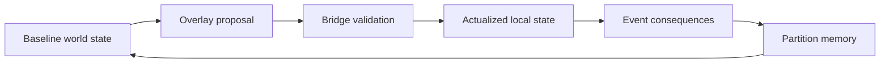

# White Paper 04B - World Generation, Lazy Ontology, and Overlays

## Purpose

The Amazing Game Engine [AGE] uses lazy ontology and overlays to generate worlds without allowing generated detail to drift away from authored truth. Lazy ontology means the system delays fine-grained actualization until play requires detail. An overlay is a structured modification applied over baseline world state. Actualization is the act of turning abstract or compressed world state into concrete local state.

The goal is to let worlds be large without requiring every village, room, road, family, shop, item, and rumor to be fully written before play begins.

## Lazy Ontology

A world can be true at several levels of detail. At high level, a kingdom may have borders, ruler, climate, technology level, dominant faith, trade posture, law, military pressure, and faction conflicts. AGE does not need every blacksmith's name until a player enters a town and needs one. The high-level facts constrain the later detail.

Lazy ontology works only if actualized detail remains subordinate to baseline truth. If the kingdom is iron-poor, the generated village should not casually sell abundant steel plate. If the region bans firearms, a market scene should not generate gun shops unless an overlay, black market rule, or special exception allows it. If the world has no germ theory, the healer should not speak with modern clinical assumptions unless a specific technology or cultural overlay grants that knowledge.

## Overlays

An overlay modifies what is available, visible, legal, likely, or possible. A technology-level overlay governs tools, techniques, concepts, infrastructure, and manufacturing. A disaster overlay governs damage, scarcity, disease, displacement, and hazard. A faction overlay governs patrols, propaganda, recruitment, threat response, safe houses, and controlled markets. A magical, psionic, or science-fiction overlay may govern impossible effects, but it must still state what it changes.

Overlays should compose in a defined order. Baseline world state comes first. Global setting overlays modify it. Regional overlays modify the global result. Local overlays modify the regional result. Event overlays modify the local result. Character-specific or troupe-specific overlays then affect what a given user sees or can access.

## Technology-Level Overlays

A technology-level overlay is not only a list of devices. It also controls concepts. A world may have metallurgy but not electricity, railroads but not radio, genetic engineering but not cheap public computing, or jump gates without local manufacturing capacity. AGE should distinguish availability, comprehension, manufacture, maintenance, cost, legality, and cultural familiarity.

This prevents world generation mismatch. If a low-technology village lies beside an ancient orbital elevator, the elevator may exist as an artifact, shrine, ruin, military installation, or external dependency while the village itself remains low-technology. The overlay explains why one advanced object is present without upgrading the entire region to the same level.

## Actualization Procedure

When play requires new detail, AGE should actualize in order.

1. Identify the baseline partition.
2. Read the governing world facts.
3. Apply active overlays in authority order.
4. Check the current narrative and temporal scope.
5. Generate candidate detail.
6. Validate candidate detail through the Bridge Layer.
7. Commit accepted detail if it becomes canonical.
8. Record visibility and source of the actualized fact.

This procedure keeps generation useful without making it uncontrolled. A generated inn, guard, rumor, minor road, or shop inventory can become canonical only after validation.

## Example

The players enter a coastal town that has never been prepared in detail. The baseline world says the region is maritime, poor, storm-damaged, and under occupation. A technology overlay says the society has steam power and telegraphy but no radio. A faction overlay says the occupying navy controls the port. A recent disaster overlay says a storm destroyed part of the fishing fleet. The actualized town should therefore contain repaired docks, ration pressure, naval checkpoints, telegraph offices, shipwright shortages, black-market food, resentment, and storm debris. It should not generate a modern marina, wireless police dispatch, or abundant luxury imports unless another overlay permits them.

## Risks

The risk is drift toward generic content. Language models tend to fill gaps with familiar assumptions. Without overlays, a medieval town gains modern bureaucracy, a science-fiction colony gains present-day social services, or a post-disaster region gains normal market abundance. The Bridge Layer must reject detail that violates active overlays.

The second risk is overconstraint. If overlays are too rigid, generated worlds become sterile. The mitigation is to allow exception records. An exception record states why an unusual item, custom, person, technology, or institution exists and what limits apply.

## Overlay Conflict

Overlays can conflict. A regional technology overlay may forbid a device while an artifact overlay permits one example of it. A disaster overlay may close roads while a military overlay opens one guarded route. A cultural overlay may forbid public magic while a secret-society overlay permits hidden practice. AGE should resolve such conflicts through authority order and explicit exception records.

An exception record should say what is exceptional, where it applies, who knows it, whether it can be reproduced, and what limits it carries. This lets the system include wonders without turning every wonder into a general rule.

## Actualized Facts

An actualized fact should record its source. It may come from author text, a table, a generated candidate, a Referee decision, an event, or a player action. Recording source makes later cleanup possible. If a generated shop inventory created a problem, the author can see that the detail was generated and either revise it or turn it into an exception.

Actualized facts also need persistence level. Some facts persist until changed. Some persist for the scene. Some persist for a tick. Some are presentation-only and should not be used for later mechanics. AGE should not treat every adjective as permanent canon.

## Testing Overlays

Overlay testing should ask practical questions. Can the generator produce forbidden objects? Can it explain why an exception exists? Does a low-technology region accidentally gain modern knowledge? Does a disaster reduce resources consistently? Does a faction overlay affect law, prices, rumors, and travel in ways the author intended? These tests reveal whether the overlay is operational or merely descriptive.

## Success Criteria

This subsystem succeeds when AGE can generate useful local detail that feels alive while still obeying baseline world truth, technology limits, event consequences, and author intent.
