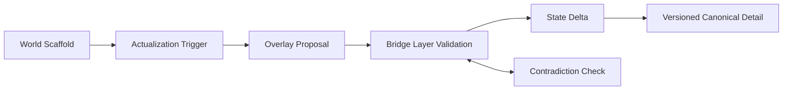

# White Paper 04B - World Generation, Lazy Ontology, and Overlays

## Document definitions

Amazing Game Engine [AGE] means the complete platform. World Scaffold means incomplete but structured world possibility. Lazy Ontology means the rule that AGE actualizes detail only when needed. Actualization means turning scaffolded possibility into versioned canonical detail. Overlay means a concern-specific lens that reads state and proposes consequences. Bridge Layer means the validation and routing boundary that decides whether a proposal may become state.

Corpus Arbitration Layer [CAL] means the component that answers corpus questions from source evidence.

## Plain definition

Lazy Ontology lets AGE start with world scaffolding and actualize detail only when needed. Overlays are concern-specific lenses that interpret state and propose consequences.

## Problem addressed

A persistent world needs depth, but fully prebuilding or simulating all detail is wasteful and brittle. AGE separates scaffolded possibility from actualized canonical fact.

## Actualization model

## Responsibility

This subsystem defines world scaffolds, actualization triggers, provenance, contradiction checks, overlay proposal rules, technology-level vectors, cultural, law, economy, faction, and religion lenses, and Living World interactions.

## Operating model

The world may know that a city has a market district before it knows every shop. A shop becomes canonical when a player visits, an author defines it, an event needs it, CAL references it, or an overlay actualizes it. Once created, it is versioned state.

Overlays inspect relevant partitions and propose effects. A law overlay may restrict weapons in a city. A technology overlay may determine available devices. An economy overlay may alter prices. A religion overlay may change social access. The Bridge Layer validates proposals before mutation.

## Reward

AGE can provide large-world feel with manageable state cost and strong author leverage.

## Risk

Lazy actualization can create contradictions if later detail conflicts with prior scaffold or authored fact.

## Mitigation

Track provenance, actualization reason, scope, overlay source, and contradiction tests.

## Success criteria

AGE can create useful local detail on demand, preserve it as canon, and prevent overlays from silently mutating state.
