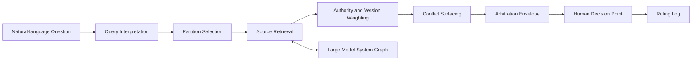

# White Paper 04 - Large Model System Graph [LMS-Graph] and Corpus Arbitration Layer [CAL]

## Document definitions

Amazing Game Engine [AGE] means the complete platform. Large Language Model [LLM] means a generative language model. Large Model System [LMS] means the wider model, retrieval, graph, tool, agent, and workspace system around one or more LLMs. LMS-Graph means the maintained graph/relational corpus substrate. CAL means the component that answers unstructured questions against LMS-Graph. Anchored Corpus Arbitration means the operation CAL performs: ground an answer in source material, expose authority, show conflicts, and preserve the human decision point. Rules Service means the first CAL deployment for a bounded rules corpus.

## Plain definition

LMS-Graph stores the corpus. CAL arbitrates questions against that corpus. The LLM may explain the answer, but the answer must be anchored to source, version, scope, authority, and conflict state.

## Problem addressed

LLMs can produce fluent answers from stale or ungrounded memory. Games, professional domains, and institutions need answers tied to source, version, scope, and authority. CAL shifts the LLM from parametric recall to evidence-guided explanation.

## Arbitration flow

## LMS-Graph

LMS-Graph uses graph structures for relationships, citations, dependencies, exceptions, conflicts, version chains, scope, jurisdiction, and concept adjacency. It uses relational structures for tables, thresholds, dates, requirements, classifications, and repeatable facts.

## CAL responsibility

CAL receives a natural-language question, interprets it, chooses corpus partitions, retrieves source evidence, weighs authority, detects conflict, forms a primary answer, preserves alternative readings, identifies the human decision point, and logs the arbitration.

## Rules Service

Rules Service is the first CAL deployment. It should begin with an owned or licensed game rules corpus. That corpus is bounded, versioned, conflict-rich, and low-risk compared to professional domains.

## Output modes

Quick ruling is optimized for play continuity. It gives a concise answer, confidence, authority tier, and human decision point.

Detailed ruling is optimized for review, authoring, testing, or disputes. It includes sources, alternatives, conflicts, deep-dive paths, and override history.

## Reward

AGE gains a source-grounded ruling layer that can improve play, reduce rules friction, capture Referee overrides, and create reusable tests.

## Risk

Retrieved evidence can be incomplete, misweighted, out of scope, or too slow for play. A sourced answer can still be wrong if the corpus or authority policy is wrong.

## Mitigation

Use output envelopes, authority tiers, conflict flags, source versioning, scope labels, quick and detailed modes, Referee override capture, and corpus-improvement loops.

## Success criteria

A rules question is answered from source-bound evidence rather than model memory, with version, authority tier, confidence, conflicts, and human decision point visible.
