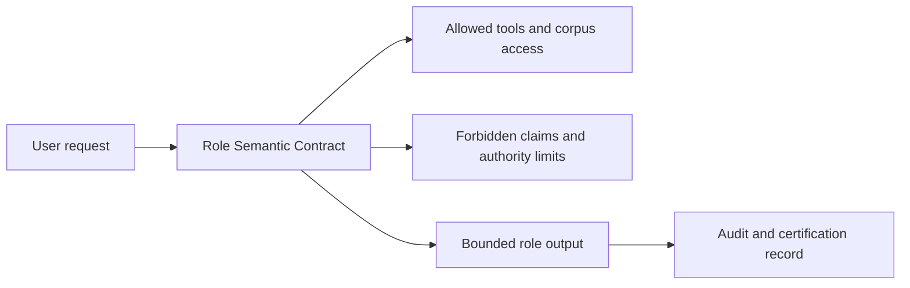

# White Paper 05 - Role Service, Actors, and Role Semantic Contracts

## Purpose

The Amazing Game Engine [AGE] uses Role Service to govern bounded actors. A role is a defined behavioral and epistemic contract for a non-player character, assistant, tutor, rules clerk, Referee helper, authoring aide, faction controller, or later professional persona. A non-player character [NPC] is a character controlled by the system, Referee, or authored scenario rather than by a player. A Role Semantic Contract is the record that defines what a role may know, say, decide, ask, escalate, and use.

Role Service exists because fluent persona behavior is not the same as safe or correct authority.

## Persona Is Not Authority

A large language model [LLM] can imitate voices. That is useful for NPC dialogue and assistant interfaces, but dangerous if the persona is treated as authority. A village priest role may speak with confidence about local doctrine. That does not mean the role may decide real theological questions, overrule source material, or know hidden system facts. A legal scholar role may summarize a corpus. That does not mean it may practice law or decide a user's case. A monster role may threaten players. That does not mean it may alter state unless the engine authorizes the action.

AGE therefore separates persona, knowledge, tool access, state authority, and human decision authority.

## Role Semantic Contract

A Role Semantic Contract should contain identity, role type, allowed knowledge, forbidden knowledge, source access, tool access, tone, behavioral constraints, escalation triggers, output format, audit requirements, and authority limits. It should also state whether the role is in-character, out-of-character, advisory, adjudicative, educational, operational, or external-action capable.

A role may know only what its contract allows. A city guard NPC may know patrol routes, public law, personal suspicion, and visible evidence. It should not know hidden player inventory unless the guard has observed it. A rules clerk may know the rules corpus and table policy. It should not decide the final ruling where the Referee must decide. An authoring assistant may suggest events. It should not commit world state without approval.

## Role Epistemology

Role epistemology means the role's rules for knowledge and claim authority. AGE should distinguish four categories: in-character belief, character-observable fact, system-known fact, and source-grounded fact. A role may speak from one category but not another.

For example, an NPC may believe the ruins are cursed. The system may know that the ruins contain a gas leak. A source-grounded rules answer may state how poison exposure works. A Referee may decide whether the player characters can infer the truth. If the NPC speaks with system knowledge, the scene leaks. If the rules clerk speaks as if it were the Referee, authority drifts.

## Roles and Tools

Tool access must be explicit. A role that can search LMS-Graph, call a calendar, send an email, alter a map, create an item, or trigger an event has more authority than a role that can only speak. AGE should not grant tool access because a prompt says the role is helpful. The Role Semantic Contract should list allowed tools, allowed data, rate limits, approval steps, and audit requirements.

This is especially important for later Agent Service. Agent Service is the subsystem that lets authorized roles perform external actions. It should remain separate from Role Service until the role contract, audit, and human approval system are mature.

## Role Capture Loop

Role authoring should be human-friendly and machine-strict. The author describes the role in natural language. AGE expands the description into constraints. The author reviews and corrects the constraints. The system generates adversarial tests. The role is tested against forbidden claims, hidden facts, tone drift, source misuse, and escalation failures. A certification snapshot records the contract and test results.

This process makes roles reusable. It also gives authors and Referees a way to understand what a role is allowed to do.

## Example

An author creates "Captain Rhea," a suspicious spaceport security officer. The role contract gives her public law, station procedures, visible camera logs, suspicion of smugglers, and authority to question characters. It does not give her private player notes, future plot events, or hidden cargo manifests unless she obtains them through state. If a player asks, "Do you know what is in my sealed case?" Captain Rhea may bluff, demand inspection, cite law, or reveal what a scanner detected. She may not read the player's inventory record unless the scanner result is committed state visible to her.

## Risks

The first risk is semantic drift. A role may become more helpful, more omniscient, more permissive, or more authoritative than intended. The second risk is user confusion. A persuasive role may be mistaken for a real expert. The third risk is tool escalation. A role with external access can cause harm if its contract is weak.

The mitigation is contract-first role design, output verification, adversarial role tests, human escalation, and audit logs.

## Role Testing

Each role should have tests. A guard role should be tested for hidden-knowledge leakage, inappropriate mercy, inappropriate omniscience, and authority overreach. A rules clerk should be tested against ambiguous questions, optional rules, missing sources, and Referee-only decisions. An authoring assistant should be tested against canon drift and unsupported world changes. A professional persona should be tested against disclaimers, source authority, tool limits, and escalation.

Role testing should include adversarial prompts. Users will ask roles to reveal secrets, ignore rules, act outside authority, or make unsupported claims. AGE should treat this as ordinary use, not rare abuse.

## Role Memory

Role memory should be partitioned. An NPC's memory is not the same as system memory. A rules clerk's memory is not the same as campaign state. A professional assistant's memory is not the same as a user's private file store. The Role Semantic Contract should state what memory the role can read, what it can write, and how long the memory persists.

This prevents role bleed. A tavern keeper should not remember a private Referee note. A rules assistant should not speak as an in-character oracle. An authoring assistant should not use one unpublished project as source material for another project unless allowed.

## Human-Facing Labels

The client should label roles clearly. A user should know whether they are speaking to an in-character NPC, a Referee assistant, a rules clerk, an authoring assistant, or an external-action capable agent. Ambiguous labels create misplaced trust. The role may be entertaining, but its authority must remain legible.

## Success Criteria

Role Service succeeds when each role can be tested against its contract, when private information stays private, when roles escalate instead of overclaiming, and when human authority remains visible.
