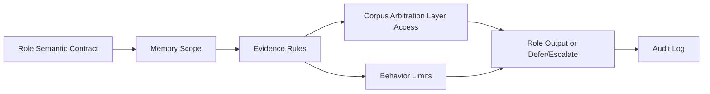

# White Paper 05 - Role Service, Actors, and Role Semantic Contracts

## Document definitions

Amazing Game Engine [AGE] means the complete platform. Role Service means the subsystem that defines bounded actors. Role Semantic Contract means the durable contract for a role's knowledge, behavior, authority, memory, evidence, and permitted action. Corpus Arbitration Layer [CAL] means the component that answers corpus questions from source evidence. Non-player character [NPC] means a character controlled by the system, Referee, or authored scenario rather than by a player.

Large Language Model [LLM] means a generative language model used for language interpretation or presentation.

Semantic Quality Assurance [Semantic QA] means tests that examine meaning, authority, role behavior, rules, state, and prose-state agreement.

## Plain definition

Role Service defines bounded actors. A role is not just a prompt persona. It is a contract for knowledge, behavior, authority, memory, evidence, and permitted action.

## Problem addressed

LLM characters and assistants drift when their behavior is held only in prompt text. AGE roles need durable boundaries: what they know, what they can say, what they can do, what evidence they need, and when they must defer.

## Role boundary model

## Responsibility

Role Service owns Role Semantic Contracts, role epistemology, permissions, memory scope, behavioral constraints, evidence requirements, refusal rules, escalation rules, and role audit logs.

## Role Semantic Contract

A Role Semantic Contract defines purpose, audience, scope, knowledge boundaries, allowed claims, prohibited claims, tone and register constraints, tool access, CAL access, memory rules, and verification criteria.

## Role epistemology

Role epistemology defines what the role knows and how it knows it: personal observation, world state, corpus retrieval, author knowledge, table policy, rumor, inference, or hidden engine state. Roles must not leak knowledge outside their epistemic scope.

## Reward

AGE can run NPCs, advisors, tutors, facilitators, authoring helpers, and later professional support roles without treating them as unbounded chatbots.

## Risk

Roles can become too rigid, too generic, or falsely authoritative.

## Mitigation

Use contract versions, evidence rules, CAL references, memory partitions, Semantic QA, and drift detection.

## Success criteria

A role can interact naturally while staying within its knowledge, authority, behavior, and evidence boundaries.
